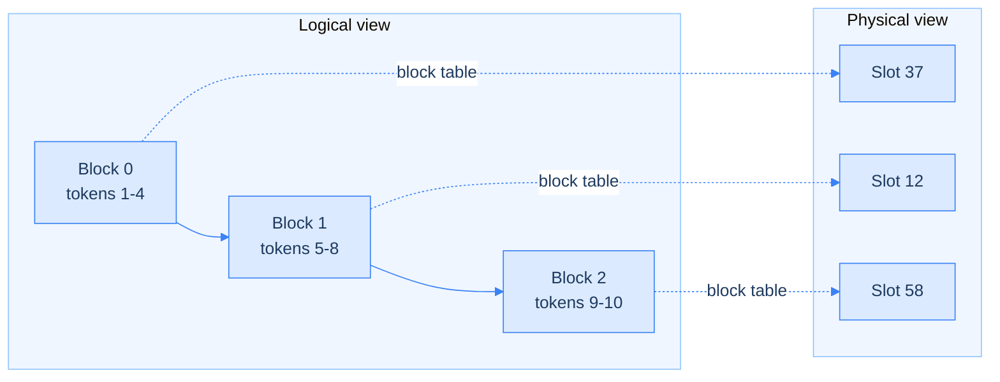

<!--more-->


- The defining trait of agentic workloads: long input, short output, and over 96% overlap with the previous turn — every optimization in this report is built around that one fact.
- Four layers of work: unified paged KV cache management with tiered offloading (Data Plane), architecture-aware parallelism choices between DCP/PCP/DEP (Execution Plane), scheduling fixes for head-of-line blocking and lockstep, and a two-phase rate-matching methodology for sizing prefill vs. decode fleets.
- The most valuable part is three "tried it, didn't work as expected" failure cases: PP doesn't suit warm agentic turns, DCP can't cleanly transfer to DeepSeek V4, and intuitive load balancing loses to simpler session-aware sticky routing.
- The headline "14.6-106x cost savings" figure has a methodological caveat — it compares self-hosted TCO against API retail pricing, which aren't the same thing. The engineering content itself is what's actually worth learning.


## Introduction

In September 2026, the vLLM team published an engineering report, *vLLM x AgentX: Optimizing for Real-World Agentic Serving*, on how to tune an inference serving system for agentic workloads — the multi-turn, long-context, highly repetitive traffic pattern typified by tools like Claude Code. It isn't a research paper; its originality isn't a new algorithm, but the systematic application of known distributed-systems techniques — paged memory, symmetric-memory communication, rate-matching capacity planning — to this emerging traffic shape, validated against a third-party benchmark (SemiAnalysis's AgentX).

The core insight fits in one sentence: agentic workload input is long, output is short, and more than 96% of the input is identical to the previous turn. Every optimization in this article — KV cache management, parallelism strategy, scheduling, and prefill/decode machine ratios — is built around that single characteristic.

This kind of infrastructure-layer work fills a gap that application-layer routing can't reach. A framework like [AgentOpt](../agentopt/) decides *which model* to use for each role in a pipeline; this report operates one layer down, on *how to get the most out of the serving engine itself for a single model*. The two are complementary, not competing.

This note covers four things in order: how vLLM manages the KV cache (Data Plane), how it picks a parallelism strategy across different model architectures (Execution Plane), how scheduling keeps requests from blocking each other, and how it works out the right machine ratio between prefill and decode. The last section is devoted to three "tried it, didn't hit the target" failure cases — the most honest and most transferable part of the source report. Most technical write-ups only cover what worked; this one rarely opens up the places where judgment missed. The note closes with a set of general lessons that hold even outside this article, and outside LLM serving entirely.

One thing worth flagging before the details: the article's most eye-catching number — "14.6-106x cost savings" — comes with a methodological caveat. It compares the total cost of ownership (TCO) of self-hosted hardware against the retail price of the Opus 5 API, but the two aren't the same thing — retail price bakes in model R&D, operations, and margin, not just raw compute. It's a bit like comparing the ingredient cost of cooking at home to a restaurant menu price: the multiple will naturally be large, and not all of it is credit to this article's own optimization work. The technical content itself is solid and verifiable, though — what's genuinely worth learning are the general system-design patterns inside it, which are worth more than this article or any specific model version.

## Background: Prefill and Decode

Understanding every optimization that follows requires first understanding the two phases a large language model goes through to process one conversation turn.

**Prefill**: the model reads all of the user's input text at once — the question, prior conversation history — and converts it into an internal mathematical representation. This step can be parallelized, because the computation between any two tokens is independent, so the GPU can compute "how every token relates to every other token" all at once.

**Decode**: the model generates the response one token at a time. Generating each token requires looking back at everything processed so far, including both the input and whatever has already been generated. This step is inherently sequential and can't be parallelized, because token N+1 can't be decided until token N is known.

A concrete example: suppose the input "What's the weather like today" is split into 6 tokens:

```
Prefill: computes the relationships across all 6 tokens at once (1 step)

Decode (assuming a 5-token answer):
  Step 1: looks at 6 tokens -> generates token 1
  Step 2: looks at 7 tokens (6 + 1 generated) -> generates token 2
  Step 3: looks at 8 tokens -> generates token 3
  ...(5 steps total)
```

Every decode step has to re-examine everything that came before, and that "looking back" is powered by storing the intermediate results already computed (called K and V — Key and Value) instead of recomputing them. That stored data is the **KV cache**. The longer the context, the more decode has to look back over at each step, and the slower it gets. Almost every optimization in this article is about managing the KV cache effectively and speeding up decode.

## Why Agentic Workloads Are Hard to Serve: Four Traits, Three Challenges

Based on observations from the SemiAnalysis AgentX benchmark, agentic workloads have four clear traits:

1. **Long, multi-turn conversations**: a median of 43 turns. A single agent task (e.g., "fix this bug") takes an average of 43 back-and-forth exchanges with the model to complete.
2. **Long input, short output**: median input is 142K tokens; median output is only 444 tokens. What gets sent in each turn (accumulated conversation history plus tool results) is enormous, but each response from the model is short.
3. **Extremely high prefix reuse**: prefix cache hit rate exceeds 96%. Every turn in an agentic session sends in the entire previous turn's content plus new tool results, so the vast majority of it is identical to what came before.
4. **Heavy subagent branching**: 44% of tasks include at least one subagent (where an agent hands off work to another, independent agent for a subtask), and tasks that use subagents spawn an average of 4 of them. A subagent typically branches off the main agent's current context, so it inherits a large chunk of already-computed content from the start.

These four traits directly translate into three engineering challenges:

| Trait | Resulting challenge |
| --- | --- |
| High prefix reuse | **Prefix cache pressure**: GPU memory is finite, so serving many long conversations at once forces a tradeoff between "keep it around for next turn" and "move it elsewhere" |
| Speed demands of long input + short output | **Execution efficiency**: the amount of computation per unit time goes up, requiring adjustments to parallelism strategy, kernels, and scheduling to match this new request shape |
| Wide length variance + branching | **Finding the right P/D ratio**: context length and cache hit rate vary widely by session and subagent, and shift with concurrency, making a fixed prefill/decode machine ratio hard to pin down |

These three challenges map directly onto the article's next three major sections: the Data Plane (KV cache management) solves the first, the Execution Plane (parallelism and scheduling) solves the second, and the P/D ratio methodology solves the third.

## Data Plane: KV Cache Management

### Why "Paged" Memory Management Is Needed

Modern models frequently mix three attention mechanisms, and their KV caches differ completely in size and lifecycle:

- **Full attention**: looks back at all prior content; the KV cache only grows, expanding continuously with conversation length.
- **Sliding-window attention**: only looks at a fixed recent window; blocks outside that window can be reclaimed immediately.
- **Linear / recurrent attention**: instead of continuously adding new blocks, compresses all prior content into a fixed-size summary state that gets repeatedly overwritten.

If each type got its own dedicated slice of memory, one slice would often sit idle and wasted while another ran short, because how much space each type actually needs shifts dynamically with conversation length and concurrency — there's no fixed answer.

### vLLM's Solution: Unified Paging + a Shared Pool

vLLM borrows the concept of operating-system virtual memory paging directly — this is also where vLLM's original paper got the name PagedAttention. The core data structure is the **block table**: in the diagram below, the left side is the logical order a single conversation sees; the right side is where those blocks actually sit in GPU memory, which can be non-contiguous; the block table maps one to the other.



Regardless of attention type, every entry uses the same "page" size and draws from the same shared block pool. Whoever needs a block dynamically borrows one from the pool, instead of pre-carving out "this region is permanently reserved for full attention." That means a block reclaimed early by sliding-window attention can be picked up immediately by full attention or any other consumer, rather than sitting locked away.

Even more important is **reference counting + copy-on-write**: if the front portion of two conversations is identical — as when a subagent inherits the context from a main agent's completed turn — their block tables can point at the same set of physical blocks without copying. This is the underlying mechanism behind prefix cache reuse. The system keeps a count on every physical block of "how many conversations are currently using this," and only makes a temporary private copy when something actually needs to modify shared content. Reference counting plus copy-on-write is a classic operating-system memory technique — not something this article or vLLM invented — but it's especially valuable for agentic workloads, since the subagent branching described earlier is, at its core, a large volume of conversations that are "identical up to a point."

The source gives a concrete example: DeepSeek V4's original KV cache approach split different cache types into 3 size-based buckets across 92 separate storage blocks, causing heavy fragmentation and poor efficiency during P/D transfer and offloading (the source's Figure 5 is a before/after comparison of DeepSeek V4 KV cache fragmentation). The new approach merges those 92 scattered blocks into a single contiguous storage region, cutting descriptor and P/D transfer overhead, and — with the FP4 indexer enabled — further shrinks the minimum allocation unit, saving roughly 10% of KV cache memory usage.

> 🔍 **Going deeper: if we already have the KV cache, why do we still need a separate snapshot?**
>
> The key is that not every attention type's KV cache "naturally retains history." Full attention's blocks only grow — a block stored at turn 1 is still sitting there, untouched, at turn 5. Any past point in time can be found directly via the block table, with no extra snapshot needed. But linear state and sliding-window caches are active states that get overwritten or evicted: linear state gets entirely replaced with a new version on every new token, discarding the old one; sliding-window simply evicts blocks that fall outside the window.
>
> If you later want to return to and reuse some past point in time, but the linear state from that moment has already been overwritten, or the sliding-window block has already been evicted, it's gone for good. What a snapshot solves isn't "storing the same thing twice" — it's giving these inherently overwritten, evicted states an extra backup at a specific point in time, so they can still be found later. Globally there's no waste: only linear and sliding-window need this at all; full attention needs none of it, because its own structure already handles this problem on its own.
>
> (The source doesn't specify exactly which memory tier holds the snapshot itself — GPU, CPU RAM, or disk. A reasonable guess is that it's folded into the tiered shared pool discussed in the next section, but that's inference, not something the source states explicitly.)

### Tiered Offloading: Storage Beyond GPU Memory

Even with a shared pool, GPU memory capacity is still finite. vLLM integrates **Mooncake Store** as a distributed KV cache pool, moving KV cache that won't be needed immediately — but might be reused later — off the GPU (to CPU memory, or even disk) for temporary storage, and pulling it back when needed:

```
GPU memory (fastest, most expensive, smallest capacity)
    ↓
CPU memory (slower, much larger capacity)
    ↓
Disk (slowest, largest capacity, cheapest)
```

In practice, this means running a dedicated Mooncake client resident on every machine, responsible for managing this broader storage pool; the GPU machines only need to request data, without managing storage details themselves.

### Two Complementary Retention Strategies

Deciding "when to save a snapshot" layers two strategies together:

1. **Interval-based retention**: automatically saves a snapshot at the end of every turn (each model generation, whether a tool call or a final response). This strategy covers the predictable, high-probability reuse point of "the end of a turn."
2. **Marconi-style selective retention**: triggers a snapshot save only when the system detects that "this prefix has appeared before." If the original state has already been overwritten, it's recomputed before being saved. This strategy covers the case where "reuse is needed partway through a turn, before it finishes" — for instance, when multiple parallel subagents or tool calls are triggered mid-turn and the branch point falls in the middle of a turn, somewhere interval-based retention wouldn't have saved a snapshot.

Together, the two strategies achieve a high hit rate without saving at every single position and wasting space. The source mentions that the technical details of this combined strategy are covered in more depth in vLLM's Kimi K3 blog post.

## Execution Plane: Choosing a Parallelism Strategy

This section covers three parts: parallelism fundamentals first, then how Kimi K3 and DeepSeek V4 each make their choice.

### Part 1: Why Parallelism Is Needed, Five Base Strategies, and the MLA Mechanism

#### Why a Model Needs Multiple GPUs

There are two reasons, each pointing to a different solution. First, the model is too big — its parameter count exceeds a single GPU's memory capacity, so splitting it is unavoidable. Second, even if it fits, you want faster processing speed or higher concurrency — so you spread the computation across multiple GPUs to run simultaneously.

#### Five Base Parallelism Strategies

| Strategy | What it splits | Which reason it solves | Communication sensitivity | Typical scope |
| --- | --- | --- | --- | --- |
| TP (Tensor Parallelism) | Matrices (within a layer, split by "head") | Doesn't fit + wants speed | Extremely high (needs NVLink) | A few GPUs within one chassis |
| PP (Pipeline Parallelism) | Layers (between layers) | Doesn't fit | Low | Can span chassis/machines |
| EP (Expert Parallelism) | Experts (MoE routing) | Doesn't fit + wants speed | Medium-high (all-to-all) | Depends on model scale |
| CP (Context Parallelism) | Input sequence length | Wants speed (long context) | Medium | Depends on implementation |
| DP (Data Parallelism) | Doesn't split the model, splits "requests" — every GPU holds a full copy of the model, each independently handling different requests | Wants speed (throughput) | Lowest (in theory needs no communication) | Unlimited |

**TP's core logic**: splits matrix operations into several vertical strips, with each GPU computing one strip and merging the results afterward (all-reduce). That merge requires high-speed interconnect between GPUs, ranked fastest to slowest: NVLink (within a chassis, up to hundreds of GB/s), PCIe (shared bus within a chassis, slower), and InfiniBand or high-speed Ethernet (across machines, slower still). The farther apart, the slower — so TP is essentially confined to a handful of GPUs within one chassis.

**PP's core logic**: splits the model layer by layer across different GPUs, rather than tearing open the inside of a layer like TP does. The advantage is that GPUs only need to pass a result once at each layer boundary, instead of doing an all-reduce at every layer like TP — communication requirements are much lower, and it can span chassis and machines. The downside is the **bubble problem**: if only one piece of data is fed into the pipeline, only one GPU is actually working at any given moment while the rest sit idle. The fix is to continuously feed in multiple small batches so several stages have work at once, leaving bubbles only at the start and end of the pipeline.

**EP's core logic**: a MoE (Mixture of Experts) model doesn't activate all its parameters every time — a router picks a small subset of "experts" for each token (typically choosing a few out of a larger total, e.g., 2 of 8). EP distributes different experts across different GPUs. Because routing is decided dynamically per token, this requires **all-to-all communication**: tokens are first dispatched (sent to the GPU holding their target expert), computed there, and then combined (results sent back to wherever originally owned that token). This has a side effect: if the router happens to send a lot of tokens to the same expert, that GPU's workload spikes while the others wait on it.

#### What MLA (Multi-head Latent Attention) Is, and Why It Makes TP Inefficient

In standard attention, a model has several independent "heads" internally, each storing a full copy of K and V. **MLA doesn't let each head store its own copy — instead, it compresses the information all heads need into a single, much smaller "latent representation" \(c\), and stores only that one copy**, reconstructing what each head needs from this compressed version when required. The benefit is a dramatic reduction in KV cache footprint.

But this is exactly why it clashes with TP. TP's logic is to split matrices into several vertical strips, handing each strip to a different GPU. But MLA has only one latent representation — there are no multiple heads to split. When TP meets MLA, it ends up **duplicating** that single latent cache, giving every GPU its own full copy instead of splitting it apart — meaning multiple GPUs are used for TP, but no KV cache memory is actually saved.

> 🔍 **Going deeper: how does MLA compress multiple heads into one, and how does it reconstruct them?**
>
> **Compression:** a dimensionality-reduction matrix \(W_{down}\) projects directly from the raw input \(h\) into a much smaller space, producing the compressed vector
>
> $$c = W_{down} \times h$$
>
> This step is the key to "many becoming one" — it isn't computing each of the 8 heads' K and V separately and then compressing them; it's a single projection that produces one unique \(c\).
>
> **Reconstruction:** different heads use different "reconstruction matrices" \(W_{up,i}\) to look at the same \(c\):
>
> $$K_i = W_{up,i} \times c$$
>
> Because each head's reconstruction matrix was learned independently during training, multiplying the same \(c\) by different matrices reveals different angles of detail — like the same compressed summary viewed through different "filters" to surface different highlights.
>
> **The key detail: matrix absorption.** In practice, \(c\) is never actually reconstructed back into a full-size \(K\) before taking the dot product with a query — that would still require the full computation, saving nothing. Because \(W_{up}\) and the query's projection matrix \(W_q\) are both fixed after training, they can be mathematically pre-merged: \(W_{up}\) gets folded into \(W_q\) ahead of time, so it only needs to be computed once, not recomputed per token. Each head can then directly use this "absorbed matrix" to project \(h\) into a \(q'\) that can be dot-producted directly against the compressed \(c\) — never reconstructing \(c\) back into a full-size \(K\) at any point.
>
> So if every GPU stores a full copy of \(c\), does it first have to reconstruct it back into multiple heads locally and then pick out the ones it needs? No. Each GPU applies the matrix-absorption trick directly, running the operation only for the reconstruction matrices of the heads it's been assigned, computing exactly the result it needs in one step, without ever expanding out any other head's version.

> 🔍 **A common follow-up: does MLA actually save compute? Where?**
>
> At first glance, MLA's "\(h \to c \to\) dot product with query" pipeline seems to involve roughly the same number of computational steps as the standard approach. But the real saving hides somewhere easy to overlook: at every decode step, the new token's query doesn't just take one dot product with "itself" — it has to take a dot product against every historical position that came before, one by one.
>
> The saving isn't in the *number* of dot products — both approaches do the same number of them — it's in **how much data has to be moved from memory for each one**. In the standard approach, each of the 8 heads has its own independent \(k_i\), so 8 heads means reading 8 separate pieces of data from memory. In MLA, \(c_i\) is shared by all 8 heads — after the first head's dot product reads it in, heads 2 through 8 can reuse that same already-loaded \(c_i\) without moving it again.
>
> A concrete illustration (illustrative numbers, not exact figures from the source): assume 8 heads, K dimension of 16 per head, an MLA-compressed \(c\) dimension of 32, and 1000 cached positions:
>
> ```
> Standard approach data moved: 8 heads × 1000 positions × 16 dims × 2 bytes ~ 256,000 bytes (V not yet counted)
> MLA approach data moved: 1000 positions × 32 dims × 2 bytes ~ 64,000 bytes (no ×8, since all 8 heads share one c)
> ```
>
> The gap is roughly 4x (DeepSeek's actual paper uses an even larger compression ratio). This echoes a line the source states explicitly: "MLA attention is memory-bound" — the decode-phase bottleneck isn't GPU compute capacity, it's the speed of moving data from memory to the compute units. The longer the context, the heavier attention's share of each decode step becomes, precisely because it has to compare against more and more historical positions, and the data volume to move grows linearly with that.

### Part 2: Kimi K3's DCP Choice and the DEP Turn

Kimi K3 uses MLA combined with Kimi Delta Attention (KDA). As covered above, applying TP to MLA amounts to duplication rather than splitting; the alternative vLLM found is **DCP (Decode Context Parallelism)**.

#### How DCP Splits: By "Sequence Position," Not by "Head"

Standard TP wants to split along the "head" dimension, but under MLA there's nothing left in that dimension to split — only a single shared \(c\). DCP switches to a different dimension: it splits the accumulated KV cache by token sequence position, with each GPU storing only 1/N of the whole. For example, with 1000 accumulated positions and DCP split 4 ways, GPU1 stores tokens 1-250, GPU2 stores 251-500, and so on — each GPU genuinely stores only 1/4, unlike TP where all 4 GPUs each store an identical full copy.

DCP brings two benefits (the source's Figure 6 shows DCP8 achieving lower decode latency than TP8, sustaining higher concurrency): lower decode latency, because each GPU processes a smaller slice after splitting; and higher throughput and KV capacity, because the full KV cache isn't duplicated, so each GPU can hold more concurrently running sequences.

> 🔍 **Going deeper: under DCP, does every GPU have to see every other GPU's data?**
>
> Yes, but not in a "later GPUs need to see more of it" step-ladder relationship — every GPU computes its own portion equally and simultaneously, then merges:
>
> 1. A new token's query is broadcast to every GPU in the group; each receives an identical copy.
> 2. Each GPU uses only the segment of \(c\) it holds locally, takes the dot product against that query, and computes its own partial result — this step is independent and parallel across GPUs, with no waiting on each other.
> 3. Because softmax's denominator (the normalizing sum) needs to see the scores from every historical position to compute, no single GPU can produce the final probability on its own — a merge step is needed to gather the partial results together.
>
> This is exactly the problem the source's mention of **online softmax** solves.

> 🔍 **Following this thread further: what is online softmax actually doing?**
>
> The most intuitive way to understand it: think of it as a "distributed weighted average." Say there are 4 data points, each with a weight and a value, split across two machines:
>
> ```
> Machine A gets positions 1, 2: weights=1,3  values=10,20
> Machine B gets positions 3, 4: weights=2,4  values=30,40
>
> Machine A reports two numbers: weighted sum=1x10+3x20=70  weight sum=1+3=4
> Machine B reports two numbers: weighted sum=2x30+4x40=220 weight sum=2+4=6
>
> Merge: total weighted sum=70+220=290  total weight sum=4+6=10
> Final weighted average=290/10=29  <- identical to computing it all centrally
> ```
>
> Each machine computes its own "weighted sum" and "weight sum" — two partial numbers — and once every machine's pair is added together and divided once, the answer matches computing everything centrally in one pass, with no machine ever needing to see another's raw data.
>
> In attention, the "weight" is the exponentiated attention score at that position, and the "value" is the value stored at that position:
>
> $$\text{output} = \frac{\sum_i \exp(\text{score}_i) \times \text{value}_i}{\sum_i \exp(\text{score}_i)}$$
>
> Each GPU (rank) reports a "local weighted sum" and a "local weight sum"; merging sums these up and divides once, producing a result identical to processing every position in one pass. The source's line "each rank locally merges the results with online softmax" describes exactly this.
>
> There's also a numerical-stability detail on the engineering side: because exponentiating large numbers risks overflow, each GPU first subtracts its own local maximum before exponentiating, then uses the difference between the local and global maximum as a correction factor to rescale its result onto a common scale before summing. This is an engineering trick independent of the core logic above, and doesn't change the underlying "distributed weighted average" nature of the mechanism.

#### vLLM's Optimization of the DCP Communication Path

Every decode step, at every layer, requires a merge — a cost that compounds repeatedly. vLLM replaces standard NCCL communication with **symmetric memory**: multiple GPUs pre-agree on the memory locations they'll use, so any GPU can directly read or write a specific location on another GPU, without going through a full "request, acknowledge, transfer" protocol each time. The query is multicast directly into the agreed-upon buffer; once each GPU finishes computing, it writes its partial result directly into the receiving GPU's location, and the entire "broadcast, compute, write, merge" sequence is fused into a single kernel execution. The result is roughly a 13% reduction in per-layer latency compared to the default DCP8 implementation (the source's Figure 7 compares the MLA decode path on DCP4 before and after adopting symmetric memory, fusing what were separate NCCL all-gather, staging copy, all-to-all, and unpack steps into a single kernel).

> 🔍 **What's the difference between symmetric memory and NVLink? Can it be applied broadly? This gets confused often, so it's worth clarifying.**
>
> These aren't at the same layer, so it isn't an either-or comparison. **NVLink is hardware** — the physical high-speed link between GPUs. **Symmetric memory is software, a programming model** — a way to write code that reads and writes another GPU's memory directly, without going through the standard NCCL protocol. It still needs NVLink (or another physical connection) to actually move data; it's a clever way to make effective use of that link, not a replacement for it.
>
> This is a relatively mature, general technical direction in the industry, not a vLLM-specific invention — NVIDIA's own **NVSHMEM** library and PyTorch's **SymmetricMemory API** are both examples of the same category, commonly seen in scenarios like MoE all-to-all communication. The rule of thumb for when it's worth applying: when the communication pattern is fixed, predictable, and happens frequently enough that eliminating the fixed setup cost pays off. When the pattern is irregular, infrequent, or the team wants something simpler to maintain, standard NCCL remains the better choice.

#### At Larger Scale: DEP Overtakes DCP

On NVL72-class systems — large-scale, spanning multiple nodes — wide EP combined with data parallelism (**DEP**) can actually outperform DCP at higher throughput under the same latency SLO (Service Level Objective — the latency ceiling a system commits to) (the source's Figure 8 shows that for Kimi K3, wide EP's DEP16 scales better than DCP8 once per-rank batch size exceeds 3). The reason is that at larger, cross-node scale, DCP's "communication cost from splitting attention" exceeds the compute it saves. The more finely DCP splits, the more GPUs need to participate in each online-softmax merge, and communication complexity rises accordingly; once scale crosses out of a single chassis, that merge also has to go over slower InfiniBand, making it even more costly.

> 🔍 **Going deeper: DEP = DP + EP — how does it actually work?**
>
> DEP's core idea is to keep every sequence entirely on one GPU for attention (the DP part), while the same batch of GPUs jointly holds every MoE expert (the EP part):
>
> ```
> Role 1 (DP identity, handles attention):
>   GPU1 handles sequences A, B (computes independently, no coordination needed)
>   GPU2 handles sequences C, D (computes independently, no coordination needed)
>
> Role 2 (EP identity, handles MoE):
>   GPU1 stores experts 1, 2
>   GPU2 stores experts 3, 4
> ```
>
> Because each sequence stays on one GPU from start to finish, attention needs zero cross-GPU communication — unlike DCP, where a sequence's KV cache is split and scattered across multiple GPUs. But this same batch of GPUs also jointly holds every expert, so when a token gets routed to an expert that isn't on its own GPU, it still triggers the dispatch/combine all-to-all communication — DCP and DEP pay the exact same MoE communication cost; neither escapes it. The difference is that DCP additionally carries the cost of "attention also needs cross-GPU communication," and that cost keeps rising with scale, while DEP never carries it at all.
>
> One thing worth clarifying: DCP isn't "CP plus something else" — it's essentially CP itself, just applied to the decode phase, splitting the KV cache (D stands for Decode). PCP, covered in the next section, is CP applied to the prefill phase instead, splitting the incoming prompt. DEP's naming logic is the one that's genuinely "two parallelism strategies stacked" (DP + EP), unlike DCP and PCP.

### Part 3: DeepSeek V4's Challenge, and the PCP/DEP Approach

DeepSeek V4 also uses MLA-style KV cache, so TP duplicates instead of splitting here too. Worse, its **compressed sparse attention** makes splitting TP by head even less worthwhile, for three reasons the source lays out.

#### Background: What Is Sparse Attention

Standard attention compares against every historical position; sparse attention's idea is that most historical positions aren't actually very relevant to the current token, so it's enough to look only at the most relevant subset (top-k), saving a large amount of computation and data movement that would otherwise be spent on irrelevant positions. Making this selection requires two additional components: a compressor and an indexer.

#### Three Reasons TP Becomes Even Less Worthwhile

1. **The compressor emits only one shared result**: for every position it compresses, it produces only a single "shared" KV representation, not an independent version per head — the exact same pathology that makes TP duplicate under MLA. Every GPU is forced to redundantly run the identical compressor computation.
2. **The indexer has 64 heads internally, but emits only one global top-k selection**: the indexer scores with 64 heads internally, but after merging produces only a single global top-k list. TP has no "64 independent pieces" to split — every GPU still has to rerun the entire 64-head computation.
3. **The genuinely expensive part — scanning and fetching the selected KV entries — has nothing to do with "heads"**: sparse MLA's computation is dominated by this memory-bound act of scanning and fetching the top-k-selected KV cache entries, not by the attention math itself. TP can only split the relatively minor "per-head computation" part — it can't reach the part that's actually expensive.

#### The Fix: PCP for Long Prefill, DEP as the Default

**PCP (Prefill Context Parallelism)** splits along the incoming prompt's sequence position (the query dimension), used during the prefill phase. Because each GPU gets a complete slice of tokens, the compressor, indexer, and every head of sparse MLA can all be computed entirely within that one GPU, with no need to assemble results across GPUs — this neatly sidesteps all three problems above, since their root cause is "splitting by head," and PCP doesn't split by head at all — it splits by sequence position.

Concrete performance: for a 32K-length prompt, PCP8 achieves 2.65x faster prefill than TP8, substantially cutting **TTFT (Time To First Token — the wait from when a user sends a request to seeing the first token appear)**. But PCP still duplicates a full copy of decode-side state on every GPU, saving nothing on decode memory — meaning PCP only solves the prefill-phase efficiency problem, and is best deployed on a dedicated fleet of machines handling prefill only, with no concern for decode.

DCP performs worse on DeepSeek V4 than it does on Kimi K3; the specific reasons are covered later in the "Bitter Lessons" section. In the end, **DEP is the default across most DeepSeek V4 configurations** — the exact same mechanism as Kimi K3's DEP, with nothing new to relearn.

> 🔍 **A common misunderstanding: does DeepSeek V4 use DEP for everything, with nothing else to consider?**
>
> No. The source's exact wording is that "DEP is the default for most configurations" — not "the only option." For long-prefill scenarios and dedicated prefill machines, PCP is still the better choice. This maps directly onto P/D disaggregation, the topic of the next section (splitting prefill and decode across different machine fleets): if the two are split into separate fleets, the fleet handling long prefill can use PCP while the fleet handling decode uses DEP — the two aren't in conflict.
>
> Incidentally, the source never explicitly discusses what strategy Kimi K3 should use during prefill at all — every discussion of Kimi K3 in the source focuses entirely on decode latency. That's a genuine information gap in the source, not something this note has omitted.

> 🔍 **A side-by-side: what's actually different between DCP and PCP?**
>
> |  | DCP | PCP |
> | --- | --- | --- |
> | Phase used | Decode (generates 1 new token at a time) | Prefill (processes a large chunk of new input at once) |
> | What it splits | The already-stored KV cache (history) | The incoming prompt itself |
> | Who looks at whom | 1 new token's query needs to see history scattered across GPUs | Each position in the prompt only needs to focus on its own segment |
> | Merge frequency | Every decode step needs a merge (online softmax) | Low frequency, flattened in one pass (the source doesn't spell out the specific merge mechanism the way it does for DCP) |
> | Saves KV cache memory? | Yes (no need to duplicate the full KV cache) | No (decode-side state is still duplicated) |
>
> Because DCP pays a communication cost at every single step, it's worth the heavy optimization effort described above (the symmetric memory work); PCP's extra communication cost is relatively easy to amortize over its much larger prefill compute, and the source doesn't go into the same depth on its merge details as it does for DCP.

#### Three Layers: From Base Building Blocks to a Complete Decision Map

Looking at the whole parallelism decision process across three layers makes the reasoning clearer. The first layer is the base building blocks — the five strategies covered above. The second layer is how this article actually applies them:

| Name | What it is (mapped to layer 1) | Phase used | What it solves |
| --- | --- | --- | --- |
| DCP | = CP applied to decode | Decode | TP duplicating instead of splitting under MLA; saves memory + cuts latency, but needs a merge every step |
| PCP | = CP applied to prefill | Prefill | The compressor/indexer's "can't split by head" problem; only cuts prefill latency, saves nothing on decode memory |
| DEP | = DP + EP stacked | Either | Lets attention skip cross-GPU communication entirely, leaving only MoE's all-to-all to handle |

The third layer is each model's own complete decision map:

```
[Kimi K3]
  TP (duplicates the latent cache, poor efficiency)
  -> DCP (genuinely splits the KV cache, best at small-to-medium scale)
  -> DEP (overtakes at larger scale, DEP16 beats DCP8 once per-rank batch size > 3)

[DeepSeek V4]
  TP (none of the three reasons let it reach the truly expensive part, even worse efficiency)
  -> PCP (best for long-prefill scenarios, 2.65x faster on a 32K prompt, but saves no decode memory)
  -> DCP (weaker than on K3 due to more complex architecture, details in Bitter Lessons)
  -> DEP (the default for most configurations)
```

One sentence runs through the entire Execution Plane: the core design of MLA and compressed sparse attention is to compress "many heads" down into "a handful of shared representations" — which is precisely the natural enemy of TP's "split by head" assumption. DCP, PCP, and DEP are, at their core, all ways of switching which dimension gets split in order to sidestep that enemy — they just differ in which dimension they switch to and which phase they apply to.

## Scheduling Optimizations

### Background: Chunked Prefill

If a single input runs 50,000 tokens long, cramming it all into one processing step at once takes a very long time. Chunked prefill splits that input into several chunks, processing only one chunk per step across several steps, so one extremely long request doesn't monopolize processing time.

### Problem 1: Head-of-Line Blocking

vLLM defaults to FIFO (first-in, first-out) scheduling: whoever reaches the front of the queue first gets served continuously until done, and only then does the next one get a turn. Agentic workload is a mix of "frequent short requests" and "occasional long prefills" — if a long prefill lands at the front of the queue and fills up an entire step's token budget, short requests behind it that could finish quickly are stuck waiting (the source's Figure 9 is a head-of-line blocking diagram: without a chunk cap, a long prefill monopolizes the budget while short turns wait; with a 512-token cap, short turns can join every step and start decoding sooner).

The fix is `--long-prefill-token-threshold`, which caps how much token budget a single request can consume per step — the source's example sets it to 512. A long prefill processes only 512 tokens per step, leaving the remaining budget for short requests to be processed alongside it, without having to wait for the long request to finish first.

Effect and tradeoff: on DeepSeek V4 Pro, TPGS (Total tokens per GPU-second) improves by up to 93%, and P90 interactivity (the per-second output rate at the 10th-percentile-worst boundary across all requests) improves roughly 2.3x. The tradeoff is that a long request's own TTFT gets worse, since it now takes more steps to finish — scenarios that especially care about long-request responsiveness should set the cap higher.

> 🔍 **Going deeper: how do chunked prefill (the time axis) and PCP (the space axis) work together?**
>
> These are two independently controlled dimensions; the source doesn't spell out the specific interaction, so what follows is a reasonable inference from how each is defined. The scheduler manages the time axis: deciding "how many tokens this step should process," carving out a 512-token chunk from a long request and scheduling it into this step. The execution layer manages the space axis: deciding "how the content scheduled into this step gets divided across multiple GPUs" — PCP splits those 512 tokens evenly across, say, 8 GPUs, each handling a slice.
>
> The next step, the scheduler carves out the next 512-token chunk, and PCP again splits it across the 8 GPUs. The same group of GPUs repeatedly processes consecutive chunks until the whole long request is done — a 50,000-token request needs roughly 98 steps. "Other chunks still in the queue" refers to the portion of that same request's tokens that haven't been scheduled into any step yet — it doesn't mean the GPUs are idle; at every step, the GPU group is busy processing whatever chunk is currently scheduled. This also explains why chunking and the head-of-line-blocking fix can coexist with PCP: because each step only carves out a small slice of budget, whatever budget is left over in that step can be filled with other short requests alongside it.

### Problem 2: Under DEP, Prefill Work Slows Down the Whole Lockstep Group

**Lockstep** is a general distributed-systems term for a group of compute units forced to advance at the same pace, where every step has to wait for the entire group to finish before moving on together — common in scenarios requiring a synchronization barrier. MoE all-to-all communication under DEP inherently requires "all participants present" to complete, so the root of lockstep is the all-to-all (or all-reduce) communication pattern itself, not "how EP initially assigns which GPU stores which experts" — the assignment only determines where a token gets sent, not whether everyone has to wait for each other. DP is the sole exception, because DP keeps every sequence entirely on one GPU with zero communication between them — it inherently never has a lockstep problem.

Decode processes just 1 new token per step, which is relatively fast; but even after being chunked, a prefill step still processes far more tokens than decode's 1, so that step itself takes longer. Because of lockstep, if a GPU happens to be scheduled a prefill chunk during a given step, every other GPU that's already finished its decode has to sit idle waiting for it — and if prefill shows up randomly across different steps and different GPUs, this penalty gets paid repeatedly.

The fix is the `--prefill-schedule-interval` setting, which only allows prefill work to be scheduled once every N steps, with this counter synchronized and aligned across every DP rank in the group. This concentrates all GPUs' prefill work into the same batch of steps, leaving every other step entirely to decode, letting pure-decode steps actually run at their intended speed (the source's Figure 10 illustrates prefill-schedule cadence alignment for a DEP8 group: on the left, prefill appears scattered across different steps, repeatedly slowing the group down; on the right, an interval of 4 concentrates prefill into the same cadence steps, with the remaining steps pure decode).

> 🔍 **Pushing one step further: if some GPUs were dedicated to prefill and others to decode, could lockstep be avoided entirely?**
>
> Yes — this is actually one of the core motivations behind P/D disaggregation (the topic of the next section). Cadence alignment is a way to minimize the drag while working within the constraint that "the same group of GPUs does both prefill and decode." Letting prefill and decode be handled by entirely separate machine fleets means that within any one group of GPUs, the mix of "some doing prefill, some doing decode" never occurs at all — the drag problem disappears at the root.

## P/D Ratio Methodology

### Rate-Matching

Splitting prefill and decode into separate machine fleets doesn't mean overall performance automatically improves just by adding more GPUs anywhere. The rate at which prefill "produces new requests entering the decode phase" has to match the rate at which decode "can absorb however many requests are running concurrently" — get either side wrong, and adding more GPUs to the side that's already sufficient is simply wasted.

### A Two-Phase Methodology

**Phase 1: Saturation profiling.** Completely separate prefill and decode, and test each independently: try different parallelism strategies (e.g., TP vs. wide EP), different fleet sizes (8, 16, 32 GPUs), and keep raising concurrency under each combination until throughput hits its saturation point. The output is a saturation lookup table: for every combination of "parallelism strategy + scale," how many requests per second it can sustain at most. Testing separately is what lets you get a pure, independent capacity number for each side, avoiding confusion over whether "overall throughput isn't enough" is actually a prefill-side or decode-side bottleneck.

**Phase 2: P/D sweep.** Work backward from Phase 1's saturation points to derive a ratio, then assemble a real system and validate it empirically.

> 🔍 **Going deeper: how is the P/D ratio actually calculated? Whichever side has higher capacity — should it get more machines or fewer?**
>
> Expressing it as an equation is the least error-prone way to keep the direction straight. Say there are P prefill groups and D decode groups, with per-group saturation points of \(\text{prefill\_rate}\) and \(\text{decode\_rate}\) respectively; to make the two rates match:
>
> $$P \times \text{prefill\_rate} = D \times \text{decode\_rate}$$
>
> As an illustration: if one prefill group (16 GPUs) saturates at 28 requests/sec, and one decode group (16 GPUs) saturates at 65 requests/sec, then
>
> $$P/D = \text{decode\_rate} / \text{prefill\_rate} = 65/28 \approx 2.3$$
>
> This means the number of prefill groups should be roughly 2.3x the number of decode groups.
>
> There's an intuition here that's easy to get backward: because decode's per-group capacity is already higher, one decode group can already absorb more than what two prefill groups produce, so relatively fewer decode groups are needed — while prefill, with lower per-group capacity, needs its numbers made up in volume. In one line: **the side with higher capacity actually needs fewer machines allocated to it** — this is genuinely easy to get backward when doing the math (mistaking "higher capacity" for "needs more machines to keep up with it"), and worth paying close attention to the direction.
>
> Once the ratio is calculated, Phase 2 is still needed to actually connect the prefill and decode fleets into a complete system, sweep across different concurrency levels again, and measure the full curve of TTFT, interactivity, and throughput. Because Phase 1 computes limit values under saturation, but a real system doesn't always run at its saturation point, and the ratio shifts with concurrency too — real-system validation is required rather than shipping straight off a theoretically computed ratio.

## Bitter Lessons: Three Failure Cases

This section is the most honest and most transferable part of the source. Most technical write-ups only cover what worked; this one rarely devotes an entire section to cases that were "tried, but didn't hit the target" — and what that reveals is often harder-won judgment than any success story.

### Case 1: PP Doesn't Suit "Warm" Agentic Turns

PP (including chunked pipeline parallelism, CPP) performs well on "long, entirely new prompts": a large volume of fresh computation is enough to feed every pipeline stage, throughput scales almost linearly, and communication cost is low. But most agentic turns are "warm": the system prompt and prior conversation are already cached, and each new request only adds a few hundred to a few thousand new tokens — not enough new computation to fill the pipeline, so bubbles eat up most of the potential benefit. The lesson isn't "PP is useless" — it's that PP suits cold, compute-heavy prefill, and shouldn't be the default choice for warm, prefix-dominated agentic turns.

> 🔍 **A tempting counterargument: even for short requests, couldn't batching a lot of them together fill the pipeline?**
>
> The key isn't "does every pipeline stage have something to do" — it's **whether the actual compute per micro-batch is large enough relative to the fixed communication cost of handing off between stages**. Every time PP passes data from one GPU to the next, that handoff itself carries a relatively fixed cost that doesn't shrink proportionally just because the data volume gets smaller.
>
> An illustrative comparison (showing the ratio relationship, not actual measurements from the source):
>
> ```
> Scenario A (cold, long prefill):
>   Actual compute per stage: 10ms   Fixed handoff cost: 1ms
>   Ratio: handoff is only ~9% -> 91% of time spent doing useful work, high efficiency
>
> Scenario B (warm agentic turn, batching 100 short requests together):
>   Actual compute per stage: 1.5ms  Fixed handoff cost: 1ms
>   Ratio: handoff is ~40% -> a large chunk of time spent on "handoff" that produces no new results
> ```
>
> Even batching 100 short requests together, satisfying "every stage has something to do," the compute each request contributes is so small that the handoff-cost share still gets amplified. This is what the source's line "there is not enough fresh computation to fill the pipeline efficiently" actually means: it isn't that there's no work — it's that the work is too small to be worth paying the fixed handoff cost for. On top of that, warm turns arrive at irregular timing (a problem already covered in the scheduling section above), making it even harder in practice to consistently assemble large-enough batches.

### Case 2: DCP Doesn't Transfer Cleanly to DeepSeek V4

DCP works well for Kimi K3 (as well as DeepSeek R1 and Kimi K2.5/K2.7 — "pure MLA" models). But DeepSeek V4's compressed sparse attention doesn't have just one KV cache to split — it has an indexer, a compressor, and the main attention computation, three sub-layers that all need to be split and coordinated together, substantially raising communication and implementation complexity. The vLLM team invested heavily in optimizing this — overlapping communication with compute, tuning the corresponding kernels — but even with those optimizations, DCP ultimately only manages to "tie" with DEP, never surpassing it.

This lesson echoes the core principle running through the whole Execution Plane: parallelism strategy has to follow model architecture. A strategy that succeeds on one latent-attention model doesn't guarantee success on another, even when both use MLA.

### Case 3: Load Balancing Doesn't Guarantee Better Performance

In large-scale DEP deployments, the vLLM team observed noticeably uneven KV cache utilization across ranks. The intuitive fix: dynamically route requests toward whichever rank is less busy, based on queue depth, number of running tokens, or current KV utilization. The result: these load-balancing strategies all lost, in testing, to a much simpler approach — "session-aware sticky routing," which keeps a session routed to the same machine as much as possible.

The root cause is cache locality: agentic sessions often have short gaps between turns, so if a session's prefix is still sitting on its original GPU, forcibly routing it to a different, less-busy GPU — even though it makes the queue look more balanced on paper — forces the system to re-fetch and move the KV cache to the new target GPU. Even done asynchronously and overlapped with compute, that's not free. The fetched data temporarily occupies KV cache capacity on the target rank's GPU, actually reducing how many concurrent requests that rank can hold at once — so the queue ends up more balanced, but the system's overall concurrent-request capacity actually drops.

The precise lesson: for workloads with short gaps between turns, preserving session locality is more valuable than chasing perfectly balanced instantaneous queues. Routing decisions have to factor in "what data is already on this machine," not just how much work is sitting in the queue.

## Two Layers of Takeaway From This Article

### The Time-Sensitive Contributions

This is a systems-engineering integration piece, not a research breakthrough. Its originality lies mainly in combining and tuning known distributed-systems techniques for the emerging agentic-workload traffic pattern, validated against a third-party benchmark. The following specific numbers will age out as hardware and model versions update — worth noting, but not worth memorizing: packed KV cache layout saves roughly 10% memory; DCP combined with symmetric-memory optimization cuts per-layer latency roughly 13%; the head-of-line-blocking fix improves TPGS by up to 93%; PCP speeds up 32K-prompt prefill by 2.65x; and the claimed cost advantage relative to the Opus 5 API is 14.6-106x (the introduction already covered this figure's methodological caveat).

### What Holds Even Outside This Article, and Outside LLM Serving

What's genuinely worth carrying forward is a set of general lessons below, whose value extends well beyond this article itself.

**General system-design patterns.** Paged memory management (a unified allocation unit plus a shared pool): any system that needs to manage resources of multiple lifecycles and multiple sizes at once can borrow this idea — instead of pre-carving dedicated space for each type, unify everything into the same base unit and allocate dynamically from a shared pool. A dual-strategy retention mechanism (predictable-boundary interval-based retention, layered with selective retention to catch irregular repetition): a general caching design pattern, applicable to any system that needs to decide "when to save a snapshot." Online softmax's essence is a distributed weighted average: compute partial statistics locally, merge and correct at the end — applicable to any scenario that computes in a distributed way first and merges for a global result, far beyond attention. Symmetric memory vs. standard collective communication: when a communication pattern is fixed and frequent, it's worth replacing "going through the full protocol every time" with "pre-agreed direct read/write."

**Judgment frameworks.** "Compressing multiple heads into a single shared representation" and "splitting by head" are inherently at odds — this is the recurring root cause throughout this article, with MLA, the compressor, and the indexer all being the same pathology. When facing a similar architecture, the first question when judging whether TP applies is: "does this structure compress multi-head information down into a small number of shared things?" Parallelism strategy has to follow model architecture and can't be assumed to transfer: DCP working well on Kimi K3 doesn't guarantee it works equally well on DeepSeek V4, even though both use MLA. The root of lockstep is a communication pattern that "requires all participants present" (all-to-all, all-reduce); DP is unaffected because it inherently needs no cross-rank communication — a general lens for judging "what situations get dragged down by a synchronization barrier." The rate-matching methodology — profiling each phase's saturation curve separately first, then validating the combination empirically — applies to any multi-stage, heterogeneous-resource distributed system doing capacity planning, not just P/D; when computing a ratio, remember that the side with higher capacity actually needs fewer machines allocated to it, since the direction is easy to get backward. Cache locality outranks instantaneous load balancing: for workloads with short request gaps and sticky state, moving requests around to chase queue balance often costs more than it's worth — a judgment framework that extends well beyond LLM serving, applicable to any stateful distributed service.

**Valuable negative results.** PP isn't useless — its payoff depends on the ratio of fixed per-handoff communication cost to actual compute volume, not simply on whether there's data to fill the pipeline. Even with heavy optimization investment, DCP on DeepSeek V4 can only tie DEP, never surpass it — sometimes the optimization ceiling is set by the architecture itself, not something engineering effort alone can break through. An intuitively reasonable load-balancing strategy lost, in testing, to a much simpler session-aware sticky routing approach — a complex strategy isn't guaranteed to beat a simple one, and that has to be verified empirically, not assumed from intuition.

## Conclusion

This article's core argument circles the same single trait from start to finish: agentic workload input is long, output is short, and over 96% overlaps with the previous turn. Around that one trait, the vLLM team traded higher reuse for unified paging plus tiered offloading in KV cache management; discovered that both MLA and compressed sparse attention compress multiple heads into shared representations in parallelism strategy, forcing the team to abandon TP in favor of DCP, PCP, and DEP — approaches that all switch which dimension gets split; used chunk caps and cadence alignment in scheduling to resolve the head-of-line blocking and lockstep caused by agentic traffic's mix of long and short requests; and used a two-phase rate-matching methodology in machine provisioning to work out how many prefill and decode machines to allocate without waste.

More worth remembering than any of these specific techniques is the way of thinking that the three failure cases reveal: parallelism strategy has to follow architecture, a complex strategy isn't guaranteed to beat a simple one, and the optimization ceiling is sometimes set by the architecture itself. These lessons hold even outside this article, and outside LLM serving entirely — the most durable value this engineering report leaves behind.

This lines up with another recent piece of vLLM team work — routing-layer optimization via [Semantic Router](../vllm-semantic-router/) — pointed at the same underlying goal: finding ever more precise ways to serve the most traffic with the least compute.
