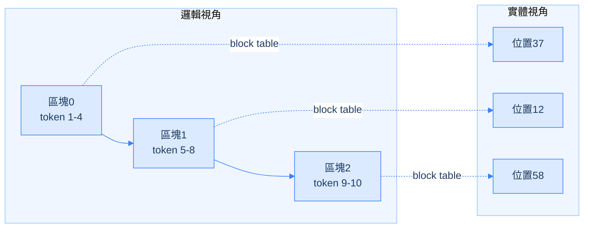

<!--more-->


- Agentic workload 的核心特徵：輸入長、輸出短，而且超過 96% 跟上一輪重複——這篇文章的每個優化手段，都是圍繞著這個特徵展開。
- 四個優化面向：KV Cache 統一分頁 + 分層卸載管理（Data Plane）、依模型架構挑選 DCP/PCP/DEP 平行化策略（Execution Plane）、排程化解隊首阻塞與 lockstep、兩階段 rate-matching 方法論算出 prefill/decode 機器配比。
- 最值得記住的，是三個「試過但沒達到預期」的失敗案例：PP 不適合熱的 agentic 輪次、DCP 沒辦法乾淨遷移到 DeepSeek V4、直覺的負載平衡策略輸給更簡單的 session-aware sticky routing。
- 文中「省下 14.6～106 倍成本」的數字方法論有所保留：拿自建硬體 TCO 比 API 零售價，兩者本質不同，技術內容本身才是真正值得學習的部分。


## 前言

2026 年 9 月，vLLM 團隊發布了一篇工程報告《vLLM x AgentX: Optimizing for Real-World Agentic Serving》，主題是「怎麼把推論服務系統，調校成適合 agentic workload(像 Claude Code 這種多輪、長 context、高重複率的應用)這種新流量型態」。這不是一篇研究論文，原創性不在提出新演算法，而在把分頁記憶體、對稱記憶體通訊、rate-matching 容量規劃這些已知的分散式系統技巧，系統性地套用到這種新興流量上，並用第三方 benchmark(SemiAnalysis 的 AgentX)驗證成果。

核心洞察其實只有一句話：agentic workload 的輸入很長、輸出很短，而且輸入裡有 96% 以上跟上一輪一模一樣。這篇文章從 KV cache 管理、平行化策略選擇、排程、到 prefill/decode 機器配比，每一個優化手段都是圍繞這個特徵展開的。

這類基礎設施層級的優化，補的正是應用層路由做不到的那塊——像 [AgentOpt](../agentopt/) 這樣的框架，管的是「不同角色之間該用哪個模型」；這篇文章談的完全是另一層，管的是「同一個模型，怎麼把 serving engine 本身的算力用好」，兩者互補，不衝突。

這篇筆記會依序講四件事：vLLM 怎麼管理 KV cache(Data Plane)、怎麼在不同模型架構下選平行化策略(Execution Plane)、怎麼排程避免請求互相卡住，以及怎麼算出 prefill 跟 decode 該配置多少機器。最後會花一整節講三個「試過但沒有達到預期」的失敗案例——這是原文最誠實、也最有遷移價值的部分，大部分技術文章只講有效的方法，這篇罕見地把判斷失準的地方也攤開來講。文章最後也會整理出一批脫離這篇文章、脫離 LLM serving 本身都還成立的通用心法。

在進入細節之前，有一點要先說清楚：文中最顯眼的「省下 14.6～106 倍成本」這個數字，方法論有所保留。它是拿「自建硬體的總持有成本(TCO)」去跟「Opus 5 的 API 零售價」比，但這兩者本質不同——零售價裡包含模型研發、服務維運、利潤，不只是硬體算力。這有點像拿「自己煮飯的食材成本」去跟「餐廳菜單價」比，倍數本來就會很大，不完全是這篇文章優化手段的功勞。技術內容本身是紮實、可驗證的，真正值得學習的是裡面的通用系統設計模式，這些概念的價值遠超過這篇文章本身或任何特定模型版本。

## 背景知識：Prefill 與 Decode

要理解後面所有優化手段，得先弄懂大型語言模型處理一次對話，分成哪兩個階段。

**Prefill(預填)**：模型一次讀完使用者輸入的所有文字(問題、之前的對話紀錄)，把它們轉換成內部的數學表示。這一步可以平行處理，因為每個字之間的計算彼此獨立，GPU 可以把「每個字跟其他所有字的關係」一次全部算完。

**Decode(解碼)**：模型一個字一個字地生成回答。每生成一個字，都要回頭看前面所有已經處理過的內容，包含輸入跟已生成的部分。這一步天生只能一步一步做，沒辦法平行，因為第 N+1 個字必須先知道第 N 個字才能決定。

用一個具體例子說明。假設輸入「今天天氣如何」被拆成 6 個 token：

```
Prefill:一次把 6 個 token 的關係全部算完(1 步)

Decode(假設答案是 5 個字):
  第1步:看 6 個 token -> 產生「今」
  第2步:看 7 個 token(6+已生成的1個) -> 產生「天」
  第3步:看 8 個 token -> 產生「很」
  ...(共5步)
```

Decode 每一步都要重新看一遍前面所有內容，而這個「看」的動作背後，靠的是把算過的中間結果(稱為 K 跟 V，即 Key 和 Value)存起來，避免重算，這份存起來的東西就是 **KV cache**。Context 越長，decode 每一步要回頭看的東西越多，速度就越慢。這篇文章幾乎所有優化手段，都是圍繞「怎麼有效管理 KV cache」跟「怎麼加速 decode」展開的。

## Agentic Workload 為什麼難伺服：四個特徵與三個挑戰

根據 SemiAnalysis AgentX benchmark 的觀察，agentic workload 有四個明顯特徵：

1. **長、多輪對話**：中位數 43 輪。一個 agent 任務(例如「修這個 bug」)平均要跟模型來回 43 次才能完成。
2. **輸入長、輸出短**：輸入中位數 14.2 萬 token，輸出中位數只有 444 token。每一輪要送進去的內容(累積對話紀錄加上工具結果)非常龐大，但模型每次回覆很短。
3. **極高的 prefix 重用率**：prefix cache 命中率超過 96%。因為 agentic session 的每一輪，都是把上一輪的全部內容加上新的工具結果送進模型，絕大部分內容跟上一輪一模一樣。
4. **大量 subagent 分岔**：44% 的任務至少包含一個 subagent(一個 agent 派工作給另一個獨立 agent 去做子任務)，平均每個有 subagent 的任務會派出 4 個 subagent。Subagent 通常會從主 agent 目前的 context 分岔出去，一開始就繼承一大段已經算過的內容。

這四個特徵直接衍生出三個工程挑戰：

| 特徵 | 衍生的挑戰 |
| --- | --- |
| 高 prefix 重用率 | **Prefix cache 壓力**：GPU 記憶體有限，同時服務很多長對話，勢必要在「留著等下一輪用」跟「搬到其他地方存放」之間取捨 |
| 長輸入 + 短回覆的速度要求 | **執行效率**：單位時間要處理的計算量變大，需要調整平行化策略、kernel、排程去適應這種新的請求形狀 |
| 長度差異大 + 會分岔 | **找到對的 P/D 配比**：context 長度跟 cache 命中率因 session、subagent 差異很大，加上會隨併發量變動，很難找到一個固定的 prefill/decode 機器配比 |

這三個挑戰，分別對應文章接下來三大節的解法：Data Plane(KV cache 管理)解決第一個、Execution Plane(平行化與排程)解決第二個、P/D 配比方法論解決第三個。

## Data Plane：KV Cache 管理

### 為什麼需要「分頁」記憶體管理

現代模型常常混用三種注意力機制，它們的 KV cache 大小跟生命週期完全不同：

- **Full attention**：回頭看全部之前的內容，KV cache 只增不減，隨對話長度一直長大。
- **Sliding-window attention**：只看最近一段固定範圍，超出範圍的區塊可以立刻回收。
- **Linear / recurrent attention**：不是一直增加新區塊，而是把之前所有內容壓縮成一個固定大小的摘要狀態，反覆被覆寫更新。

如果每種類型都各自切一塊記憶體專用，某一塊常常閒置浪費，另一塊卻不夠用，因為三者實際需要多少空間，會隨對話長度、並發量動態變化，沒有固定答案。

### vLLM 的解法：統一分頁 + 共用池

vLLM 的做法直接借用作業系統的虛擬記憶體分頁(virtual memory paging)概念——這也是 vLLM 最初的論文取名 PagedAttention 的由來。核心資料結構是 **block table(區塊對照表)**：下圖左側是單一對話自己看到的邏輯順序，右側是這些區塊在 GPU 記憶體裡實際、可以不連續的實體位置，中間靠 block table 對應起來。



不管是哪一種 attention，都用同一種「頁」大小存資料，而且共用同一個區塊池。誰需要，就從共用池裡動態借用，不需要事先切好「這一區永遠留給 full attention」。這代表 sliding-window 提早回收的區塊，可以立刻被 full attention 或別的使用者拿去重新利用，不會被鎖死。

更關鍵的是 **引用計數(reference counting)+ 寫入時複製(copy-on-write)**：如果兩個對話的前面一段內容完全相同，例如 subagent 繼承主 agent 已完成輪次的 context，它們的 block table 可以指向同一批實體區塊，不用複製——這正是 prefix cache 重用的底層機制。系統在每個實體區塊上記一個「目前有幾個對話在用」的計數，只有真的需要修改共用內容時，才臨時複製一份出來單獨改。這套引用計數加 COW 是作業系統管理記憶體的經典手法，不是這篇文章或 vLLM 發明的，但套用在 agentic workload 上特別划算，因為前面提到的 subagent 分岔，本質上就是大量「前段完全相同」的對話。

原文有一個具體案例：DeepSeek V4 原本的 KV cache 做法，把不同種類的快取拆成 3 種尺寸桶，配置 92 個獨立儲存區塊，碎片化嚴重，在 P/D 傳輸跟 offloading 時效率很差(原文 Figure 5 是一張 DeepSeek V4 KV cache 碎片化前後對照圖)。新做法把這 92 個分散區塊合併成同一塊連續儲存空間，減少描述符跟 P/D 傳輸開銷，搭配 FP4 indexer 開啟時能進一步縮小最小分配單位，約省下 10% 的 KV cache 記憶體用量。

> 🔍 **深入問答：KV cache 都有了，為什麼還需要額外存 snapshot？**
>
> 關鍵在於不是所有 attention 類型的 KV cache 都「自然保留歷史」。Full attention 的區塊只增不減——第 1 輪存的區塊，第 5 輪時還在原地沒被動過，任何過去的時間點，對照 block table 就能直接找到，完全不需要額外快照。但 linear state 跟 sliding-window cache 是會被覆寫或淘汰的活動狀態：linear state 每來一個新 token 就整個被更新成新版本，舊版本消失；sliding-window 則是超出視窗範圍的區塊直接被踢出去回收。
>
> 如果之後想回到某個過去的時間點重新利用，但那個時間點的 linear 狀態早就被覆寫、或 sliding-window 的區塊早就被踢掉了，就會找不回來。Snapshot 要解決的不是「重複存同一份東西」，而是幫這種天生會被覆寫、淘汰的東西，在特定時間點額外備份一份，好讓未來還找得回來。全域來說沒有浪費，只有 linear/sliding-window 這兩種需要，full attention 完全不用，因為它自己的結構已經處理好這件事了。
>
> (原文沒有明確講快照本身具體存在哪一層記憶體——GPU、CPU RAM 還是硬碟。合理推測是被納入下一段講的分層共用池統一管理，但這只是推論，原文沒有明講。)

### 分層卸載：GPU 記憶體之外的儲存

即使有共用池，GPU 記憶體容量還是有限。vLLM 整合了 **Mooncake Store** 作為分散式 KV cache pool，把不會馬上用到、但之後可能重用的 KV cache，搬到 GPU 之外(CPU 記憶體、甚至硬碟)暫存，需要時再搬回來：

```
GPU 記憶體(最快,最貴,容量最小)
    ↓
CPU 記憶體(較慢,容量大很多)
    ↓
硬碟(最慢,容量最大,最便宜)
```

做法是啟動一個獨立的 Mooncake client 常駐每台機器，專門管理這個更大範圍的儲存池，GPU 機器只需要發請求要資料，不用自己管理儲存細節。

### 兩個互補的保留策略

決定「什麼時候該存快照」用兩個策略疊加：

1. **Interval-based retention**：每一輪(對應每一次模型生成，不論是 tool call 或最終回應)結束時自動存一份快照。這個策略覆蓋「輪次結尾」這種可預期、機率高的重用點。
2. **Marconi-style selective retention**：當系統偵測到「這段 prefix 之前已經出現過一次」時才觸發存快照。如果原本的狀態已經被覆寫，就重新計算一次再存下來。這個策略補上「輪次進行到一半、還沒跑完就需要重用」的情況，例如同一輪生成中途觸發多個平行 subagent 或 tool call，分岔點落在輪次中間，interval-based 沒有為它存快照。

兩者合起來，兼顧高命中率又不會每個位置都存、浪費空間。原文提到這套組合策略的技術細節，在 vLLM 的 Kimi K3 部落格文章裡有更深入說明。

## Execution Plane：平行化策略怎麼選

這一節分三段講，先講平行化的基礎知識，再看 Kimi K3、DeepSeek V4 兩個模型分別怎麼選。

### 上：為何需要平行化、五種基礎策略、MLA 機制

#### 為什麼一個模型需要多張 GPU

原因有兩個，對應不同的解法。第一，模型太大，一張 GPU 裝不下——參數量超過一張 GPU 的記憶體容量，不拆不行。第二，就算裝得下，想要更快的處理速度或更高的並發量——把計算工作分散到多張 GPU 同時做。

#### 五種基礎平行化策略

| 策略 | 切的是什麼 | 解決哪個理由 | 通訊敏感度 | 典型範圍 |
| --- | --- | --- | --- | --- |
| TP(Tensor Parallelism) | 矩陣(層內部，照「頭」切) | 裝不下 + 想更快 | 極高(需 NVLink) | 同機箱內少數 GPU |
| PP(Pipeline Parallelism) | 層(層與層之間) | 裝不下 | 低 | 可跨機箱/機器 |
| EP(Expert Parallelism) | 專家(MoE 路由) | 裝不下 + 想更快 | 中～高(all-to-all) | 依模型規模而定 |
| CP(Context Parallelism) | 輸入序列長度 | 想更快(長 context) | 中 | 依實作而定 |
| DP(Data Parallelism) | 不切模型，切「請求」——每張 GPU 放一份完整模型，各自獨立處理不同請求 | 想更快(吞吐量) | 最低(理論上不用溝通) | 不限 |

**TP 的核心邏輯**：把矩陣運算切成好幾直條，每張 GPU 各算一直條，算完合併(all-reduce)。合併動作需要 GPU 間高速互連，速度從快到慢依序是 NVLink(同機箱內，可達每秒數百 GB)、PCIe(同機箱內共用通道，較慢)、InfiniBand 或高速乙太網路(跨機器，更慢)。距離越遠，速度越慢，所以 TP 幾乎只能限制在同機箱少數 GPU。

**PP 的核心邏輯**：把模型整層整層分給不同 GPU，不像 TP 撕開層的內部。優點是 GPU 之間只需要在層與層交界處傳遞一次結果，不像 TP 每層都要 all-reduce，通訊要求低很多，可以跨機箱、跨機器使用。缺點是 **bubble(氣泡)問題**：如果只丟一筆資料進管線，任何時刻只有一張 GPU 真正在工作，其他都在空等。解法是連續灌入多筆小份資料，讓多個 stage 同時都有事做，只有管線頭尾會有 bubble。

**EP 的核心邏輯**：MoE(混合專家)模型不是每次都動用全部參數，而是用一個路由器幫每個 token 挑選一小部分「專家」(通常是總數裡的一小部分，如 8 選 2)。EP 把不同的專家分散存放到不同 GPU 上。因為路由是逐 token 動態決定的，需要靠 **all-to-all(全對全)通訊**：先 dispatch(把 token 送到目標專家所在的 GPU)，各自算完後再 combine(結果送回原本負責這個 token 的地方)。這帶來一個副作用：如果路由器剛好把很多 token 導向同一個專家，那張 GPU 的工作量會暴增，其他 GPU 卻在等它。

#### MLA(Multi-head Latent Attention)是什麼、為什麼讓 TP 沒效率

標準 attention 做法裡，模型內部有好幾個獨立的「頭」，各自存一份完整的 K、V。**MLA 不讓每個頭各自存一份，而是把所有頭需要的資訊先壓縮成一份小很多的「潛在表示」\(c\)，只存這一份**，需要用時再從這份壓縮版還原出各頭要的東西。好處是 KV cache 佔用空間大幅縮小。

但這正是它跟 TP「八字不合」的原因。TP 的邏輯是把矩陣切成好幾直條，分給不同 GPU 各自處理一部分，但 MLA 只有一份潛在表示，沒有好幾個頭可以分。TP 遇到 MLA，實際上會把這份唯一的潛在快取**複製**給每一張 GPU 各留一份完整副本，而不是切開分著存——這代表用了好幾張 GPU 做 TP，但沒有省到任何 KV cache 記憶體空間。

> 🔍 **追問：MLA 怎麼把多頭壓縮成一份、又怎麼還原？**
>
> **壓縮：** 用一個降維矩陣 \(W_{down}\)，直接從原始輸入 \(h\) 投影到一個小很多的空間，得到壓縮向量
>
> $$c = W_{down} \times h$$
>
> 這一步是「多份變一份」的關鍵——不是把 8 個頭的 K、V 個別算出來再壓縮，而是一次投影得到唯一的 \(c\)。
>
> **還原：** 不同的頭，用不同的「還原矩陣」\(W_{up,i}\) 去看同一個 \(c\)：
>
> $$K_i = W_{up,i} \times c$$
>
> 因為每個頭的還原矩陣是訓練過程各自學出來的、彼此不同，同一份 \(c\) 透過不同矩陣相乘，可以讀出不同角度的細節，類似同一份壓縮摘要，透過不同「濾鏡」看出不同重點。
>
> **關鍵細節：矩陣吸收(matrix absorption)。** 實務上並不會真的先把 \(c\) 還原成完整大小的 \(K\)，再拿 query 去做內積，那樣還是要做全部的計算量，沒有省到東西。因為 \(W_{up}\) 跟 query 的投影矩陣 \(W_q\) 都是訓練後固定不變的，數學上可以把 \(W_{up}\) 預先合併進 \(W_q\) 裡，只需要算一次，不是每個 token 都重算。這樣每個頭可以直接用「吸收後的矩陣」把 \(h\) 投影成能直接跟壓縮版 \(c\) 做內積的 \(q'\)，全程不需要把 \(c\) 還原成完整大小的 \(K\)。
>
> 那如果每張 GPU 都存一份完整的 \(c\)，是不是要在自己的 GPU 上先還原回多份再挑自己要的那份？不是。每張 GPU 直接用矩陣吸收技巧，只對自己被分配到的那幾個頭的還原矩陣做運算，一步到位算出自己要的結果，從來沒有把其他頭的版本攤開過。

> 🔍 **這裡還有一個常被問到的問題：MLA 真的有省算力嗎？省在哪裡？**
>
> 乍看之下，MLA 的「\(h \to c \to\) 跟 query 的內積」流程，運算步驟數量似乎跟標準做法差不多。但真正的節省藏在一個容易被忽略的地方：decode 每一步，新 token 的 query 不是只跟「自己」的 K 做一次內積，而是要跟前面所有歷史位置逐一做內積。
>
> 關鍵不在「內積次數」——兩種做法都要做同樣多次——而在**每一次內積要從記憶體搬運的資料量**。標準做法裡，8 個頭各自有獨立的 \(k_i\)，8 個頭就要從記憶體讀 8 份不同的資料；MLA 裡，\(c_i\) 是全部 8 個頭共用的，做完第 1 個頭的內積後，第 2~8 個頭可以重複使用同一份已經讀進來的 \(c_i\)，不需要再重新搬運。
>
> 用具體數字說明差距(示意數字，非文章原文精確值)：假設 8 個頭、每頭 K 維度 16、MLA 壓縮後 \(c\) 維度 32、快取了 1000 個位置：
>
> ```
> 標準做法要搬運的資料量:8頭 × 1000位置 × 16維 × 2bytes ≈ 256,000 bytes(還沒算V)
> MLA做法要搬運的資料量:1000位置 × 32維 × 2bytes ≈ 64,000 bytes(不用乘以8,因為8頭共用同一份c)
> ```
>
> 差距約 4 倍(DeepSeek 實際論文的壓縮比更大)。這也呼應原文明講的一句話：「MLA attention is memory-bound」，decode 階段的瓶頸不是 GPU 計算能力不夠，而是「把資料從記憶體搬到計算單元」的速度跟不上。Context 越長，attention 佔每一步 decode 的比例越重，正是因為要跟越來越多歷史位置比對，要搬的資料量跟著線性增加。

### 中：Kimi K3 的 DCP 選擇與 DEP 轉折

Kimi K3 用 MLA 加上 Kimi Delta Attention(KDA)。前面講過 TP 用在 MLA 上等於複製而非分攤，vLLM 找到的替代方案是 **DCP(Decode Context Parallelism)**。

#### DCP 的切法：照「序列位置」切，不照「頭」切

標準 TP 想切「頭」這個維度，但 MLA 下這個維度沒東西可切，只有一份共用的 \(c\)。DCP 換一個維度：把累積的 KV cache，依照 token 的序列位置切開，每張 GPU 只存整體的 1/N。例如 context 累積 1000 個位置，DCP 切成 4 份，GPU1 存 token 1\~250、GPU2 存 251\~500，依此類推，每張 GPU 真正只存 1/4，不像 TP 那樣 4 張都存一模一樣的完整版。

DCP 帶來兩個好處(原文 Figure 6 顯示 DCP8 相較 TP8，decode 延遲更低、能撐到更高並發量)：更低的 decode 延遲，因為切分後每張 GPU 要處理的量變少；更高的吞吐量跟 KV 容量，因為不用複製整份 KV cache，GPU 能同時容納更多在跑的序列。

> 🔍 **深入問答：DCP 底下，每張 GPU 是不是要看過所有其他 GPU 的資料？**
>
> 是的，但不是「越後面的 GPU 要看越多份」這種階梯式關係，而是每張 GPU 都平等地、同時各自算一部分，再合併：
>
> 1. 新 token 的 query 被廣播(broadcast)給組內所有 GPU，每張都收到一份一模一樣的 query。
> 2. 每張 GPU 只用自己手上那一段 \(c\)，跟這份 query 做內積，算出自己那一段的部分結果——這一步彼此獨立、平行進行，不用互相等待。
> 3. 因為 softmax 的分母(正規化用的總和)需要看過全部歷史位置的分數才能算，單一 GPU 沒辦法自己算出最終機率，所以需要一個合併步驟，把 4 份部分結果湊起來。
>
> 這正是原文提到的 **online softmax** 在解決的問題。

> 🔍 **順著這個問題往下追：Online softmax 到底在幹嘛？**
>
> 最直覺的理解方式：把它想成「分散式加權平均」。假設有 4 筆資料，每筆有權重跟內容值，分散在兩台機器上：
>
> ```
> 機器A拿到位置1、2:權重=1,3  內容值=10,20
> 機器B拿到位置3、4:權重=2,4  內容值=30,40
>
> 機器A交出兩個數字:加權總和=1×10+3×20=70  權重總和=1+3=4
> 機器B交出兩個數字:加權總和=2×30+4×40=220 權重總和=2+4=6
>
> 合併:總加權總和=70+220=290  總權重總和=4+6=10
> 最終加權平均=290/10=29  <- 跟「全部集中算」的結果一模一樣
> ```
>
> 每台機器各自算「加權總和」跟「權重總和」這兩個部分數字，最後把所有機器的這兩個數字分別相加，再除一次，答案就跟一次全部算完完全相同，不需要任何機器看過別人的原始資料。
>
> 在 attention 裡，「權重」就是這個位置的注意力分數取指數，「內容值」就是這個位置存的 value：
>
> $$\text{output} = \frac{\sum_i \exp(\text{score}_i) \times \text{value}_i}{\sum_i \exp(\text{score}_i)}$$
>
> 每個 GPU(rank)交出「局部加權總和」跟「局部權重總和」，合併時加總、相除，結果跟一次處理全部位置完全一致。原文一句「each rank locally merges the results with online softmax」講的就是這件事。
>
> 工程上還有一個數值安全性的細節：因為指數運算算大數字容易溢位，每個 GPU 會先減掉自己看過的局部最大值再取指數，合併時再用局部最大值跟全域最大值的差，算出一個校正係數把各自的結果調整到同一個尺度再加總。這是獨立於核心邏輯之外的工程技巧，不影響上面「分散算加權平均」的本質。

#### vLLM 對 DCP 通訊路徑的優化

每個 decode 步驟、每一層都要做一次合併，通訊成本會被反覆放大。vLLM 用 **symmetric memory(對稱記憶體)** 取代標準的 NCCL 通訊：讓多張 GPU 事先約定好彼此要用的記憶體位置，任何一張 GPU 可以直接讀寫另一張的特定位置，不用每次都走「請求、確認、傳輸」的完整協定流程。Query 直接 multicast 寫進約定好的緩衝區，每張 GPU 算完後也直接把局部結果寫進對方接收位置，並把「廣播、計算、寫入、合併」整串動作融合進同一個 kernel 執行。效果是相較預設 DCP8 實作，每層延遲降低約 13%(原文 Figure 7 對照 MLA decode path 在 DCP4 使用 symmetric memory 前後，把 NCCL all-gather、staging copy、all-to-all、unpack 幾個步驟融合進單一 kernel)。

> 🔍 **Symmetric memory 跟 NVLink 差在哪？能不能廣泛應用？這個問題常被搞混，值得花一段釐清。**
>
> 兩者不是同一層次，不能二選一比較。**NVLink 是硬體**，GPU 之間實體的高速連線。**Symmetric memory 是軟體、程式設計模型**，一種讓你可以直接讀寫另一張 GPU 記憶體的寫法，不用透過 NCCL 那套標準協定。它需要靠 NVLink(或其他實體連接)才能真正傳輸資料，是「怎麼有效利用」那條線的聰明方式，不是取代它。
>
> 這是業界相對成熟、通用的技術方向，不是 vLLM 專屬發明——例如 Nvidia 官方的 **NVSHMEM** 函式庫、PyTorch 的 **SymmetricMemory API**，都是同類技術，常見於 MoE 的 all-to-all 通訊等場景。適合套用的判斷原則：通訊模式固定、可預期，且發生頻率高，值得花力氣優化掉固定啟動成本時適用；通訊模式不固定、發生頻率低，或團隊想要簡單好維護時，標準 NCCL 仍是更好的選擇。

#### 規模變大後：DEP 反而勝過 DCP

在 NVL72-class 這種大規模、跨多節點的系統上，wide EP 搭配 data parallelism(**DEP**)反而能比 DCP 撐到更高吞吐量、同樣的延遲 SLO(Service Level Objective，服務等級目標，系統承諾要達到的延遲上限)下表現更好(原文 Figure 8 顯示，對 Kimi K3 而言，wide EP 的 DEP16 在每個 rank 的批次量超過 3 之後，擴展性優於 DCP8)。原因是更大規模、跨節點的 DCP，「切分 attention 帶來的通訊成本」會超過「省下來的計算量」。DCP 切得越細，online softmax 合併時要打交道的 GPU 數量越多，通訊複雜度跟著上升，規模一旦跨出同機箱，合併動作還要透過更慢的 InfiniBand 完成，代價更高。

> 🔍 **深入問答：DEP = DP + EP，具體怎麼運作？**
>
> DEP 的核心是讓每個序列完整留在一張 GPU 上做 attention(這是 DP 的部分)，同一批 GPU 同時共同持有全部 MoE 專家(這是 EP 的部分)：
>
> ```
> 角色1(DP身分,負責attention):
>   GPU1顧序列A、B(獨立算,不用跟人溝通)
>   GPU2顧序列C、D(獨立算,不用跟人溝通)
>
> 角色2(EP身分,負責MoE):
>   GPU1存專家1、2
>   GPU2存專家3、4
> ```
>
> 因為每個序列從頭到尾只待在一張 GPU 上，attention 完全不需要跨 GPU 溝通，不像 DCP 序列的 KV cache 被切開分散在多張 GPU。但這批 GPU 同時也共同持有全部專家，當某個 token 被路由到「不在自己這張 GPU」的專家時，一樣要觸發 dispatch/combine 的 all-to-all 通訊——DCP 跟 DEP 的 MoE 通訊成本是一樣的，兩者逃不掉；差別只在於 DCP 多背了一份「attention 也要跨 GPU 溝通」的成本，而且這份成本會隨規模擴大持續上升，DEP 從頭到尾都沒有這份成本。
>
> 有一點值得澄清：DCP 不是「CP + 某個東西」的組合技，它本質上就是 CP 本身，只是套用在 decode 階段、切的對象是 KV cache(D 代表 Decode)。相對地，下一節會提到的 PCP 是 CP 套用在 prefill 階段、切的對象是新進的 prompt。DEP 的命名邏輯才是真正的「兩種平行化疊加」(DP + EP)，跟 DCP、PCP 不一樣。

### 下：DeepSeek V4 的挑戰與 PCP/DEP 方案

DeepSeek V4 同樣是 MLA-style KV cache，TP 一樣會複製而不分攤。更麻煩的是，它的**壓縮稀疏注意力(compressed sparse attention)**讓 TP 照頭切這件事更不划算，原文列出三個原因。

#### 背景：什麼是稀疏注意力

標準 attention 要跟全部歷史位置比對；稀疏注意力的想法是大部分歷史位置其實跟目前 token 關係不大，只挑最相關的一小部分(top-k)來看就好，省下大量原本花在不相關位置上的計算跟資料搬運。要做到這個篩選，需要額外的 compressor(壓縮器)跟 indexer(索引器)兩個元件。

#### 三個讓 TP 更不划算的原因

1. **Compressor 只吐一份共用結果**：對每一個被壓縮的位置，只產生「一份共用」的 KV 表示，不是每個頭各自獨立的版本，跟 MLA 讓 TP 變成複製的病灶完全相同，每張 GPU 被迫重複做一次一模一樣的 compressor 計算。
2. **Indexer 雖有 64 個頭，但只吐一份全域 top-k 選擇**：Indexer 內部有 64 個頭各自評分，但合併後只產生一份全域的 top-k 名單。TP 沒有「64 份各自獨立」的東西可分，每張 GPU 還是得把整個 64 頭的計算重跑一遍。
3. **真正貴的部分，是掃描、抓取被選中的 KV 項目，跟「頭」無關**：稀疏 MLA 的計算量主要被「掃描、抓取 top-k 選中的 KV cache 項目」這個 memory-bound 動作主宰，不是被 attention 本身的數學運算主宰。TP 只能切到「頭部運算」這個相對次要的部分，切不到真正貴的地方。

#### 解法：PCP 給長 prefill，DEP 當預設

**PCP(Prefill Context Parallelism)** 切的是新進的 prompt 序列位置(query 這個維度)，用在 prefill 階段。因為每張 GPU 分到的是完整的一小段 token，compressor、indexer、稀疏 MLA 的所有頭運算都能在自己這張 GPU 內部一次做完，不需要跨 GPU 湊齊——這巧妙避開了前面三個原因的病灶，它們的根源是「照頭切」，PCP 根本不照頭切，而是照序列位置切。

具體效能：32K 長度的 prompt，PCP8 比 TP8，prefill 速度快 2.65 倍，大幅降低 **TTFT(Time To First Token，使用者從送出請求到看到第一個字出現的等待時間)**。但 PCP 仍然會在每張 GPU 上複製一份完整的 decode 端狀態，沒有省到任何 decode 記憶體，這代表 PCP 只解決 prefill 階段的效率問題，最適合部署在「專門處理 prefill、不管 decode」的獨立機器群。

DCP 在 DeepSeek V4 上，效果不如它在 Kimi K3 上好，具體原因留到後面「Bitter Lessons」一節細講。最終，**DEP 是 DeepSeek V4 大部分配置下的預設**，跟 Kimi K3 的 DEP 是完全相同的機制，不用重新學一次。

> 🔍 **一個常見的誤解：DeepSeek V4 是不是全部用 DEP，不用考慮其他方法？**
>
> 不是。原文原句是「DEP 是大部分配置的預設」，不是「唯一」。長 prefill 場景、專門的 prefill 機器，PCP 仍然是更好的選擇。這正好對應下一節要講的 P/D disaggregation(把 prefill、decode 拆給不同機器群)：如果把兩者拆成不同機器群，專門處理長 prefill 的那群機器可以選用 PCP，處理 decode 的那群機器用 DEP，兩者不衝突。
>
> 附帶一提，原文對 Kimi K3 的 prefill 階段該用什麼策略，其實完全沒有明確討論——原文對 Kimi K3 的討論全部聚焦在 decode 延遲上，這是一個真實的資訊空缺，不是這份筆記省略。

> 🔍 **對照一下：DCP 跟 PCP 到底差在哪？**
>
> |  | DCP | PCP |
> | --- | --- | --- |
> | 用在哪個階段 | Decode(每次只生成 1 個新 token) | Prefill(一次性處理一大段新輸入) |
> | 切的是什麼 | 已經存好的 KV cache(歷史記錄) | 新進來的 prompt 本身 |
> | 誰要看誰 | 1 個新 token 的 query，要看分散在各 GPU 上的歷史 | prompt 裡每個位置，只需要專心處理自己這一段 |
> | 合併頻率 | 每個 decode 步驟都要合併(online softmax) | 頻率低，一次性攤平(原文沒有像 DCP 那樣明講具體合併機制) |
> | 省不省 KV cache 記憶體 | 省(不用複製整份 KV cache) | 不省(decode 端狀態仍複製) |
>
> DCP 因為每一步都要付通訊成本，值得花大力氣優化(前面提到的 symmetric memory 那套)；PCP 的額外通訊成本相對容易被龐大的 prefill 計算量攤平，原文沒有像講 DCP 那樣深入展開合併細節。

#### 三層總結：從基礎積木到完整決策地圖

把整個平行化決策過程分三層看，能更清楚看出脈絡。第一層是基礎積木，就是前面提到的五種策略；第二層是這篇文章實際用到的應用場景版本：

| 名稱 | 本質(對照第一層) | 用在哪階段 | 解決什麼 |
| --- | --- | --- | --- |
| DCP | = CP 套用在 decode | Decode | MLA 下 TP 複製而不分攤的問題；省記憶體 + 降延遲，但每步要合併 |
| PCP | = CP 套用在 prefill | Prefill | compressor/indexer 切不了頭的問題；只降 prefill 延遲，不省 decode 記憶體 |
| DEP | = DP + EP 疊加 | 都可以 | 讓 attention 完全不用跨 GPU，只剩 MoE 的 all-to-all 要通訊 |

第三層是兩個模型各自完整的決策地圖：

```
【Kimi K3】
  TP(複製latent cache,效率差)
  -> DCP(真正分攤KV cache,中小規模最好)
  -> DEP(規模變大後反超,批次量>3時DEP16贏DCP8)

【DeepSeek V4】
  TP(三個原因都切不到真正貴的部分,效率更差)
  -> PCP(長prefill場景最好,32K prompt快2.65倍,但不省decode記憶體)
  -> DCP(因架構更複雜,效果不如K3,細節見Bitter Lessons)
  -> DEP(大部分配置的預設)
```

貫穿整個 Execution Plane 的一句話是：MLA、壓縮稀疏 attention 的核心設計，是把「多頭」壓縮成「少數幾份共用表示」，這正好是 TP「照頭切」這個假設的天敵。DCP、PCP、DEP 三種方案，本質上都是在想辦法換一個切的維度去繞開這個天敵，只是各自換的維度、適用的階段不一樣。

## 排程優化

### 背景：Chunked prefill(分塊 prefill)

如果一段輸入長達 5 萬 token，一次全部塞進一個處理步驟會耗時很長。分塊 prefill 把這段輸入拆成好幾塊，每個處理步驟只處理其中一塊，分好幾步驟處理完，避免一個超長請求獨佔太久的處理時間。

### 問題 1：Head-of-line blocking(隊首阻塞)

vLLM 預設用 FIFO(先進先出)排程：誰先排到隊伍前面，誰就先被持續服務直到完成，才輪到下一個。Agentic workload 是「頻繁短請求」混雜「偶爾出現的長 prefill」——如果一個長 prefill 排在隊伍最前面，把整個步驟的 token 額度佔滿，後面明明可以很快處理完的短請求只能乾等(原文 Figure 9 是一張 head-of-line blocking 示意圖：左側沒有 chunk 上限時，長 prefill 獨佔預算、短輪次等待；右側設 512-token 上限後，短輪次每步都能加入、更快開始 decode)。

解法是用 `--long-prefill-token-threshold` 限制單一請求每步驟最多能佔用多少 token 額度，原文舉例設為 512。長 prefill 每步只處理 512 個 token，剩餘額度留給短請求一起處理，短請求不用等長請求做完就能同批被排入。

效果與取捨：在 DeepSeek V4 Pro 上，TPGS(Total tokens per GPU-second，每 GPU 每秒處理的總 token 數)提升最多 93%，P90 互動性(所有請求中表現最差的前 10% 分界點的每秒輸出速度)改善約 2.3 倍。代價是長請求自己的 TTFT 會變長，因為要花更多步驟才處理完，特別在意長請求反應速度的場景，應該把上限設大一點。

> 🔍 **深入問答：Chunked prefill(時間軸)跟 PCP(空間軸)怎麼一起運作？**
>
> 這是兩個獨立維度的控制，原文沒有明講具體互動細節，以下是根據兩者定義的合理推論。排程器管的是時間軸：決定「這一步驟要處理多少 token」，從一個長請求裡切出一個 512-token 的 chunk，排入這一步驟。執行層管的是空間軸：決定「這一步驟排入的內容，怎麼分給多張 GPU」，PCP 把這 512 個 token 平均切給 8 張 GPU 各處理一部分。
>
> 下一個步驟，排程器再切出下一個 512-token chunk，PCP 再次把它分給 8 張 GPU。同一組 GPU 反覆處理連續的 chunk，直到整個長請求處理完，例如 5 萬 token 需要約 98 步。「其他 chunk 仍在 queue 中」指的是同一個請求裡還沒被排入任何步驟的那部分 token，不是 GPU 閒置——每個步驟，GPU 群組都在忙著處理當下被排入的 chunk。這也解釋了為什麼 chunking 跟 head-of-line blocking 修正可以跟 PCP 並存：因為每步只切出一小塊額度，同一步驟剩下的額度可以順便塞進其他短請求一起處理。

### 問題 2：DEP 底下，prefill 工作拖慢整個 lockstep 群組

**Lockstep(鎖步)** 是分散式系統裡的通用詞，泛指一群運算單位被強制用同一個節奏推進，任何一步都要等這一群全部完成，才能一起進入下一步，常見於需要「同步屏障」的場景。DEP 裡的 MoE all-to-all 通訊天生需要「所有參與者都到齊」才能完成，所以 lockstep 的根源是 all-to-all(或 all-reduce)這類通訊模式本身，不是「EP 一開始怎麼分配哪個 GPU 存哪些專家」這件事——分配方式只決定 token 要送去哪，不影響「要不要等全部人」。DP 是唯一的例外，因為 DP 讓每個序列完整留在一張 GPU、彼此完全不用溝通，天生不會 lockstep。

Decode 每一步只處理 1 個新 token，相對快；但 prefill 就算已被切成 chunk，要處理的 token 數量還是遠多於 decode 的 1 個，這一步本身花的時間比較長。由於 lockstep，如果某張 GPU 這一步剛好排到一個 prefill chunk，其他張已經做完 decode 的 GPU 必須乾等它，如果 prefill 隨機出現在不同步驟、不同 GPU，這個懲罰會被重複付很多次。

解法是用 `--prefill-schedule-interval` 設定，只允許每隔 N 個步驟才排入一次 prefill 工作，而且這個計數器在整組所有 DP ranks 之間對齊同步。這樣把所有 GPU 的 prefill 工作集中排在同一批步驟裡，其他步驟則全部留給 decode，讓純 decode 步驟真正發揮應有速度(原文 Figure 10 示意 DEP8 群組的 prefill 排程節奏對齊：左側 prefill 零散出現在不同步驟、反覆拖慢群組，右側 interval=4 讓 prefill 集中到同一批 cadence 步驟，其餘步驟純 decode)。

> 🔍 **這裡可以再追問一步：如果讓某些 GPU 專門做 prefill、某些專門做 decode，是不是能徹底避開 lockstep？**
>
> 是的，這正是 P/D disaggregation(下一節主題)背後的核心動機之一。排程節奏對齊是在「同一組 GPU 既做 prefill 又做 decode」的前提下，把拖累降到最低；而讓 prefill、decode 由不同機器群各自負責，同一組 GPU 內部就再也不會出現「有些做 prefill、有些做 decode」的混雜狀況，拖累問題直接從根源消失。

## P/D 配比方法論

### Rate-matching(速率匹配)

拆開 prefill、decode 機器群之後，不代表隨便加更多 GPU，整體效能就會自動變好。Prefill 那邊「產出新請求進入 decode 階段」的速度，跟 decode 那邊「能夠消化多少同時在跑的請求」的速度，要互相匹配——任何一邊配置不對，加再多 GPU 到已經足夠的那一邊，都是浪費。

### 兩階段方法論

**Phase 1：Saturation profiling(飽和度測試)。** 把 prefill、decode 完全拆開，各自獨立測試：試不同平行化策略(如 TP vs. wide EP)、不同機器規模(8、16、32 張 GPU)，在每種組合下持續增加併發量，直到吞吐量摸到飽和點。輸出一張飽和度對照表：每種「平行化策略 + 規模」組合，各自最多能撐住每秒幾個請求。分開測，才能拿到每一邊純粹、獨立的產能數字，不會混淆「整體吞吐量不夠」到底是 prefill 端撐不住還是 decode 端撐不住。

**Phase 2：P/D sweep(配比掃描)。** 從 Phase 1 的飽和點反推配比，再組成真實系統實測驗證。

> 🔍 **深入問答：P/D 配比怎麼算？哪邊產能高，該配置更多還是更少機器？**
>
> 用等式表達最不容易搞錯方向。假設 P 組 prefill、D 組 decode，單組飽和點分別是 \(\text{prefill\_rate}\)、\(\text{decode\_rate}\)，要讓兩邊速率匹配：
>
> $$P \times \text{prefill\_rate} = D \times \text{decode\_rate}$$
>
> 示意數字：若 prefill 單組(16 張 GPU)飽和點是每秒 28 個請求，decode 單組(16 張 GPU)飽和點是每秒 65 個請求，則
>
> $$P/D = \text{decode\_rate} / \text{prefill\_rate} = 65/28 \approx 2.3$$
>
> 代表 prefill 組數應該大約是 decode 組數的 2.3 倍。
>
> 這裡有個容易弄反的直覺：因為 decode 這邊單組產能本來就比較高，代表一組 decode 已經能消化超過兩組 prefill 送出來的量，所以需要配置的 decode 組數相對少，而 prefill 因為單組產能較低，需要用數量補上去。一句話：**產能越高的那一邊，反而需要配置越少的機器**——這一點在計算時很容易被直覺搞反(把「產能高」誤解為「需要更多機器去配合它」)，值得特別留意方向。
>
> 算出配比後，還要用 Phase 2 把 prefill、decode 機器群實際接起來組成完整系統，重新掃過不同併發量，量測 TTFT、互動性、吞吐量等指標的完整曲線。因為 Phase 1 算出的是飽和狀態下的極限值，但系統實際運作不一定總是跑在飽和點，配比也會隨併發量變動，需要用真實系統驗證，不能只憑理論算出的比例就直接上線。

## Bitter Lessons：三個失敗案例

這一節是原文最誠實、也最有遷移價值的部分。大部分技術文章只講有效的方法，這篇罕見地花一整節講「試過但沒有達到預期」的案例，揭露的往往是比成功案例更難得的判斷力。

### 案例 1：PP 不適合「熱」的 agentic 輪次

PP(含 chunked pipeline parallelism，CPP)在「長、全新的 prompt」上表現很好：大量全新運算足以餵飽每個 pipeline stage，吞吐量幾乎線性成長，通訊成本低。但大部分 agentic 輪次是「熱」的：系統提示詞、之前對話都已在 cache 裡，每個新請求只新增幾百到幾千 token，新增運算量太少，不足以填滿管線，bubble 吃掉了大部分潛在效益。這個教訓不是「PP 沒用」，而是 PP 適合冷、運算量大的 prefill，不該是熱、以 prefix 為主的 agentic 輪次的預設選項。

> 🔍 **容易被問到的反例：即使是短請求，湊很多個一起排不就能塞滿管線嗎？**
>
> 關鍵不在「管線每個 stage 有沒有事做」，而在**每一份微批次的實際運算量，相對「stage 間交接的固定通訊成本」，比例夠不夠大**。PP 每次把資料從一個 GPU 傳到下一個 GPU，這個交接動作本身有一份相對固定的成本，不會因為資料量變小就等比例縮小。
>
> 示意數字對比(展示比例關係，非原文實測值)：
>
> ```
> 情境A(冷、長prefill):
>   單一stage實際運算:10毫秒   交接固定成本:1毫秒
>   比例:交接只佔約9% -> 91%時間都在做有用的事,效率高
>
> 情境B(warm agentic turn,湊100個短請求成一批):
>   單一stage實際運算:1.5毫秒  交接固定成本:1毫秒
>   比例:交接佔約40% -> 大量時間花在沒有產出新結果的「交接」動作上
> ```
>
> 即使湊到 100 個短請求，滿足了「每個 stage 都有事做」，但因為每個請求本身帶來的運算量太小，交接成本佔比依然被放大，這才是原文「there is not enough fresh computation to fill the pipeline efficiently」真正的意思：不是沒有工作，而是工作量太小，划不來付出交接的固定成本。再加上 warm turn 的到達時機本身不規律(前面排程優化一節提過的問題)，持續穩定湊出夠大批次在實務上又更難。

### 案例 2：DCP 沒辦法乾淨地遷移到 DeepSeek V4

DCP 對 Kimi K3(以及 DeepSeek R1、Kimi K2.5/K2.7 這些「純 MLA」模型)效果很好。但 DeepSeek V4 的壓縮稀疏 attention，不是只有一份 KV cache 要切，而是包含 indexer、compressor、主要 attention 運算，三個子層要一起被切開、協調，通訊跟實作複雜度大幅上升。vLLM 團隊投入大量心力優化，讓通訊跟計算重疊、優化對應 kernel，但即使做了這些優化，DCP 最終也只是「打平」DEP，沒有超越它。

這個教訓呼應整個 Execution Plane 的核心原則：平行化策略必須跟著模型架構走，在一個 latent-attention 模型上成功的策略，不保證能套用到另一個模型上，即使兩者都用 MLA。

### 案例 3：負載平衡不保證效能更好

在大規模 DEP 部署裡，vLLM 團隊觀察到不同 rank 之間 KV cache 使用率明顯不均。直覺的解法：依照隊列深度、正在跑的 token 數量、或當下的 KV 使用率，把請求動態導向比較閒的 rank。結果這些負載平衡策略，實測全部輸給一個簡單得多的做法——「session-aware sticky routing」(依 session 黏著，盡量固定路由到同一台機器)。

根源在快取局部性(cache locality)：agentic session 輪次間隔常常很短，如果一個 session 的 prefix 還留在原本那張 GPU 上，把它硬導向另一張比較閒的 GPU，雖然帳面上讓隊列變得更平均，卻強迫系統把 KV cache 重新抓取搬到新的目標 GPU，即使是非同步進行、跟計算重疊，也不是免費的。抓取過來的資料會暫時佔用目標 rank 的 GPU KV cache 容量，讓這個 rank 能同時容納的並發請求數量反而變少，結果就是隊列雖然更平均，但整體能同時處理的請求數量卻下降。

精確的教訓是：對「輪次間隔短」這種 workload，保留 session 的局部性，比追求瞬間隊列的完美平衡更有價值。路由決策必須把「這台機器上已經有什麼資料」也算進去，不能只看隊列裡排了多少工作。

## 這篇文章留下的兩層收穫

### 有時效性的貢獻

這是一篇系統工程整合文章，不是研究突破。原創性主要在組合、調校已知的分散式系統技巧，套用到 agentic workload 這個新興流量型態，並用第三方 benchmark 驗證。以下這些具體數字，會隨硬體、模型版本更新過期，值得留意但不用死記：packed KV cache layout 省約 10% 記憶體、DCP 搭配 symmetric memory 優化每層延遲降低約 13%、head-of-line blocking 修正讓 TPGS 提升最多 93%、PCP 讓 32K prompt 的 prefill 加速 2.65 倍、相對 Opus 5 API 的成本優勢號稱 14.6～106 倍(前言已說明這個數字的方法論保留之處)。

### 脫離這篇文章、脫離 LLM serving 也成立的東西

真正該帶走的，是底下這幾類通用心法，它們的價值遠超過這篇文章本身。

**系統設計的通用模式。** 分頁記憶體管理(統一配置單位加共用池)：任何要同時管理多種生命週期、多種大小資源的系統，都能借用這個思路，不預先為每種類型切好專屬空間，統一成同一種基本單位放進共用池動態分配。雙策略疊加的保留機制(可預期邊界的 interval-based，加上補漏非規律重複的 selective retention)：通用的快取設計模式，任何需要決定「什麼時候該存快照」的系統都適用。Online softmax 的本質是分散式加權平均：局部算部分統計量、最後合併校正，適用於任何「先分散算、再合併求全域結果」的場景，遠不限於 attention。Symmetric memory vs. 標準集合通訊：通訊模式固定、頻繁發生時，值得用「預先約定的直接讀寫」取代「每次都走完整協定流程」。

**判斷框架。** 「多頭壓縮成單一共用表示」與「照頭切」天生互斥，這是這篇文章反覆出現的病灶根源，MLA、compressor、indexer 都是同一種病。遇到類似架構，判斷 TP 適不適用時，先問「這個結構，是不是把多頭的資訊壓縮成了少數共用的東西」。平行化策略必須跟著模型架構走，不能想當然爾遷移：DCP 在 Kimi K3 好用，不保證在 DeepSeek V4 一樣好用，即使兩者都用 MLA。Lockstep 的根源是「需要所有參與者到齊」的通訊模式(all-to-all、all-reduce)，DP 不受影響是因為它天生不需要跨 rank 溝通，這是判斷「什麼情況會被同步屏障拖累」的通用透鏡。Rate-matching 方法論——先分開測兩階段各自的飽和曲線，再組合實測驗證——任何多階段、異質資源的分散式系統做容量規劃都能套用，不限 P/D，計算配比時要記住產能越高的一邊反而需要配置越少機器，方向容易弄反。快取局部性優先於瞬時負載平衡：對請求間隔短、狀態有黏性的 workload，移動請求追求隊列平均往往得不償失，這個判斷框架超越 LLM serving，適用於任何有狀態的分散式服務。

**有價值的負面結果。** PP 不是沒用，而是效益取決於單次交接固定通訊成本相對實際運算量的比例，不是單純看有沒有資料可填。即使投入大量優化工程，DCP 在 DeepSeek V4 上也只能打平 DEP，無法超越，優化的天花板有時是架構本身決定的，不是工程努力能突破的。直覺上合理的負載平衡策略，實測全部輸給更簡單的 session-aware sticky routing，複雜策略不保證贏過簡單策略，要靠實測驗證，不能只憑直覺。

## 結論

這篇文章的核心主張，從頭到尾都繞著同一個特徵打轉：agentic workload 輸入長、輸出短、而且 96% 以上跟上一輪重複。vLLM 團隊圍繞這個特徵，在 KV cache 管理上用統一分頁加分層卸載換取更高的重用率；在平行化策略上，發現 MLA 跟壓縮稀疏 attention 都把多頭壓縮成共用表示，逼得團隊放棄 TP、改用 DCP、PCP、DEP 這些換一個維度切的方案；在排程上，用 chunk 上限跟節奏對齊化解 agentic 流量長短混雜帶來的隊首阻塞跟 lockstep；在機器配置上，用兩階段 rate-matching 方法論找出 prefill、decode 該配多少機器才不浪費。

比起這些具體技巧，更值得記住的是三個失敗案例揭露的判斷方式：平行化策略要跟著架構走、複雜策略不保證贏過簡單策略、優化的天花板有時是架構本身決定的。這些心法脫離這篇文章、脫離 LLM serving 都還成立，是這份工程報告最持久的價值。

這與 vLLM 團隊近期另一項工作——[Semantic Router](../vllm-semantic-router/) 的路由層優化——方向一致：兩者都在想辦法把「用最少算力伺服最多流量」這件事，做到更細緻。
