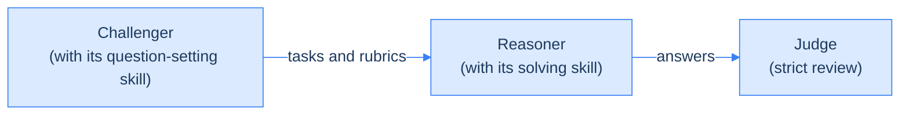
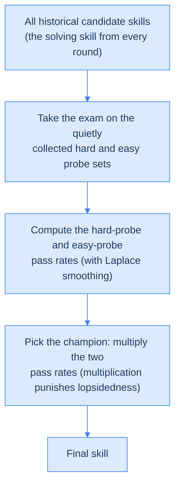

<!--more-->


1. **What it does**: Ctx2Skill has a question-setting Challenger and a problem-solving Reasoner play against each other, and condenses the hidden rules of a long text into a reusable natural-language skill file, with no human labels, no external feedback and no parameter updates.
2. **How well it works**: on CL-bench, GPT-4.1 rises from 11.1% to 16.5%, GPT-5.1 from 21.1% to 25.8%, and GPT-5.2 from 18.2% to 21.4%. Skills distilled by the stronger GPT-5.1 also lift GPT-4.1 to 16.1%.
3. **The finding worth remembering**: longer self-play does not mean a better skill. GPT-4.1's skills swell from 313.9 words in round 1 to 1704.1 words in round 5 while the solve rate slips from 15.9% to 14.7%. That is why a cross-time replay, which multiplies the hard-probe and easy-probe pass rates, is needed to pick the version that is not lopsided.
4. **Costs to weigh before you use it**: the self-play stage burns a lot of API tokens, and it only suits texts with explicit rules whose answers can be judged with binary rubrics.


## Introduction

Suppose you ask an engineer who has never touched a system to read several hundred pages of scattered architecture documents and then go fix a production bug. They will not remember every detail. What actually helps is a "Troubleshooting SOP" distilled from those documents.

That is exactly the situation of Context Learning for an LLM: at inference time the model must understand a long, never-seen text, whether a brand-new API doc, a custom board game's rules or a lab protocol in some domain, and induce the implicit rules and procedures in it before it can solve the task correctly.

The paper's method, Ctx2Skill, tries to generate that SOP automatically. Its positioning is clear: no parameter fine-tuning at all, purely at the inference layer. The extraction process needs no human-labeled answers, and has no external feedback (such as a compiler or a ground-truth answer) to lean on. Multiple agents play against each other and condense the text's implicit rules into a human-readable natural-language skill file, which can then be attached in front of any LLM and reused.



For AI software engineers, what makes this paper interesting is not only the numbers but the agentic-workflow design pattern it demonstrates: using a strong model offline to "distill" a structured prompt that online inference can reuse. Below we first lay out how hard the problem is and how Ctx2Skill attacks it, then unpack a few easily overlooked but crucial engineering safeguards, and finally check with the experiments whether those designs actually help. Related work on automatically growing agent skills includes [SkillOpt](../skillopt/), which treats a skill file as a trainable weight, [WikiSkill](../wikiskill/), which adds a wiki memory layer that is never rolled back, and [Resource2Skill](../resource2skill/), which distills a skill library from videos and code.

## Background: What Makes Context Learning Hard

To see why Ctx2Skill is designed the way it is, we first need the three core bottlenecks of applying natural-language skills to context learning.

### Hand-Written Skills Do Not Scale

Earlier work has shown that handing an LLM structured procedures (skills) at inference time clearly improves reasoning. The catch is that real-world context texts, such as technical manuals, regulations and lab protocols, are long, dense and highly domain-specific. Early skill-library approaches (such as SkillNet and Skillorchestra) rely on human experts reading the documents and writing skill descriptions by hand, which cannot keep up in time or cost when faced with thousands of new private documents.

### No External Feedback to Check Right From Wrong

If humans are too expensive, the intuitive next step is to let AI generate the skills. But the hardest part of automatic generation is "how do you verify that what was generated is correct?" The automatic skill-building frameworks that worked before (AutoSkill, SkillX, AutoRefine) succeeded because they operate in verifiable domains: code can be run through a compiler, and math answers can be checked against a ground truth.

Context learning is different. The model does pure semantic understanding and rule application over text, for example judging whether a board-game move is legal. There is no compiler and no ground truth, and without that kind of objective external feedback, the existing automatic skill-evolution pipelines simply stall.

### Self-Play Itself Is Risky: Adversarial Collapse

To create an internal feedback loop without external feedback, a common remedy is a self-play of "question-setter (Challenger) versus problem-solver (Reasoner)": the Challenger writes the questions and grades them, manufacturing a feedback signal artificially. But the mechanism has its own side effect. As the rounds go on, the Challenger, trying to break through the Reasoner's defenses, writes ever trickier and more extreme questions and gradually produces a pile of edge cases.

To cope with these odd questions, the Reasoner keeps stuffing targeted special-case patches into its skill library. The library bloats, which not only eats a lot of prompt tokens but, worse, makes the model prone to forgetting the most central, routine reasoning rules in the text, a kind of "catastrophic forgetting".


It is a bit like a math teacher who, to stump students, fills the final exam with obscure olympiad trap questions. To cope, students spend all their time memorizing special tricks and end up getting basic arithmetic wrong. The paper calls this phenomenon "Adversarial Collapse", and it is the core risk that Ctx2Skill's whole design has to confront.


## Ctx2Skill's Design: Five Roles in a Self-Play Game

Ctx2Skill's core idea fits in one sentence: let a pair of co-evolving AI agents, the question-setting Challenger and the problem-solving Reasoner, automatically distill reasoning skills for a specific text through self-play and text edits, with no human labels and no external feedback.



### Formalizing the Problem

A context-learning task has three ingredients:

- **Context (\(C\))**: a new, complex text, for example a board-game rulebook.
- **Tasks (\(T = \{t_j\}\))**: tasks that can only be answered by relying on \(C\).
- **Rubrics (\(\mathcal{R}_j = \{r_{j,k}\}\))**: a set of binary (pass or fail) grading criteria for task \(t_j\).

The goal is to produce a natural-language skill library \(S\) such that, when it is used as the prompt in front of the system, the answer \(a_j \sim \pi(\cdot \mid S, C, t_j)\) produced by model \(\pi\) passes every rubric:

$$\prod_k \mathbb{I}[r_{j,k}(a_j) = \text{pass}] = 1$$

At the start of the algorithm, the Reasoner's and the Challenger's skill libraries are both initialized to the empty set (\(S^R_0 \leftarrow \emptyset\), \(S^C_0 \leftarrow \emptyset\)), and two empty probe sets are created, \(Q^h\) (hard questions) and \(Q^e\) (easy questions). What they are for is explained in the cross-time replay section below.

### Five Agents With Distinct Jobs

In each iteration \(i\), five frozen-parameter LLM agents work together:

1. **Challenger (\(\pi_{\text{Challenger}}\))**: sets the questions. Given \(C\) and its current question-setting skill \(S^C_{i-1}\), it generates \(M\) tasks with matching binary rubrics.
2. **Reasoner (\(\pi_{\text{Reasoner}}\))**: solves them. Given \(C\), a task \(t_m\) and its current solving skill \(S^R_{i-1}\), it produces an answer \(a_m\).
3. **Judge (\(\pi_{\text{Judge}}\))**: grades. A neutral fixed model with no skills attached, it strictly decides whether \(a_m\) passes all the rubrics.
4. **Proposer (\(\pi_{\text{Proposer}}\), one for each side)**: diagnoses. It analyzes a batch of graded papers and outputs a high-level "skill revision proposal" in JSON.
5. **Generator (\(\pi_{\text{Generator}}\), one for each side)**: does the writing. It turns the diagnosis into a rigorously formatted, human-readable Markdown skill file (\(S^R_i\) or \(S^C_i\)).

## The Algorithm: What Happens in One Iteration

### The Forward Adversarial Loop: Set, Solve, Judge

#### Step 1: The Challenger Writes the Exam

$$\{(t_m, \mathcal{R}_m)\}_{m=1}^M \sim \pi_{\text{Challenger}}(\cdot \mid C, S^C_{i-1})$$

In plain words, the Challenger must set questions as \(S^C_{i-1}\) instructs, for example "add a word limit to the question and design a matching format-check rubric", which yields hard questions with multiple constraints.

#### Step 2: The Reasoner Answers

$$a_m \sim \pi_{\text{Reasoner}}(\cdot \mid C, S^R_{i-1}, t_m)$$

When solving, the Reasoner uses the steps in \(S^R_{i-1}\) (for example a pre-answer checklist) as guidance, making sure it does not miss rules or break format constraints.

#### Step 3: The Judge Grades Strictly

$$z_{m,k} = \mathbb{I}[r_{m,k}(a_m) = \text{pass}], \quad y_m = \prod_k z_{m,k}$$

This is an all-or-nothing judgment: if even one rubric fails (\(z_{m,k}=0\)), the whole task fails (\(y_m=0\)). That forces the Reasoner to show a very high level of attention to detail; being almost right does not count.

### The Backward Evolution Loop: Routing and Co-Evolution

#### Splitting the Papers

After the \(M\) tasks are judged, the system automatically splits them into two piles:

- The failed pile: \(\mathcal{F}_i = \{t_m \mid y_m = 0\}\)
- The solved pile: \(\mathcal{P}_i = \{t_m \mid y_m = 1\}\)

#### Reasoner: Patching the Holes

The failed tasks go to the Reasoner Proposer for diagnosis:

$$\text{Diagnosis}^R \sim \pi_{\text{Proposer}}^R(\cdot \mid \mathcal{F}_i, S^R_{i-1}, C)$$

The output is a JSON containing fields such as `action` (add or merge), `skill_name` and `proposed_skill` (the high-level idea). The Reasoner Generator then turns this diagnosis into a concrete new skill file:

$$S^R_i \sim \pi_{\text{Generator}}^R(\cdot \mid \text{Diagnosis}^R, S^R_{i-1})$$

#### Challenger: Finding New Tricks

So that the game does not lose tension once the Reasoner has learned the question types, the Challenger also upgrades itself from the solved cases \(\mathcal{P}_i\): it analyzes how the Reasoner cracked the tasks and uses that to find the loopholes in its own question-setting:

$$\text{Diagnosis}^C \sim \pi_{\text{Proposer}}^C(\cdot \mid \mathcal{P}_i, S^C_{i-1}, C), \qquad S^C_i \sim \pi_{\text{Generator}}^C(\cdot \mid \text{Diagnosis}^C, S^C_{i-1})$$


The Proposer/Generator split is really a "doctor examines, pharmacist dispenses" division of labor. If you ask a single LLM to look at failure cases and edit a Markdown skill file directly, it often has to handle two things at once, "where is the logic wrong" and "the format must be precise", and tends to drop one of them. The Proposer only reads the case history (the trace) and writes the diagnosis (JSON) without worrying about how to lay out Markdown; the Generator focuses on following the diagnosis and turning it into a fully laid-out Markdown file with a YAML header. In software-engineering terms, this decoupling clearly improves the quality and stability of the generated text.


The next two figures are the actual Proposer and Generator prompts from the appendix. They show what the "JSON diagnosis to Markdown skill file" split looks like at the prompt level (the Reasoner side has a structurally matching pair of prompts, not repeated here).





### Quietly Collecting the Probe Sets

To handle the adversarial collapse described earlier, the system quietly builds a "final exam collection" during evolution. At the end of every iteration:

- **Collect the hardest failed task (Hard Probe, \(Q^h\))**: if this round has failed tasks (\(\mathcal{F}_i \neq \emptyset\)), pick the one with the lowest rubric pass rate. This tests the skill library's "ceiling": can it solve the hardest problems?
- **Collect the easiest solved task (Easy Probe, \(Q^e\))**: if this round has solved tasks (\(\mathcal{P}_i \neq \emptyset\)), pick the one with the fewest rubrics. This tests the skill library's "floor": has it evolved to the point of forgetting even the most basic common sense?

The two probe sets are updated as follows:

$$Q^h \leftarrow Q^h \cup \left\{ \arg\min_{m \in \mathcal{F}_i} (\text{rubric pass rate}) \right\}$$

$$Q^e \leftarrow Q^e \cup \left\{ \arg\min_{m \in \mathcal{P}_i} (\text{number of rubrics}) \right\}$$

### Cross-Time Replay: A Multiplicative Formula to Pick the Skill That Is Not Lopsided

After \(N\) iterations, you hold a whole series of historical candidate skills \(S^R_1, S^R_2, \dots, S^R_N\). Cross-time replay picks, from among them, the version with the strongest generalization.

#### The Big Exam

Let every historical skill \(S^R_i\) (\(i = 1, \dots, N\)) answer every question in \(Q^h\) and \(Q^e\) again, with the Judge regrading, which yields the binary solve indicator \(y_q\).

#### Laplace-Smoothed Pass Rates

To keep a probe set that is answered entirely wrong from driving the rate to \(0\) (which would zero out the whole score under multiplication), the pass rate is computed with Laplace smoothing:

$$\rho^h(i) = \frac{\sum_{q \in Q^h} y_q(S^R_i) + 1}{|Q^h| + 1}, \quad \rho^e(i) = \frac{\sum_{q \in Q^e} y_q(S^R_i) + 1}{|Q^e| + 1}$$

Adding \(1\) to both numerator and denominator means that even if every \(y_q\) is \(0\), the pass rate stays a small positive number (for example \(\tfrac{1}{6}\)), so a single \(0\) cannot wipe out the product later.

#### The Multiplicative Decision

Pick the round whose skill library maximizes the product of the "hard-question pass rate" and the "easy-question pass rate":

$$i^* = \arg\max_i \left( \rho^h(i) \cdot \rho^e(i) \right), \quad S^R_* = S^R_{i^*}$$

Why must it be multiplication and not addition? With addition (\(\rho^h + \rho^e\)), a lopsided skill with \(\rho^h = 0.9\) and \(\rho^e = 0.1\), heavily overfit to the odd late-round questions and forgetful of the basics, still scores a high \(1.0\).

With multiplication, the lopsided skill scores \(0.9 \times 0.1 = 0.09\) and is knocked out, while a balanced skill scoring \(0.5\) on both hard and easy questions gets \(0.5 \times 0.5 = 0.25\) and wins. Multiplication mathematically punishes lopsidedness hard, making sure the selected skill still generalizes reasonably well on routine problems.

### Inference and Deployment: Distill Once, Use Forever

Once \(S^R_*\) is chosen, the self-play loop has done its job. In production, facing a new, unknown task \(t_u\), all that is needed is:

$$a_u \sim \pi_{\text{Reasoner}}(\cdot \mid S^R_*, C, t_u)$$

The engineering value is twofold. First, online inference is pure prompt engineering, with no expensive GPU fine-tuning. Second, although the self-play stage consumes a fair number of API tokens (the paper uses \(N=5\), \(M=5\), roughly a few tens of dollars per run), each context document needs to be run only once, and the same \(S^R_*\) can then serve thousands of later queries, so the cost is heavily amortized.

## Four Engineering Safeguards That Keep Evolution From Going Off the Rails

A multi-agent system easily develops format drift, self-deception and ineffective evolution because of the LLM's own non-determinism. Ctx2Skill protects the rigor of its evolution with the four engineering details below. The paper's main text says little about them, but they matter a lot for stability, and they are especially worth borrowing for engineers who write agentic workflows every day.

### A Strict Internal Anatomy for Skills

If you let an LLM write the skill library freely, it easily produces empty lines like "please read carefully" or "mind the time limit". To make the output actually binding, the authors force the Generator's prompt to require that the skill file (`SKILL.md`) contain the following four blocks and nothing else:

1. **Pre-answer checklist**: forces the Reasoner to do explicit information extraction before answering, for example listing every numeric constraint in the text first.
2. **Response procedure**: specifies a first step, second step and third step of thinking, even prescribing sentence templates. In essence it turns a Chain-of-Thought flow into a procedure.
3. **Self-verification steps**: after drafting, the model must check itself against the rules, for example "count whether the answer has exactly three bullet points, and delete one if there are four".
4. **Common pitfalls to avoid**: lists the intuitive mistakes typical of this domain.

This structure turns a semantically vague natural-language prompt into a strongly constrained "step-by-step execution algorithm" that makes the LLM run self-checks while reasoning, greatly reducing rubric violations caused by carelessness or hallucination.

### An Asymmetric Judge

Self-play has a common trap called Reward Hacking: if the Judge is not smart enough, what the Reasoner learns during evolution may be "how to fool the judge" rather than how to actually read the text. The paper's remedy: when testing GPT-4.1, the Challenger, Reasoner, Proposer and Generator all use GPT-4.1, but the Judge is fixed to the stronger GPT-5.1.

The reasoning is simple: the referee must see better than the players. If the Judge were at the Reasoner's level, it might be unable to grade the polished answers the Reasoner writes after round three, and once the feedback signal becomes inaccurate, the direction of evolution drifts with it. Fixing a stronger model as Judge keeps the grading standard consistent and strict throughout evolution, cutting off Reward Hacking at the root. (For a different take on trading off an LLM judge, see [the hands-on analysis of JEV](../jev-as-a-judge/).)

### Pure Negative Feedback: Strict Per-Side Routing

In the backward evolution step, the authors deliberately send failed cases only to the Reasoner and solved cases only to the Challenger, rather than stuffing both into the Reasoner Proposer so it can "also learn from success". They did test that intuitive version, giving both solved and failed cases to the Reasoner Proposer, which the paper calls the Joint Outcome Skill Update, and the solve rate actually dropped by 1.0%.

The reason has to do with how an LLM's context window behaves: information density and focus matter. Stuffing in useless information like "you did this perfectly" distracts the Proposer. Purely failure-driven input forces the Proposer to act like a debugger, spending all its attention on finding and fixing bugs, which helps both the precision and the efficiency of skill updates.

### Defensive Data Cleaning of the Probe Sets

During self-play, the Challenger occasionally fails to produce parseable JSON and emits an invalid task with a rubric count equal to \(0\). When collecting the easy probe set \(Q^e\) (which picks the task with the fewest rubrics), the system explicitly filters out such zero-rubric junk tasks.



Without this filter, because \(0 < 1 < 2\), the algorithm would automatically store these "broken-format tasks with no grading criteria" in \(Q^e\) as the "easiest tasks". A task with no rubrics gives every skill a perfect score, which would badly contaminate the later big exam of the cross-time replay and throw the whole selection mechanism off. The lesson: when designing a multi-agent self-evolving system, assume any node can emit garbage, and clean defensively at the key points, such as wherever data accumulates.

## Experimental Design and Key Findings

The authors ran a full evaluation on CL-bench: 500 complex contexts, 1,899 tasks and 31,607 rubrics, covering four hard categories: domain knowledge reasoning, rule system application, procedural task execution, and empirical discovery and simulation. Four experiments stand out.

### Experiment 1: Main Results, Does Ctx2Skill Actually Help?

The experiment compares three settings: a frontier LM with no skill at all (running bare), a Prompting baseline that generates a skill in one shot, and the AutoSkill4Doc baseline from the literature.



Ctx2Skill brings clear gains on every backbone model: GPT-4.1 goes from 11.1% to 16.5% (+5.4%), GPT-5.1 from 21.1% to 25.8% (+4.7%), and GPT-5.2 from 18.2% to 21.4% (+3.2%). The largest gain is in "procedural task execution", where GPT-4.1 climbs from 10.4% to 17.6% (+7.2%).

These numbers say one thing: pure-text context learning is still hard for today's top LLMs, since even GPT-5.1 running bare solves only 21.1%. One-shot Prompting, or AutoSkill4Doc that simply slices the document, cannot capture the complex semantic rules in the text; only a structured skill polished through self-play truly helps the model reason precisely.

### Experiment 2: Can Skills Transfer Across Models?

This experiment checks something with real commercial value: can a skill distilled by a strong model's self-play be handed directly to a weaker model, achieving knowledge distillation without touching any code or any model weights? The setup attaches the skill library produced by GPT-5.1 to GPT-4.1, and also tests the reverse.



The result is striking: GPT-4.1, which solves only 11.1% running bare, jumps to 16.1% with skills distilled by GPT-5.1, very close to the 16.5% it reaches with its own skills. This means the apprenticeship paradigm of "a large model distills the SOP offline, a small model executes it online" is entirely workable. In practice a large model's inference cost is often high; pay once to run Ctx2Skill on the large model, and then hand all online queries to a cheap small model with that skill, and you get performance close to the large model at a low cost.

### Experiment 3: Is Adversarial Collapse Real? The Effect of Cross-Time Replay

This experiment directly tests the earlier hypothesis: do late-round skills really degrade through overfitting? The authors take the skills that GPT-4.1's self-play produced in each of rounds one through five, test each of them on its own, and compare them with the skill picked by cross-time replay.

The data is not encouraging: using the round-1 (Iter-1) skill gives a 15.9% solve rate, but by round 5 (Iter-5) it falls to 14.7% (the Effect of Cross-Time Replay block of Table 3 above). Performance does not rise monotonically; it goes up and then down, confirming that late-round skills really do suffer adversarial collapse.



The word counts explain why: the average skill length is only 313.9 words at Iter-1 but swells to 1704.1 words by Iter-5, confirming that the model keeps stuffing useless, verbose special-case patches into the skill library in the later rounds.



Interestingly, cross-time replay most often picks the early Iter-1 to Iter-3, yet in a few complex contexts it still picks a later version. This shows the mechanism is not blindly choosing the earliest version but judging dynamically for each context.

The lesson is direct: in an LLM self-play evolution, "newest does not mean best". Blindly deploying the last round's prompt would let token bloat and edge-case overfitting wreck generalization. A "final-exam screening" like cross-time replay, together with a multiplicative formula that punishes lopsidedness, is the key safety bolt that makes this evolution system deployable.

### Experiment 4: Ablating the Challenger's Evolution

This experiment tests whether two-sided co-evolution is really necessary: if the Challenger does not get smarter alongside the Reasoner and only the Reasoner improves, what happens? The authors remove the mechanism by which the Challenger evolves its question-setting skill, so that every round it sets questions with a random, unoptimized prompt (the ablation is named `-w/o Challenger Skills Evolving`, see the Ablation Study block of Table 3).

This is the hardest hit among all the ablations: GPT-4.1's solve rate plunges from 16.5% to 13.8% (-2.7%). It confirms an iron rule of adversarial agent design: without opposition there is no evolution. If the opponent's questions stay put (repetitive or too easy), the Reasoner soon stagnates and loses the drive to dig out the text's implicit rules. When designing any synthetic-data or self-evolving framework, "upgrade the exam" and "upgrade the examinee" have to run on two tracks to keep up adversarial pressure.

## Three Design Lessons for AI Software Engineers

Beyond the paper's own results, Ctx2Skill offers several patterns that are easy to carry over into your own projects and that hold independently of this paper.

### Lesson 1: Split Cognitive Tasks Apart

Do not ask one agent to do "deep reasoning" and "strict formatting" at the same time. Splitting into a Proposer (focused on logical diagnosis) and a Generator (focused on format and materialization) clearly improves output quality and stability. This is the general principle behind the earlier doctor-and-pharmacist analogy, and any scenario that asks an LLM to analyze and typeset at once can borrow it.

### Lesson 2: Build Your Own Feedback Loop

When there is no external compiler or ground-truth answer, let "the question-setter define a binary checklist (rubrics) at the moment of setting the question" create an internal feedback loop artificially. This opens a new path for self-evolution in non-verifiable domains, and it is not limited to context learning: any automated-evaluation scenario that lacks ground truth can apply this "set the question and define the criteria together" idea.

### Lesson 3: Self-Evolving Systems Need Defensive Design

Self-evolving systems drift easily toward overfitting or adversarial collapse, so you cannot blindly trust the last version. Build a dual exam dynamically during evolution, a "fundamentals set" and an "extreme-challenge set", and use something like the multiplicative formula to pick the most robust version, rather than looking at the score of a single metric.

## Limitations of the Method

Ctx2Skill works well, but several limits need to be counted before using it in a real production setting:

- **The upfront build cost is not low**: although inference cost is amortized, the offline self-play stage (5 iterations, 5 tasks per round, many agent calls) eats a lot of API tokens. The paper mentions a total API cost of about 30,000 USD including a large amount of exploratory experiments.
- **Not for situations without fixed rules**: the method relies heavily on explicit rules, procedures and logic in the text. For subjective settings with no absolute right or wrong, such as writing or creative brainstorming, the closed loop of "set the question, judge by rubrics" simply cannot be built.
- **The Judge may be too strict**: with all-or-nothing grading, a very small format slip or semantic nuance can fail a whole task even when the Reasoner passed 90% of its rubrics, steering evolution toward fiddling with format rather than improving logic.

## Conclusion

The problem Ctx2Skill solves is very concrete: how can an LLM, with zero parameter updates, no human labels and no external feedback, distill reusable skills by itself from an unfamiliar long text? Its answer is to let the Challenger and the Reasoner play against each other, decouple skill updates with a Proposer/Generator split, quietly collect two probe exams of hard and easy tasks, and finally use a multiplicative cross-time replay to pick a skill version that is not lopsided.

The experiments back the design: the main results beat the no-skill baseline and other automatic methods across the board, skills transfer across models for low-cost knowledge distillation, adversarial collapse is real and is indeed held down by cross-time replay, and removing the Challenger's co-evolution sharply cuts performance. It is not a silver bullet either: the upfront cost, the restriction to texts with clear rules, and an overly strict judging mechanism are all costs to count before deployment.

For engineers who write agentic workflows every day, the most valuable thing in this paper may not be the Ctx2Skill framework itself but the design patterns it demonstrates: split cognitive tasks apart, build your own feedback loop, and give evolving systems defensive design. Even apart from this paper, these are worth borrowing when designing any self-evolving multi-agent system.
