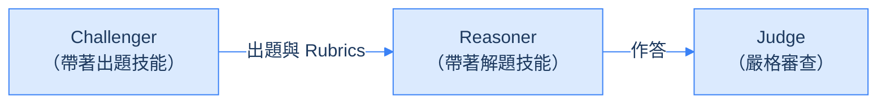
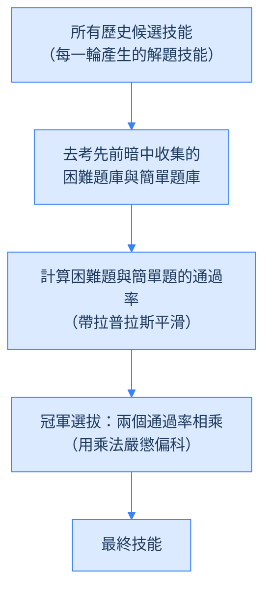

<!--more-->


1. **它做什麼**：Ctx2Skill 讓出題的 Challenger 與解題的 Reasoner 自我對弈，在沒有人工標註、沒有外部反饋的前提下，把一份長文本裡的隱含規則濃縮成可重複使用的自然語言技能檔，全程不更新任何模型參數。
2. **效果**：在 CL-bench 上，GPT-4.1 從 11.1% 提升到 16.5%，GPT-5.1 從 21.1% 提升到 25.8%，GPT-5.2 從 18.2% 提升到 21.4%；強模型提煉的技能掛給 GPT-4.1，也能把解題率拉到 16.1%。
3. **最值得記住的發現**：自我對弈跑得愈久，技能不一定愈好。GPT-4.1 的技能平均字數從第 1 輪的 313.9 字膨脹到第 5 輪的 1704.1 字，解題率卻由 15.9% 掉到 14.7%，所以才需要用「難題 × 簡單題」通過率相乘的跨時間回放，挑出不偏科的版本。
4. **使用前要算清楚的成本**：對弈階段很吃 API token，且只適用於規則明確、能用二元 Rubric 判對錯的文本。


## 前言

假設你要一個從沒碰過某套系統的工程師，去讀一份幾百頁、寫得零零散散的架構文件，然後立刻上線修一個 bug。他大概記不住全部細節，真正有用的，是一份從文件裡整理出來的「Troubleshooting SOP」。

這正是情境學習（Context Learning）在 LLM 身上遇到的處境：模型得在推論當下讀懂一份從沒見過的長文本——可能是全新的 API 文件、一套自訂桌遊規則，或是某個領域的實驗規範——並從中歸納出隱含的規則與操作程序，才能正確解題。

這篇論文提出的 Ctx2Skill，就是想幫 LLM 自動生出那份 SOP。它的定位很明確：不做任何參數微調，純粹在推論層運作；而且整個技能萃取過程不需要人類標註答案，也沒有外部反饋（例如編譯器或標準答案）可用——多個 Agent 靠自我對弈，自己把文本裡的隱含規則濃縮成一份人類看得懂的自然語言技能檔，之後就能直接掛在任何 LLM 前面重複使用。



對 AI 軟體工程師來說，這篇論文有意思的地方不只是效能數字，而是它示範了一種 Agentic Workflow 的設計模式：怎麼用強模型在離線階段「蒸餾」出結構化的 Prompt，讓線上推論可以重複利用。以下先講清楚問題有多難、Ctx2Skill 怎麼解，再拆解幾個容易被忽略但很關鍵的工程防禦細節，最後用實驗數據驗證這些設計到底有沒有用。

## 背景：情境學習到底難在哪裡

要理解 Ctx2Skill 的設計動機，得先搞清楚把「自然語言技能」套用在情境學習上，會撞到哪三個核心瓶頸。

### 人工標寫技能不划算

過去的研究已經證實，在推論時把結構化的操作步驟（技能）交給 LLM，能明顯提升推理表現。問題是，現實世界的情境文本——技術手冊、法規條文、實驗規範——通常又長又硬核，而且高度領域特定。早期的技能庫作法（像 SkillNet、Skillorchestra）靠的是人類專家自己讀懂文件、手寫技能說明，這在面對成千上萬份全新的私有文件時，不管是時間或成本都撐不住。同樣想讓 agent 自動長出技能的研究還有不少，例如把技能檔當成可訓練權重的 [SkillOpt](../skillopt/)、替技能加上一層不回滾 Wiki 記憶的 [WikiSkill](../wikiskill/)，以及從影片與程式碼提煉技能庫的 [Resource2Skill](../resource2skill/)。

### 沒有外部反饋可以驗證對錯

既然人工太貴，直覺的下一步是讓 AI 自動生成技能。但自動生成最麻煩的地方在於「怎麼驗證生成的東西對不對」。過去成功的自動化技能建構框架（AutoSkill、SkillX、AutoRefine）之所以走得通，是因為它們運作在「可驗證」的領域：寫程式可以丟給編譯器跑，解數學題可以對答案。

情境學習不一樣——模型要做的是純文本的語意理解與規則套用，例如判斷某個桌遊動作合不合規則。這裡沒有編譯器，也沒有標準答案，一旦少了這種外部客觀反饋，既有的自動化技能演化流程就直接停擺。

### 自我對弈本身也有風險：對抗性崩潰

要在沒有外部反饋的情況下製造一個內部反饋迴圈，學界常見的解法是設計「出題者（Challenger）與解題者（Reasoner）」的自我對弈：由 Challenger 出題兼評分，人為創造出反饋訊號。但這個機制自己也有副作用：隨著對弈輪數增加，Challenger 為了突破 Reasoner 的防線，會愈出愈刁鑽、愈極端，逐漸生出一堆邊緣案例。

Reasoner 為了應付這些怪題，只好不斷往技能庫裡塞入針對性的特例補丁，技能庫愈養愈臃腫，不只吃掉大量 Prompt token，更嚴重的是：模型很容易因此忘記文本中最核心、最常規的推理規則，發生「災難性遺忘」。


這有點像一個數學老師為了考倒學生，期末考狂出超偏門的奧林匹克陷阱題。學生為了應付這些怪題，整天只背特殊解法，結果連最基本的加減乘除都算錯——論文把這個現象稱為「對抗性崩潰（Adversarial Collapse）」，是 Ctx2Skill 整套設計要正面處理的核心風險。


## Ctx2Skill 整體設計：五個角色的自我對弈

Ctx2Skill 的核心想法，用一句話講完：讓一對會協同進化的 AI Agent——出題的 Challenger 與解題的 Reasoner——在沒有人類標註、沒有外部反饋的前提下，透過自我對弈與文字修改，自動為特定文本提煉出推理技能。



### 先把問題形式化

一個情境學習任務，由三個要素組成：

- **Context（\(C\)）**：一份全新的複雜文本，例如一份桌遊規則手冊。
- **Tasks（\(T = \{t_j\}\)）**：必須依賴 \(C\) 才能解答的任務。
- **Rubrics（\(\mathcal{R}_j = \{r_{j,k}\}\)）**：針對任務 \(t_j\) 的一組二元（通過／不通過）評分標準。

目標是生成一個自然語言技能庫 \(S\)，讓它作為系統前端的 Prompt 時，模型 \(\pi\) 產生的答案 \(a_j \sim \pi(\cdot \mid S, C, t_j)\) 能完美通過所有 Rubrics：

$$\prod_k \mathbb{I}[r_{j,k}(a_j) = \text{pass}] = 1$$

演算法一開始，系統會把 Reasoner 與 Challenger 的技能庫都初始化為空集合（\(S^R_0 \leftarrow \emptyset\)、\(S^C_0 \leftarrow \emptyset\)），同時建立兩個空的探針題庫 \(Q^h\)（困難題）與 \(Q^e\)（簡單題）——這兩個題庫的用途，後面「跨時間回放」那節會詳細說明。

### 五個各司其職的 Agent

每一輪迭代 \(i\)，系統由五個參數凍結的 LLM Agent 協同運作：

1. **Challenger（\(\pi_{\text{Challenger}}\)）**：負責出題。看著 \(C\) 與目前的出題技能 \(S^C_{i-1}\)，生成 \(M\) 道任務與對應的二元 Rubrics。
2. **Reasoner（\(\pi_{\text{Reasoner}}\)）**：負責解題。看著 \(C\)、題目 \(t_m\)、與目前的解題技能 \(S^R_{i-1}\)，產出回答 \(a_m\)。
3. **Judge（\(\pi_{\text{Judge}}\)）**：負責閱卷。是一個中立、不配備任何技能的固定模型，嚴格判定 \(a_m\) 是否通過所有 Rubrics。
4. **Proposer（\(\pi_{\text{Proposer}}\)，雙方各一個）**：負責診斷。批次分析考卷，產出高階的「技能修改建議書」（JSON 格式）。
5. **Generator（\(\pi_{\text{Generator}}\)，雙方各一個）**：負責動手寫。把診斷書轉化成排版嚴謹、人類可讀的 Markdown 技能檔（\(S^R_i\) 或 \(S^C_i\)）。

## 演算法拆解：一輪迭代裡到底發生了什麼事

### 前向對抗迴圈：出題、解題、評判

#### 步驟一：Challenger 生成考卷

$$\{(t_m, \mathcal{R}_m)\}_{m=1}^M \sim \pi_{\text{Challenger}}(\cdot \mid C, S^C_{i-1})$$

白話講，Challenger 得照著 \(S^C_{i-1}\) 的指示出題，例如「幫題目加上字數限制，並設計對應的格式檢查 Rubric」，藉此生出帶有多重限制的硬題。

#### 步驟二：Reasoner 答題

$$a_m \sim \pi_{\text{Reasoner}}(\cdot \mid C, S^R_{i-1}, t_m)$$

Reasoner 解題時，會把 \(S^R_{i-1}\) 裡的步驟（例如 Pre-answer checklist）當作導引，確保不漏看規則、不違反格式限制。

#### 步驟三：Judge 嚴格評判

$$z_{m,k} = \mathbb{I}[r_{m,k}(a_m) = \text{pass}], \quad y_m = \prod_k z_{m,k}$$

這是一個 all-or-nothing 的判法：只要有一條 Rubric 沒過（\(z_{m,k}=0\)），整題就算失敗（\(y_m=0\)）。這逼著 Reasoner 得展現極高的細節遵循能力，差一點都不行。

### 反向演化迴圈：分流與協同進化

#### 考卷分流

\(M\) 個任務評判完後，系統自動分成兩堆：

- 失敗考卷堆：\(\mathcal{F}_i = \{t_m \mid y_m = 0\}\)
- 成功考卷堆：\(\mathcal{P}_i = \{t_m \mid y_m = 1\}\)

#### Reasoner：補破網

失敗的題目送給 Reasoner Proposer 診斷：

$$\text{Diagnosis}^R \sim \pi_{\text{Proposer}}^R(\cdot \mid \mathcal{F}_i, S^R_{i-1}, C)$$

輸出是一份 JSON，包含 `action`（新增／合併）、`skill_name`、`proposed_skill`（高階概念）等欄位。接著由 Reasoner Generator 把這份診斷書實體化成新技能檔：

$$S^R_i \sim \pi_{\text{Generator}}^R(\cdot \mid \text{Diagnosis}^R, S^R_{i-1})$$

#### Challenger：想新招

為了不讓 Reasoner 摸清題型後對弈失去張力，Challenger 也得靠成功案例 \(\mathcal{P}_i\) 自我升級——分析 Reasoner 是怎麼破解題目的，藉此找出出題方式的漏洞：

$$\text{Diagnosis}^C \sim \pi_{\text{Proposer}}^C(\cdot \mid \mathcal{P}_i, S^C_{i-1}, C), \qquad S^C_i \sim \pi_{\text{Generator}}^C(\cdot \mid \text{Diagnosis}^C, S^C_{i-1})$$


這裡的 Proposer／Generator 拆分，其實就是「醫生看診、藥劑師配藥」的分工。如果直接叫一個 LLM 看著錯誤案例去改 Markdown 技能檔，它常常得同時處理「邏輯上錯在哪」跟「格式要排版精準」兩件事，容易顧此失彼。Proposer 只負責看病歷（Trace）、寫診斷書（JSON），不用管 Markdown 怎麼排；Generator 專心照著診斷書配藥，把它轉成有 YAML 標頭、排版完整的 Markdown。這種架構解耦，在軟體工程上能明顯提升生成文本的品質與穩定度。


下面兩張圖是附錄裡實際的 Proposer 與 Generator Prompt，可以看出這套「JSON 診斷書 → Markdown 技能檔」的分工在 Prompt 層面具體長什麼樣子（Reasoner 那一側也有結構完全對應的一組 Prompt，這裡就不重複貼了）。





### 探針題庫的暗中收集

為了應付前面提到的對抗性崩潰，系統得在演化過程中，自動且不動聲色地建立一份「期末考卷集」。每輪迭代結束時：

- **收集最難的失敗題（Hard Probe，\(Q^h\)）**：如果這輪有失敗題目（\(\mathcal{F}_i \neq \emptyset\)），挑出 Rubric 通過率最低的那一題。這是在測技能庫的「上限」——能不能解決最難的問題。
- **收集最簡單的成功題（Easy Probe，\(Q^e\)）**：如果這輪有成功題目（\(\mathcal{P}_i \neq \emptyset\)），挑出 Rubric 數量最少的那一題。這是在測技能庫的「下限」——會不會演化到後來，連最基礎的常識都忘了。

兩個題庫的更新方式如下：

$$Q^h \leftarrow Q^h \cup \left\{ \arg\min_{m \in \mathcal{F}_i} (\text{rubric pass rate}) \right\}$$

$$Q^e \leftarrow Q^e \cup \left\{ \arg\min_{m \in \mathcal{P}_i} (\text{number of rubrics}) \right\}$$

### 跨時間回放機制：用乘法公式挑出不偏科的技能

\(N\) 輪迭代跑完後，手上會有一整串歷史候選技能 \(S^R_1, S^R_2, \dots, S^R_N\)。跨時間回放要從中挑出真正泛化能力最強的一版。

#### 大會考

讓每一版歷史技能 \(S^R_i\)（\(i = 1, \dots, N\)）重新去回答 \(Q^h\) 與 \(Q^e\) 裡的每一題，由 Judge 重新批改，得出二元解題指標 \(y_q\)。

#### 拉普拉斯平滑通過率

為了避免某個題庫全錯導致機率變成 \(0\)（乘法運算下會直接把整體分數歸零），用拉普拉斯平滑計算通過率：

$$\rho^h(i) = \frac{\sum_{q \in Q^h} y_q(S^R_i) + 1}{|Q^h| + 1}, \quad \rho^e(i) = \frac{\sum_{q \in Q^e} y_q(S^R_i) + 1}{|Q^e| + 1}$$

分子分母同時加 \(1\)，即使某輪 \(y_q\) 全部是 \(0\)，通過率依然會是一個很小的正數（例如 \(\tfrac{1}{6}\)），確保後面乘法運算不會因為單一個 \(0\) 就整個歸零。

#### 乘法判定

挑出能讓「難題通過率」與「簡單題通過率」乘積最大的那一輪技能庫：

$$i^* = \arg\max_i \left( \rho^h(i) \cdot \rho^e(i) \right), \quad S^R_* = S^R_{i^*}$$

為什麼一定要用乘法，不能用加法？假設用加法（\(\rho^h + \rho^e\)），一個 \(\rho^h = 0.9\)、\(\rho^e = 0.1\) 的偏科技能——極度過擬合到後期的怪題、忘光基礎題——依然能拿到 \(1.0\) 的高分。

但如果用乘法：偏科技能的分數是 \(0.9 \times 0.1 = 0.09\)，直接被判出局；而一個難題、簡單題都拿 \(0.5\) 的平衡技能，分數是 \(0.5 \times 0.5 = 0.25\)，反而勝出。乘法在數學上會強烈懲罰偏科，確保最終選出來的技能面對常規問題時，依然有不錯的泛化能力。

### 推論與部署：一次提煉、終身受用

\(S^R_*\) 選出來之後，整個自我對弈迴圈就功成身退了。實際上線時，面對全新、未知的任務 \(t_u\)，只需要：

$$a_u \sim \pi_{\text{Reasoner}}(\cdot \mid S^R_*, C, t_u)$$

這件事的工程價值在於兩點：第一，線上推論完全是 Prompt Engineering，不需要昂貴的 GPU 微調；第二，雖然自我對弈階段會消耗不少 API token（論文設定 \(N=5\)、\(M=5\)，一次大概是幾十美元的成本），但每份 Context 文件只需要跑這一次——之後上千次查詢都能重複使用同一份 \(S^R_*\)，成本被大量攤銷掉。

## 工程防禦細節：讓系統不會演化到歪掉的四個關鍵設計

多智能體系統在演化過程中，很容易因為 LLM 本身的不確定性，產生格式跑掉、自我欺騙、無效演化等問題。Ctx2Skill 靠下面四個工程細節，把演化過程的嚴謹性守住——這些設計論文正文著墨不多，但對系統穩不穩定影響很大，對日常在寫 Agentic Workflow 的工程師來說也特別值得參考。

### 技能的嚴格內部解剖學

如果放任 LLM 自由發揮寫技能庫，很容易寫出「請仔細閱讀」、「注意時間限制」這種空話。為了讓產出的技能真的有約束力，作者在 Generator 的 Prompt 裡，強制規定技能檔（`SKILL.md`）必須包含以下四個區塊，不允許夾雜其他廢話：

1. **Pre-answer checklist（答題前檢查表）**：強制 Reasoner 作答前先做顯式資訊提取，例如先把文本裡所有的數值限制列成清單。
2. **Response procedure（具體作答步驟）**：規定第一步、第二步、第三步的思考路徑，甚至指定句型模板——本質上是把 Chain-of-Thought 流程化。
3. **Self-verification steps（自我驗證步驟）**：寫完草稿後要求模型自我對照，例如「數一下答案是不是剛好三個 bullet points，如果是四個就刪掉一個」。
4. **Common pitfalls to avoid（常見避坑指南）**：列出這個領域常見的直覺性錯誤。

這個結構把語意模糊的自然語言提示，轉成了強約束的「逐步執行演算法」，逼 LLM 在推理時執行自我檢查，大幅降低因為粗心或幻覺導致的 Rubric 違規。

### 裁判模型的不對稱設定

自我對弈裡有個常見陷阱叫 Reward Hacking：如果 Judge 不夠聰明，Reasoner 在演化過程中學到的，可能是「怎麼騙過裁判」，而不是真正讀懂文本。論文的作法是：測 GPT-4.1 的能力時，Challenger、Reasoner、Proposer、Generator 全都用 GPT-4.1，但 Judge 固定用更強的 GPT-5.1。

道理很直白——裁判的眼力得比選手好。如果 Judge 跟 Reasoner 是同一個等級，Reasoner 到了第三輪以後寫出的精緻答案，Judge 可能根本批改不動，回饋訊號一旦失準，演化方向就跟著走偏。固定用更強的模型當 Judge，確保整個演化過程中評判標準始終一致且夠嚴苛，從根本上杜絕 Reward Hacking。（另一種「用 LLM 當裁判」的取捨，可以對照 [JEV 的實測分析](../jev-as-a-judge/)。）

### 純粹負面反饋：嚴格按邊路由

反向演化時，作者刻意把 Failed 案例只送給 Reasoner、Solved 案例只送給 Challenger，而不是兩邊都塞給 Reasoner Proposer 讓它「順便學一下成功經驗」。作者確實測過這個直覺版本——把 Solved 和 Failed 一起塞給 Reasoner Proposer，論文稱為 Joint Outcome Skill Update——結果解題率反而下降了 1.0%。

原因跟 LLM 的 Context Window 特性有關：資訊密度與對焦度很重要，如果把「你這裡做得很完美」這種無用資訊也塞進去，反而會分散 Proposer 的注意力。純粹的失敗驅動，能強迫 Proposer 像 debugger 一樣，百分之百專注在找出並修掉 bug，這對技能更新的精準度與效率幫助更大。

### 探針題庫的防禦性資料清洗

自我對弈過程中，Challenger 偶爾會因為 JSON 格式解析失敗，產生「Rubric 數量等於 \(0\)」的無效任務。系統在收集簡單題庫 \(Q^e\)（挑 Rubric 數量最少的題目）時，會明確過濾掉這種 Rubric 數量為 \(0\) 的垃圾任務。



如果不做這層過濾，演算法會因為 \(0 < 1 < 2\)，自動把這些「格式壞掉、沒有評分標準」的垃圾題目，當成「最簡單的題目」存進 \(Q^e\)——這種題目沒有 Rubric，任何技能去考都會拿滿分，會嚴重污染後面跨時間回放的大會考結果，讓整個篩選機制失準。這提醒我們：設計 Multi-Agent 自我演化系統時，必須假設任何一個節點都可能吐出垃圾，並在關鍵節點（例如資料累積的地方）做好防禦性清洗。

## 實驗設計與關鍵發現

作者在 CL-bench 這個基準測試上做了完整評估——500 個複雜情境、1,899 個任務、31,607 條評分標準，涵蓋四個高難度類別：領域知識推理、規則系統應用、程序任務執行、經驗發現與模擬。以下挑出四個最值得關注的實驗。

### 實驗一：主結果——Ctx2Skill 到底有沒有用

實驗比較了三種設定：完全沒有技能的 Frontier LM（裸跑）、直接一次性生成技能的 Prompting 基準，以及文獻中的 AutoSkill4Doc 基準。



Ctx2Skill 在所有 backbone 模型上都取得明顯提升：GPT-4.1 從 11.1% 提升到 16.5%（+5.4%），GPT-5.1 從 21.1% 提升到 25.8%（+4.7%），GPT-5.2 從 18.2% 提升到 21.4%（+3.2%）。提升最明顯的是「程序任務執行」這個類別，GPT-4.1 從 10.4% 一路衝到 17.6%（+7.2%）。

這組數字說明一件事：純文本的情境學習，對現在最頂尖的 LLM 依然很難——GPT-5.1 裸跑也只有 21.1% 的解題率。單次生成的 Prompting、或是簡單切片文件的 AutoSkill4Doc，都不足以抓到文本裡複雜的語意規則；只有透過對弈打磨出來的結構化技能，才能真正幫模型精準推理。

### 實驗二：技能可以跨模型遷移嗎

這個實驗想確認一件很有商業價值的事：強模型對弈提煉出來的技能，能不能直接拿給弱模型用，做到不用動任何程式碼、不用碰模型權重的知識蒸餾？作法是把 GPT-5.1 跑出來的技能庫，掛給 GPT-4.1 解題，反過來也測一次。



結果相當亮眼：原本裸跑只有 11.1% 解題率的 GPT-4.1，掛上 GPT-5.1 提煉出的技能後，成績飆到 16.1%——已經非常接近 GPT-4.1 用自己技能的上限（16.5%）。這代表「大模型離線提煉 SOP、小模型線上執行」這種師徒制範式完全可行。實務上，大模型的推論成本往往偏高，只要花一次成本讓大模型跑 Ctx2Skill 提煉技能，之後線上查詢全部交給便宜的小模型搭配這份技能，就能用很低的成本拿到接近大模型的解題表現。

### 實驗三：對抗性崩潰是真的嗎？跨時間回放機制的效果

這個實驗直接驗證前面提到的對抗性崩潰假設——後期技能是不是真的會因為過擬合而退化？作法是把 GPT-4.1 自我對弈中，固定使用第一輪到第五輪產生的技能分別拿去測試，再跟跨時間回放機制挑出來的技能表現對比。

數據結果不算樂觀：固定用第一輪（Iter-1）技能有 15.9% 的解題率，但到了第五輪（Iter-5），解題率反而掉到 14.7%（上面表 3 的 Effect of Cross-Time Replay 區塊）——效能不是單調上升，而是先升後降，證實了後期技能確實發生了對抗性崩潰。



字數統計能解釋為什麼：Iter-1 的技能平均字數只有 313.9 字，到了 Iter-5 卻膨脹到了 1704.1 字——印證了模型在後期不斷往技能庫裡塞進無用、冗長的特例補丁。



有意思的是，跨時間回放機制最常選中的還是早期的 Iter-1 到 Iter-3，但在少數複雜情境下，還是會選到後期的版本——這證明了這套篩選機制不是無腦選最早的一版，而是真的針對每個情境動態判斷。

這裡的教訓很直接：在 LLM 自我對弈的演化過程裡，「最新不代表最好」。如果盲目拿最後一輪的 Prompt 去部署，會因為 token 膨脹和邊緣案例過擬合，讓泛化能力崩潰；跨時間回放這種「期末考篩選機制」，搭配乘法公式嚴懲偏科，是讓這套演化系統真正能落地的關鍵保護栓。

### 實驗四：拔掉 Challenger 演化的消融實驗

這個實驗想驗證雙向協同演化是不是真的必要——如果 Challenger 不跟著變聰明，只讓 Reasoner 單方面進步，系統會發生什麼事？做法是拔掉 Challenger 演化出題技能的機制，讓它每一輪都用隨機、未優化的 Prompt 出題（消融名稱是 `-w/o Challenger Skills Evolving`，對照表 3 的 Ablation Study 區塊）。

這是所有消融實驗裡摔得最重的一項：GPT-4.1 上的解題率直接從 16.5% 暴跌到 13.8%（-2.7%）。這印證了一條對話式 Agent 設計的鐵律——沒有對抗，就沒有進化。如果對手出題水準停在原地（題目重複、太簡單），Reasoner 很快就會陷入停滯，失去繼續挖掘文本隱含規則的動力。設計任何合成資料生成或自我演化框架時，「升級考卷」跟「升級考生」得雙軌並行，才能維持持續的對抗壓力。

## 給 AI 軟體工程師的三個設計啟發

除了論文本身的實驗結果，Ctx2Skill 這套設計其實提供了幾個很適合搬去自己專案用的模式，獨立於這篇論文本身也成立。

### 心法一：把「認知任務」拆開來做

不要叫同一個 Agent 同時做「深度推理」跟「嚴格排版」。拆成 Proposer（專注邏輯診斷）跟 Generator（專注格式與實體化）兩個角色，能明顯提高輸出品質與穩定度——這是前面 Proposer／Generator 那節「醫生與藥劑師」比喻背後的一般化原則，任何要求 LLM 同時做分析與排版的場景都可以借鏡。

### 心法二：自己造一個反饋迴圈

沒有外部編譯器或標準答案可用時，可以讓「出題者在出題當下，自己定義好二元檢核表（Rubrics）」，人為創造出內部反饋迴圈。這幫非驗證領域的自我演化開了一條新路——不只限於情境學習，任何缺乏 ground truth 的自動化評估場景，都可以套用這個「出題兼定義判準」的思路。

### 心法三：自我演化系統要有防禦性設計

自我演化的系統很容易走向過擬合或對抗性崩潰，設計時不能盲目信任最後一個版本。得在演化過程裡動態建立「基本功題庫」跟「極限挑戰題庫」的雙重會考機制，並用類似乘法公式的方式挑出最穩健的版本，而不是只看單一指標的分數。

## 這套方法有哪些限制

Ctx2Skill 效果不錯，但實際要用在正式環境前，有幾個限制得先算清楚：

- **前期建構成本不低**：雖然推論成本被攤銷掉了，但離線對弈階段（5 輪迭代、每輪 5 題、多個 Agent 呼叫）會吃掉不少 API token——論文提到含大量探索性實驗在內，總 API 成本約 30,000 美元。
- **不適合沒有固定規則的情境**：這套方法高度依賴文本裡存在明確的規則、流程與邏輯。像寫作、創意發想這種主觀、沒有絕對對錯的情境，「出題 → Rubric 判定」這個閉環根本立不起來。
- **Judge 的評判可能過嚴**：採用 all-or-nothing 判定，有時候會因為極細微的格式落差或語意微調——Reasoner 的 Rubric 通過率明明有 90%，題目卻整題被判失敗——導致演化方向過度偏向格式微調，而不是邏輯改進。

## 結論

Ctx2Skill 解決的問題很具體：怎麼讓 LLM 在零參數更新、沒有人工標註、沒有外部反饋的前提下，自己從陌生的長文本裡煉出可重複使用的技能。它的做法是讓 Challenger 跟 Reasoner 互相對弈、用 Proposer／Generator 解耦技能更新、暗中收集難題與易題兩份探針考卷，最後用乘法公式的跨時間回放機制，挑出一版真正不偏科的技能。

實驗數據撐得住這套設計：主結果全面超越無技能基準與其他自動化方法，技能可以跨模型遷移、達成低成本的知識蒸餾，對抗性崩潰確實存在、也確實被跨時間回放壓下去了，拿掉 Challenger 的協同演化更是直接讓效能大幅下滑。它也不是萬靈丹——前期建構成本、只適用於規則明確的情境、以及過嚴的評判機制，都是實際落地前得算清楚的成本。

對日常在寫 Agentic Workflow 的工程師來說，這篇論文最有價值的，可能不是 Ctx2Skill 這套框架本身，而是它示範的幾個設計模式：認知任務拆開來做、自己造反饋迴圈、演化系統要有防禦性設計——這幾點就算脫離這篇論文，也是在設計任何自我演化的 Multi-Agent 系統時值得參考的心法。
