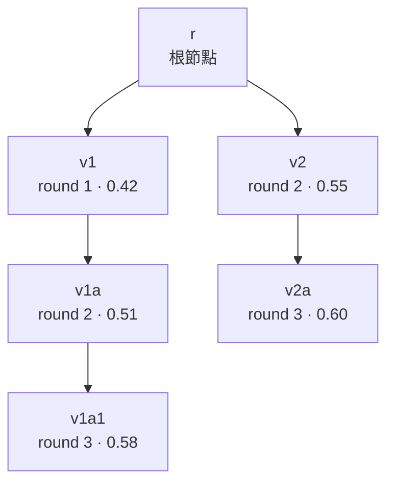
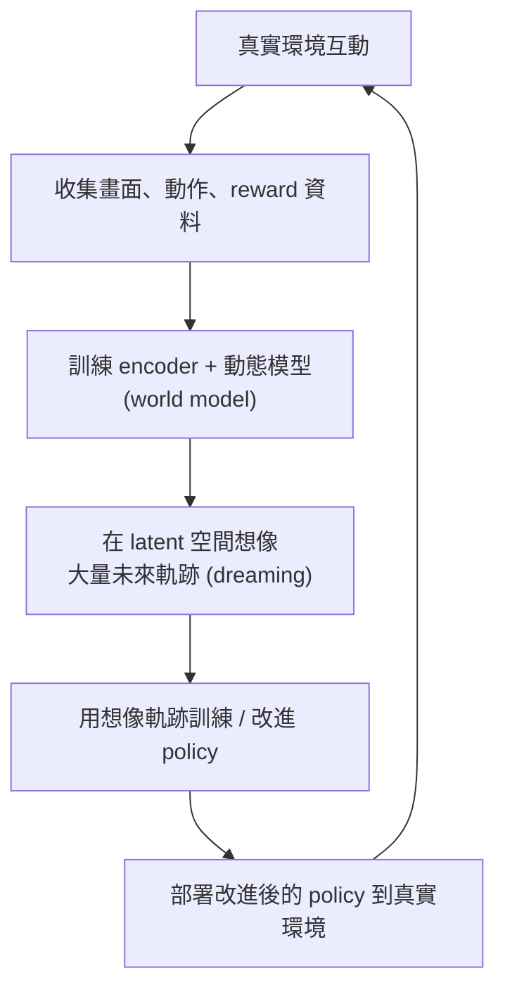
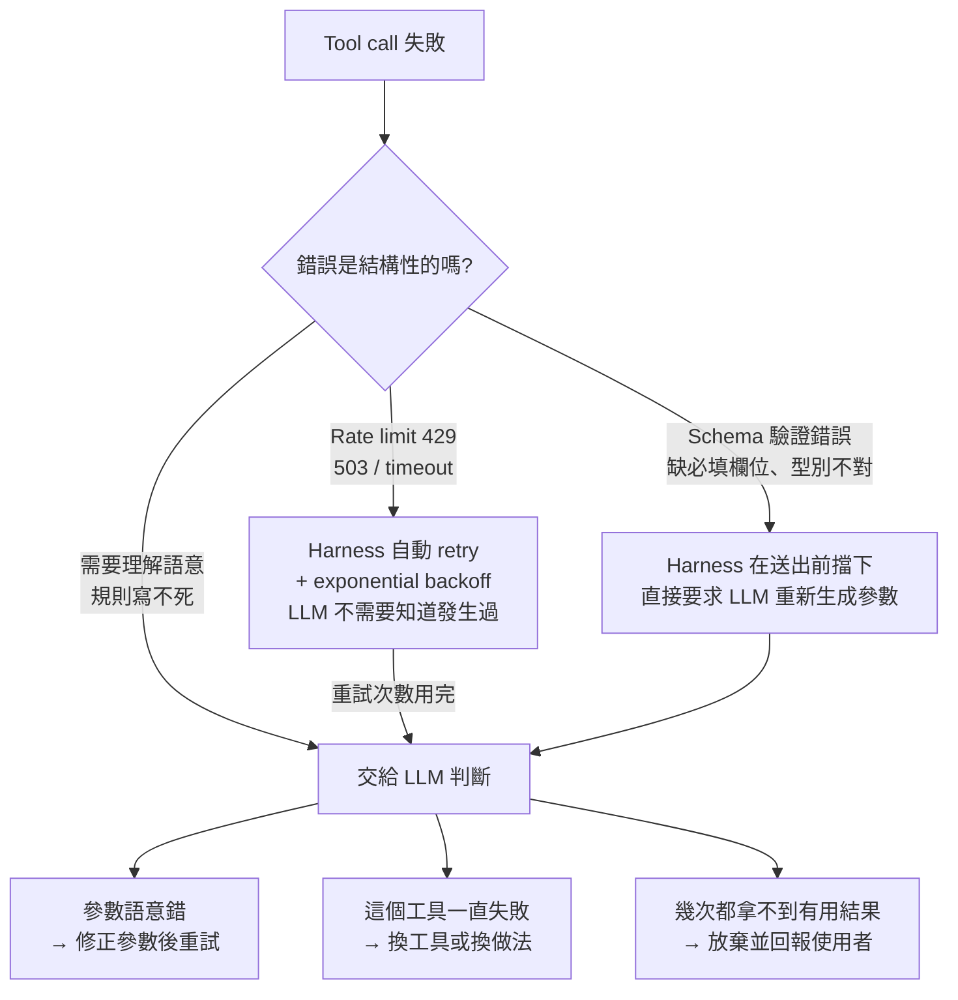

<!--more-->

## 前言

如果你寫過會自己迭代改善的 agent 系統，大概踩過這個問題：改善邏輯本身也該被改善，但要知道「這次改的版本比較好」，通常得先真的花錢跑一整輪才知道。Dream-RSI(Tong Zheng 等人，Google 與 University of Maryland、Google DeepMind、University of Virginia 合作；RSI 是 Recursive Self-Improvement，遞迴自我改良)想解決的正是這件事——當 AI agent 被用來做科學或演算法發現(想想 AlphaEvolve 那類系統)時，負責決定「往哪個方向深挖、什麼時候平行展開、什麼時候該停手」的探索策略，能不能低成本地自我改良。

論文的解法很直接：把已經跑完的探索歷史直接當成一個可以重播的資料庫。想測試一個新策略好不好，不用真的重跑任何程式碼，讓新策略去讀歷史紀錄裡「換一種走法會揭露哪些節點」，就能算出一個分數，近乎免費地篩選成千上萬個候選版本。這個機制確實聰明，論文自己的消融實驗也證明它比另一種常見做法(把歷史寫成文字摘要塞進 prompt)更有效。

但這篇論文值得花時間的地方，不只是它做了什麼。老實講，這是一篇工程紮實、但敘事包裝過頭的論文——它把自己類比成「World Model」，但真正的 world model 是一個訓練出來、能泛化到沒見過狀態的函數，Dream-RSI 的模擬器只是原封不動重播已發生的紀錄，評不出任何原本沒探索過的分支；三個實驗場域裡，真正的貢獻也幾乎都集中在「用更少運算資源達到同等品質」，不是「品質突破」。這篇文章的前半段會照著論文的邏輯把方法和實驗講清楚，後半段則會花相當篇幅拆解幾件**脫離這篇論文本身也成立**的東西——怎麼分辨真假 World Model、Planning 跟 Policy Learning 該怎麼選、失敗分類框架怎麼套用到 agent 的 tool-calling 設計。如果你趕時間，後半段其實比論文本身更值得讀完。


- Dream-RSI 把已完成的探索歷史(discovery tree)直接當成可重播的資料庫，測試一個新的探索策略好不好，不用重新執行任何程式碼。
- 消融實驗證明：把歷史當成可互動重播的模擬器，效果優於把歷史摘要成文字提示塞進 prompt。
- 三個實驗場域的提升幾乎都集中在「用更少運算資源達到同等品質」，不是能力上的突破。
- 論文自稱用了「World Model」，但它的重播機制沒有泛化能力，無法評估從沒發生過的分支——更準確的定位是一套精緻的 off-policy replay 評估機制。
- 後半段整理了幾個脫離論文本身也成立的心法：怎麼分辨真假 World Model、Planning 與 Policy Learning 該怎麼選、失敗分類框架怎麼套用到 agent 的 tool-calling 設計。


## 探索策略卡在哪裡

用 AI agent 做科學或演算法發現時，整個流程是「提出候選解 → 執行評估 → 依回饋修正 → 再提出」不斷循環，任務一難，這個循環可能要跑到數千次。誰來決定循環怎麼安排——往哪個方向深挖、哪些候選要平行展開、什麼時候換方向——本身就決定了效率高低，論文把這個決策者稱為 **exploration policy(探索策略)**。

現有做法大多是人工寫死一套規則，整個發現過程不會變，容易一直把資源砸在早就證明沒用的方向上。讓策略自己上線學習聽起來是解法，但會卡在兩個瓶頸上：評估「一個候選解好不好」可以很快，評估「一個探索策略好不好」卻沒辦法這麼快，得讓它實際指揮完一整輪(可能上百上千次)發現循環才知道效果；而且候選策略空間很大，新版本表現可能很差，得試很多版本才找得到好的。兩者疊加，每個候選策略都要跑一次完整、昂貴的線上探索才能拿到回饋，策略的持續改良自然變得又慢又貴。

## 核心想法：把探索歷史變成可重播的模擬器

Dream-RSI 的關鍵觀察是：每一次線上探索的過程，本來就已經把「在哪個節點分支、產生什麼結果、分數多少」全部記錄成一棵樹了。理論上，評估「換一種走法結果會不會不一樣」只需要讀這棵樹裡的紀錄，不需要真的重新執行程式碼。

系統在「線上探索」跟「離線做夢」之間交替，分成三個階段：



第一階段(Online Explore)用目前的探索策略指揮一個 coding agent 跑真實的發現循環，把每次嘗試記錄成一棵 discovery tree。第二階段(Construct Replay Simulator)把這棵樹收進歷史庫，庫會越滾越大。第三階段(Dreaming-based Policy Improvement)在歷史庫裡想像出大量候選策略，把每個候選策略拿去重播已存的樹算出分數，挑出表現最好的版本，變成下一輪真的要部署的策略。整個迴圈跑完後回到第一階段，用改良後的策略開始新一輪。

值得注意的是，只有探索策略的程式碼在變動——底層真的解題的 coding agent、負責評分的 evaluator、執行介面全部固定不動。這種「凍結大部分元件、只讓一個小的可控部分自我改良」的設計思路，即使脫離這篇論文，也是拆解自我改良系統時值得留意的切入點。

### Discovery Tree：一份可以重播、但不能改寫的歷史

discovery tree 裡的每個節點代表一次「生成—評估」嘗試。論文用一組簡單的符號把它形式化：

- \( r \)：根節點，代表最初的工作空間狀態。
- \( v \)：樹上一個非根節點，代表一次嘗試。
- \( \mathrm{parent}(v) \)：\( v \) 的父節點(可以是 \( r \)，也可以是另一個 \( v \))——agent 產生 \( v \) 時，從 \( \mathrm{parent}(v) \) 存下來的工作空間繼續，並參考其累積的觀察紀錄當上下文。
- \( s_v \)：\( v \) 這次嘗試的分數(越大越好)。

節點裡存的不只是分數，還包含檔案系統快照、產生的成果、評估診斷資訊——每個節點都是一次嘗試完整、可事後重看的紀錄。任何時刻，「可以繼續往下接」的節點只有兩種：根節點 \( r \)(開一條全新分支)，或現有葉節點(延續某條已在走的分支)，論文用 \( A(T) = \{r\} \cup L(T) \) 表示這個可選集合，其中 \( L(T) \) 代表目前樹 \( T \) 裡所有葉節點。假設有 \( W \) 個平行 worker，策略每一輪從 \( A(T) \) 裡選出一個批次 \( C \)，大小最多是 \( W \)。

拿一個具體的小例子走一次(\( W=2 \))會比公式好懂得多：

```
第0輪: T⁰={r}, A(T⁰)={r}, 選 C⁰={r}
       -> 產生 v1(0.42), T¹={r,v1}

第1輪: A(T¹)={r,v1}, 選 C¹={r,v1}(批次大小=2,用滿W)
       -> r 開新分支產生 v2(0.55)
       -> v1 延續產生 v1a(0.51)
       T²={r,v1,v2,v1a}   (v1不再是葉節點)

第2輪: A(T²)={r,v2,v1a}
       選 C²={v2,v1a}
       ...依此類推
```


形式化定義裡，批次 \( C \) 是一個集合，代表同一輪根節點 \( r \) 最多只能被選一次——要同時開 10 條平行分支，按這個定義得一輪一輪慢慢堆起來。但論文描述 baseline 策略時卻說它「一開始就平行開了 10 個或 32 個獨立 workspace」，聽起來像是一開局就直接平行開好幾條。這兩處怎麼銜接，論文沒有明講——是形式化只是抽象框架、具體實作另外處理，還是省略了細節，不確定。




### Online Rollout 與 Offline Replay：同一套規則，兩種邏輯

這是整篇論文能省錢的根本機制。線上跟離線用的是同一套「選節點、湊批次」規則，但運作邏輯完全不同：

| | Online rollout(真的在跑) | Offline replay(不是跑，是讀) |
|---|---|---|
| 節點內容從哪來 | coding agent 現場生成、evaluator 現場評分 | 直接讀歷史樹裡早就存好的內容 |
| 同一動作，結果會變嗎 | 會(隨機) | 不會(決定性) |
| 選根節點 \( r \) 時，回傳哪個小孩 | 現場生一個全新分支 | 一定是歷史樹裡「最早被創造出來、還沒揭露」的那個小孩，順序鎖死 |
| 選某已展開節點 \( v \) 時 | 現場生一個全新小孩 | 直接回傳歷史樹裡存好的那個小孩 |

online rollout 每跑完一輪外層迭代，就把新蓋出的完整樹存進歷史庫；offline replay 則會把目前累積的**所有**樹都拿來重播一遍，評估同一個候選策略版本在全部歷史上的表現，而不是只重播最新那一棵。

走一次完整例子最容易感受到差別。假設真實線上探索存下的完整歷史樹長這樣(\( W=2 \))：



左右兩條分支的創造順序是 v1 早於 v2，這個順序在 replay 時是鎖死的。

用一個替代策略 \( \pi^m \) 去 replay 這棵樹：

```
Round1: 選 C={r} -> 回傳 r 最早創造、未揭露的小孩 = v1(0.42)

Round2: A={r,v1}, 選 C={r,v1}
        -> r: 回傳下一個未揭露小孩 = v2(0.55)
        -> v1: 回傳唯一小孩 = v1a(0.51)

Round3: A={r,v2,v1a}, r已無小孩可揭露, 選 C={v2,v1a}
        -> v2: 回傳v2a(0.60)
        -> v1a: 回傳v1a1(0.58)
        全部揭露完畢 -> 停止
```

3 輪就把整棵樹揭露完，且每輪都塞滿 \( W=2 \)——如果原本線上探索是一輪一輪慢慢展開、平行度沒用滿，這個替代策略重播出來的結果就顯示：早知道就該更積極批次處理。這正是 replay 有意義的地方：不用真的重新執行任何程式碼，只是換一種讀取既有紀錄的順序或分組方式，就能看出不同策略的效率差異。


選根節點時回傳的小孩順序固定照原始創造順序(v1 先、v2 後)，replay 沒辦法測試「如果當初先開 v2 這條分支會怎樣」——這條路徑在 replay 裡完全不可能被還原出來評估。替代策略能自由決定的是要不要開新分支、開幾條、何時開、怎麼批次組合、深入哪條分支多深、何時停，但不能改變分支開啟的先後順序。



附錄的探索 prompt 明文要求 coding agent 每次提案前，必須讀完每一個 sibling attempt 的內容，以及累積歷史裡的每一筆紀錄——不是抽樣、不是只看最近幾輪。這代表歷史越滾越大，每次 API 呼叫要讀的東西也跟著線性成長，但論文報的效率指標全程只用「discovery-agent calls 的次數」當成本，完全沒算進「每次呼叫因為 context 變長而變貴」這件事。這個問題值得完整拆開來看，後面「累積歷史會不會把 context 撐爆」那節會細談。


### 怎麼避免「贏家永遠是把樹逛光的那個」

光看 replay 揭露出來的最高分還不夠——只要把整棵樹逛光，一定能拿到這棵樹的全域最佳分，這樣量不出「有效率地找到好結果」跟「暴力逛完」的差別。論文的 replay 分數因此由三項組成：揭露節點裡的最高分(quality)，扣掉揭露節點數乘上一個係數(cost，揭露越多扣越多)，再加上平均每輪揭露節點數乘上另一個係數(parallelism bonus，獎勵懂得批次處理的策略)。論文正文用 \( \beta_1 \)、\( \beta_2 \) 表示這兩個係數的權重，但沒有在正文或附錄給出實驗實際用的具體數值。

一個具體例子最能說明這個設計的用意。沿用前面那棵樹，假設 \( \beta_1 = 0.05 \)、\( \beta_2 = 0.1 \)(這是示範用的數值，不是論文真實設定)：

| | 揭露節點 | 最高分(quality) | 揭露節點數 \( N \) | 平均每輪揭露(parallelism) | 算式 | 分數 \( V \) |
|---|---|---|---|---|---|---|
| 策略 A(保守、序列式) | v1， v1a， v1a1 | 0.58 | 3(每輪只選1個，\( k^*=3 \)) | \( 3/3 = 1.0 \) | \( 0.58 - 0.05 \times 3 + 0.1 \times 1.0 \) | **0.53** |
| 策略 B(積極、有批次) | 全部 5 個 | 0.60 | 5(round2、3各選2個，\( k^*=3 \)) | \( 5/3 \approx 1.667 \) | \( 0.60 - 0.05 \times 5 + 0.1 \times 1.667 \) | 0.5167 |

策略 B 的最高分和平行度都比較高，但因為多揭露了兩個節點，cost 項扣得更多，最後算出來反而是保守的策略 A 分數更高——「保守但精準」贏過「積極但浪費」。這示範了 objective 的核心用意：不是單純找誰的分數最高，而是在「找多好」跟「花多少」之間權衡，天平完全由 \( \beta_1 \)、\( \beta_2 \) 這兩個係數決定。而且候選策略的最終分數，是它在**所有**歷史樹上各自算出分數後取平均：

\[ V^m = \frac{1}{t}\sum_{i=1}^{t} V_i^m \]

不是只在一棵樹上評分，否則選出的策略可能只是剛好很適合那棵樹的特殊結構，換一棵就不管用了。

### 一個「不會變差」的保底機制

每一輪的策略改良流程是這樣的：先讓目前正在用的策略原封不動 replay 一次，拿到一個基準分數 \( V^0 \)；接著讓一個負責改寫程式碼的 policy-development agent(本身也是一顆 LLM)讀這次的 replay 紀錄，改出新版本 \( \pi^1 \)，一樣拿去 replay 評分；重複這個過程到 \( M-1 \)，共產生 \( M \) 個版本；最後從全部候選版本裡，挑 replay 分數最高的那個(\( m^* = \arg\max_m V^m \))，變成下一輪真的要部署的策略 \( \pi_{t+1} \)。

候選版本裡永遠留著「完全不改」的原始版本 \( \pi^0 \)，所以挑出來的分數絕不會比原本的差——最壞情況是這幾次改寫都沒改進，那就繼續用原本的，不會因為亂改而倒退。這個設計叫 **monotonic non-regression(單調不退步)**，是任何「LLM 自己改自己邏輯」的系統都可以拿來檢查的一個簡單健檢指標：有沒有在候選集裡保留一個「不改」的選項當底線。

完整流程裡其實有三個角色可能牽涉到 LLM，搞清楚誰貴誰便宜很重要——其中 evaluator 是不是真的用 LLM 打分，論文自己也沒交代清楚：

| 角色 | 用哪份 prompt | 產出什麼 | 何時動 | 成本 |
|---|---|---|---|---|
| Discovery agent | 附錄 B.1 | 任務的候選解內容 | 只在 Online Explore 階段 | 貴(真的要解題) |
| Evaluator | 論文未交代是否為 LLM | 分數 \( s_v \) | 只在 Online Explore 階段 | 通常便宜(跑程式量測) |
| Policy-development agent | 附錄 B.2 | 探索策略的程式碼 | Dreaming 階段，每輪跑 \( M \) 次 | 中等(改程式碼，不用真的解任務) |
| Replay 本身 | 無 prompt，純程式邏輯 | 分數 \( V_i^m \) | Dreaming 階段，每個候選版本都跑 | 幾乎免費(純讀表) |

真正貴的 LLM 呼叫只發生在角色 1(有限次)跟角色 3(每輪只跑 \( M \) 次，通常個位數到十位數)，而 replay 評分本身完全不含 LLM——這是「上千次候選策略評估不會產生上千次昂貴 API call」的原因。

不過這個保底有一個容易被忽略的限制：它保證的是「replay 分數不退步」，不等於「真實線上表現不退步」。這個落差就是 replay-to-real gap，後面會完整拆解。

### 附錄裡的工程細節：B.2 Prompt 的設計

論文附錄有一份大約 270 行的 prompt，指導 policy-development agent 怎麼改寫探索策略程式碼。這份 prompt 是全篇工程含金量最高的地方，幾個核心機制值得拆開來看：

**Prefix-only 限制**：策略的每個決策，只能用「目前為止這次 replay 自己已主動揭露過的節點」，不能用還沒揭露節點的分數、budget 統計，或任何「上帝視角」資訊。這避免了作弊——先掃過整棵樹找最高分、假裝一路探索剛好找到——真實線上部署時沒有這種作弊空間，因為線上的樹根本還沒長出來。這種「決策只能用當下已知資訊，不能偷看未來或全局」的限制，在強化學習和 online algorithm 領域是標準要求，叫 **causality constraint**，不是 Dream-RSI 獨創(off-policy evaluation 也是同樣邏輯)。

**Batch 決策的三分法**：每輪最多選 \( W \) 個候選，prompt 要求拆成三種角色湊——exploitation(目前最有希望的正常延伸)、exploration(開新 root，或深入還沒探索夠的 branch)、recovery(最多一個，一個真的可修復的失敗嘗試)。這是經典的 multi-armed bandit explore-exploit tradeoff，但多了 recovery 這個 bandit 框架裡沒有的第三角色，因為這裡的「失敗」可能只是實作 bug，不代表方向本身壞掉。規則明確要求：recovery 最多佔 1 個名額、不能搶走 exploitation 名額或讓 worker 閒置；不能用固定配額，要根據 prefix 證據動態決定；禁止隨機抽樣、禁止「因為某候選很明顯就只選它」。

**四類失敗分類**：hard-unrecoverable(硬性不可能修好)、repairable implementation failure(想法可能沒問題，是實作 bug)、weak-but-underexplored(分數普通但還沒試夠深)、repeatedly unpromising(已有足夠證據顯示這方向真的不行)。一個容易忽略的細節是，`valid==False` 不等於「失敗」——一次嘗試可能程式碼順利跑完、沒有拋出錯誤，但產出的解不滿足正確性條件，這不算「失敗」，是正常評估出一個較弱的解，不該被塞進「可修復失敗」的籃子裡重試。而且任何分類都不是永久判決，即使一條分支被判定成 hard-unrecoverable，只要之後真的出現一次成功結果，就要重新打開這條分支。這套框架背後的更大脈絡，後面「Failure Classification」那節會完整攤開，包含它跟分散式系統經典設計的關係，以及怎麼套用到 agent 的 tool-calling 錯誤處理上。

**Beta：策略內部的保守/積極旋鈕**：prompt 裡的 `beta` 是策略程式碼內部的一個超參數，決定策略行為多寬容/多保守，跟正文公式的 \( \beta_1 \)、\( \beta_2 \) 不是同一組東西——正文用 \( \beta_1 \)/\( \beta_2 \)，附錄實作用 beta 搭配 `pareto.reward`、`pareto.auc`、`lambda` 這組不同符號，兩者對應關係論文沒有交代清楚。

**Grid Planning**：在一輪全新線上探索開始前，還有一個更早的決策——要開幾條 root 分支(width)、每條分支最多延伸幾層(depth)。這由獨立的 `plan_grid()` 方法負責，一樣不能偷看這一輪還沒發生的結果，只能根據過去幾輪的 history 決定。判斷規則大致是：很多方向早期有起色但深入後停滯，就加 width；高分要 refine 很多層才出現且集中少數方向，就加 depth；都試夠深了還停滯但有未試過的方向類型，就加 width；反覆硬性失敗或方向高度重複，width、depth 都保守縮小。

具體一點想像：如果過去三輪只有一條 root 分支持續往下 refine 出高分，其他分支都在第二層就停滯不前，`plan_grid()` 該判斷「方向已經找對，值得往深挖」，下一輪就加大 depth、不必再開更多 width；反過來，如果每條分支都在深度 4、5 左右就卡住不再進步，但還有好幾種完全沒試過的初始寫法，判斷就該轉向「先加開幾條新 root，看看有沒有更好的起點」，而不是繼續往已經卡住的方向硬挖。

Dream-RSI 的自適應機制因此是分層的：最外層是 grid(場地大小)、中間層是 beta(玩法保守/積極)、最內層是逐輪的具體決策邏輯(prefix-only、batch portfolio、failure classification)。這種「把可調整的東西按時間尺度分層」的架構思路，即使脫離這篇論文，也是設計「要跨迭代自我調整」系統時可以參考的模式。

## 三個實驗場域：省下來的是運算，不是品質

論文在三個領域測試 Dream-RSI：演算法工程(用 Lasso regularization path 當範例)、數學優化(Sum-Difference、Autocorrelation、Circle Packing 三個任務)、GPU kernel 工程(KernelBench 的四個任務)。三個場域有個共通的模式，值得先講在前面：Dream-RSI 贏的維度幾乎都是「用更少運算資源達到同等品質」，不是「品質本身有突破」。

演算法工程場域裡，Dream-RSI 在六個 held-out 下游任務上拿到跟 baseline 相近或更好的 wall-clock runtime，但用掉的 discovery-agent calls 少了一到兩個數量級：



數學優化場域是三者裡「品質幾乎沒有提升」最明顯的一個：



Dream-RSI 用遠少於 SimpleTES(這三個數學任務裡另一個對照用的 baseline 系統)的 generation 數(少於 1,000 次，對比 SimpleTES 的 51,200 次)就拿到相近的分數，但真正的分數差距大多落在小數點後三、四位，Circle Packing 上甚至所有方法都收斂到同一個值。


Autocorrelation 上 SimpleTES 的分數其實比 Dream-RSI 好一點(1.453675 對比 1.456375，越低越好)，論文自己也承認這一點。這張表也把 Gemini-2.0、Qwen3-8B、GPT-OSS-120B、Gemini-3.0/3.1-Pro 放在同一張表裡比分數，模型能力本身就是個變因，不算乾淨的對照。


GPU kernel 工程場域則是效率提升最直接可讀的一個：



把三個場域放在一起看，論文自己的效率指標藏著一個共通的盲點，而且剛好可以拿有具體數字的場域算一次規模：Gemini-3.7-Flash 在 Lasso 任務上，每輪線上探索是 32 個平行 workspace、每個最多跑 20 步 refinement，五輪下來累積用了 1,879 次 discovery-agent calls——而第五輪開始時，前四輪已經留下數千份紀錄要讀。輪數一拉長，理論上每次 API call 要讀的 context 只會越來越長、越來越貴，但論文全程用來衡量效率的指標只算「discovery-agent calls 的次數」，沒有算進這件事。這個問題三個場域都適用，只是 Lasso 剛好是唯一報了具體 call 數的地方，後面「累積歷史會不會把 context 撐爆」那節會把這個問題單獨拉出來講清楚，包括它可能踩到的天花板和更通用的解法方向。


整套自適應機制(beta schedule、grid planning、batch portfolio)是綁在一起驗證的，沒有個別消融，不知道拆開哪一塊會掉多少分；圖 4 只有圖沒有表，具體數字沒辦法回頭核對。


## 消融實驗與探索行為的演化

比起三個主實驗，論文 §5.1 的消融實驗更值得細看，某種程度上是全篇最有方法論價值的部分：對照「把歷史當成可互動的 replay simulator 主動測試」跟「把歷史只摘要成文字提示塞進 prompt 引導方向」，兩種 paradigm(Dream-RSI 跟另一個 baseline)只要加了文字提示，表現都變差。



論文的解讀是：長時間、多線並行的探索裡，把方向性建議寫死在 prompt 裡反而會過度限縮搜尋空間、抑制探索的多樣性。這個結果值得放進更大的脈絡看：同樣處理「怎麼利用過去經驗」這個問題，ReasoningBank、[WikiSkill](../wikiskill/) 那類方法走的是「把經驗摘要成文字知識再注入」的路線。這組消融結果指向的是「結構化、可執行的重播」在探索策略這個場景下優於「文字摘要式提示」，但這只是一組場景下的結果，不能直接推論成摘要式記憶方法整體不如結構化重播。

另一個實驗接著追蹤：隨著遞迴輪次一輪一輪跑下去，學出來的探索策略本身行為怎麼變化。



論文觀察到一個清楚的自適應模式：早期表現還在快速進步時，策略傾向保守，把資源花在深挖少數幾條看起來有希望的分支；等表現逐漸逼近瓶頸、進步趨緩，策略反而轉為更積極地開新分支、擴大搜尋廣度。這個「早期收斂、後期發散」的行為不是寫死的規則，而是策略自己從歷史 replay 裡學出來的，某種程度上呼應了前面提到 `plan_grid()` 那套根據歷史動態調整探索寬度、深度的邏輯。

## 這篇論文老實說做到多少

把方法和實驗攤開來看，Dream-RSI 的核心貢獻是真實的：把「已完成的探索歷史」重新框架成一個可以拿來做 off-policy 評估的資料結構，用來低成本篩選 exploration policy 的改良版本，取代昂貴的線上試錯，而且消融實驗也確實證明它比單純把歷史摘要成文字提示更有效。

但貢獻的份量，誠實講不多。品質提升幾乎不存在——數學優化任務多數差距在小數點後三四位，Circle Packing 甚至完全打平，真正貢獻集中在「用更少運算資源達到同等品質」，是效率貢獻，不是能力突破。「World Model」這個框架包裝，跟真正的 world model 有實質落差，它更準確的定位是一套精緻的 off-policy replay 評估機制——這一點值得完整拆開來談，也是接下來這篇文章要花最多篇幅的地方。

## 延伸：幾個獨立於論文本身、隨時能用得上的心法

以下內容跟 Dream-RSI 這篇論文本身的關係，其實比較像是「這篇論文剛好是個引子」。就算你從沒聽過 Dream-RSI，這幾件事本身也成立，而且大概率會在你自己設計 agent 系統時用得上——這是這篇文章接下來要花最多篇幅講清楚的部分。

### 這真的是「World Model」嗎

Dream-RSI 把整套機制類比成「World Model」，呼應 Dreamer 那類 model-based RL 系統。這個類比聽起來很唬人，但拆開來看，經不起太仔細的檢查。

**先鋪 RL 基礎**：Reinforcement Learning 的基本迴圈是「agent 觀察狀態 → 選動作 → 環境給回饋(reward + 新狀態) → 迴圈」。目標是學出一個 policy：看到什麼狀態該採取什麼動作，讓長期累積 reward 最大。這裡有兩條路線分岔。

**Model-free(無模型)**：agent 完全靠實際跟環境互動、試錯，慢慢學「在這個狀態採取這個動作長期而言好不好」，不去學「環境本身怎麼運作」。類比一下：學騎腳踏車靠肌肉記憶，不需要懂牛頓力學。

**Model-based(有模型)——world model 的位置**：agent 額外學一個「環境動態模型」：輸入「目前狀態加動作」，輸出「下一個狀態加 reward」。這個模型就是 world model。有了它，不用真的跟環境互動，只要不斷問模型「如果我這樣做接下來會怎樣」，就能在模型內部一路模擬。類比：西洋棋高手腦中推演接下來五步棋，靠的是對「棋怎麼走」這個規則的理解模型。真實環境互動往往慢、貴、有風險，有了夠準的 world model，可以在模型裡用標準 RL 方法大量便宜地「練習」，因為每步是模型的一次前向運算，不是真的執行動作——這是 model-based RL 樣本效率通常比 model-free 高的根本原因。

但這裡有個關鍵前提：world model 要有用，必須能**泛化**到「還沒真的走過的狀態或動作組合」，不然只能在模型裡重演已發生的事，沒有意義。

Dreamer 具體是這樣做的：先把高維度輸入(遊戲畫面)壓縮成低維抽象向量 z(latent state，潛在狀態)，不直接在 pixel 空間預測。接著在這個壓縮空間裡學一個函數——「目前 z 加動作 a → 預測下一個 z' 加 reward」，這個函數(常叫 RSSM，Recurrent State-Space Model)就是 world model 的核心，用真實互動收集的資料訓練。最後「做夢」的過程完全在 latent 空間裡滾動：從某個 z 開始，重複「用 policy 決定動作 a → 用動態模型預測 z' → 再決定下一動作」，滾出一整條想像出來的未來軌跡——完全不碰真正環境，也不解碼回真實畫面。整個流程是：



動態模型是神經網路，本質是學到一個連續函數，對「沒有一模一樣見過但相似」的 z 和 a 組合通常也能給出合理預測——這就是它能泛化到沒見過狀態的能力來源。

這正是 Dream-RSI 跟真正 world model 的落差所在。Dream-RSI 的「重播模擬器」不具備這個能力：discovery tree replay 是把已發生節點原封不動存起來重播，沒有任何函數在做泛化或內插；如果某分支從沒被探索過，replay 就是空的，不會有任何預測值可以評估。用「World Model」這個詞來包裝 Dream-RSI，有一定程度的過譽，比較準確的定位是一套精緻的 off-policy replay 評估機制。


之後看到任何論文說自己用了 simulator、world model、imagination 這類詞，第一個該問的問題是——**它能不能評估從沒發生過的可能性？** 能，才是真正的模型；不能，就是重播機制，價值仍然存在，但上限被「已經發生過的事」鎖死。


### 為什麼不是每一步都拿 World Model 去搜尋？

一個自然的疑問是：如果已經有一個能泛化的 world model，為什麼不在每個 state 直接試各種 action、選 reward 最大的，每步都這樣，不就能找到 reward 最大的軌跡？

這個做法真實存在，叫 **Planning**，具體技術如 **MPC(Model Predictive Control)** 或 **CEM(Cross-Entropy Method)**：每個 timestep 用 world model 對好幾種 action 序列做前向模擬，選累積 reward 最高的那串，執行第一步，下個 timestep 重新再搜一次。Dreamer 的前身 PlaNet 論文，就是用 CEM 這種方式直接在 latent space 裡規劃，沒有另外學一個 policy。Dreamer 後來改成學 policy，是有具體理由的，而且這三個理由本身就很值得記住：

**問題一：連續動作空間裡，不存在「試過所有 action」**。Dreamer 鎖定的場景(機器人控制、Atari 連續操作)裡 action 常是連續值，頂多能取樣幾十幾百個候選，已經不是「找到最優解」，是「用取樣逼近」。

**問題二：搜尋計算量隨 horizon 指數爆炸**。假設每步試 10 種動作(離散化近似)，規劃未來 15 步：\( 10^{15} \) 種組合——這是每個真實 timestep 都要重算一次的量，即時反應場景完全不可行。MCTS 用啟發式剪掉大部分無意義分支，但即使加了剪枝，計算量還是比「訓練好 policy 網路、決策時只做一次前向運算」貴很多。

**問題三：往遠處規劃，model 的預測誤差會累積放大**。規劃 15 步，代表拿「第 1 步已有誤差的預測」去餵給模型算第 2 步、再拿誤差更大的結果算第 3 步，誤差一路放大，搜得越深反而越可能被逐漸失真的模型誤導。

Dreamer 的解法是把搜尋成本攤還到訓練階段：訓練一個 policy 加一個 value function，兩者都用大量想像軌跡去訓練。訓練時想像的軌跡不用很長，因為 value function 本身承擔「這條路後面大概還有多少價值」的估計工作(bootstrapping 技巧，不用真的模擬到最後才知道好不好)。訓練好之後，真正部署時決策只是把目前 z 丟進 policy 網路做一次前向運算——不用在真實世界每個 timestep 都重新搜尋。搜尋成本被搬到背景訓練階段，決策當下變得便宜。

三種做法放在一起比較會更清楚：

| 做法 | 決策時怎麼選 action | 優點 | 缺點 | 代表方法 |
|---|---|---|---|---|
| Planning | 每步用 model 重新搜尋/模擬 | 不需另外學 policy，更「誠實」利用 model | 連續動作空間搜不動、決策計算量大、長 horizon 誤差累積 | PlaNet， MPC， CEM |
| Policy Learning in Imagination | 決策時只做一次 policy 前向運算 | 決策當下便宜，value function 用 bootstrapping 處理長期回報 | policy 品質受限於 world model 準不準；多一組要訓練的網路 | Dreamer(v1~v4) |
| 兩者混合 | 用 policy/value 當先驗縮小搜尋範圍，再做較淺搜尋 | 結合兩邊優點，搜尋有引導不會亂槍打鳥 | 系統複雜度最高 | MuZero、AlphaZero |

可遷移的判斷規則是：動作空間小、離散，單步 model 算得快，能接受決策時多花點運算(回合制棋類遊戲)→傾向純 planning 或混合法；動作空間連續、需即時反應、horizon 很長→傾向像 Dreamer 把搜尋成本攤還到訓練期。這個「把貴的運算搬到背景、讓即時決策變便宜」的思路是通用的系統設計原則，不限於 RL——像 [MemRL](../mem-rl/) 把 memory retrieval 本身當成一個透過 RL 訓練出來的 policy，而不是每次都即時重新判斷，也是同一種成本轉嫁邏輯的另一種應用。

### 累積歷史會不會把 Context 撐爆？

前面提過，附錄的探索 prompt 明文要求 agent 提出新方案前，必須讀完每一個 sibling attempt 的 proposal，以及完整歷史裡的每一筆紀錄——特別強調不是抽樣、不是只看最近幾輪、不是只看目前這條分支。這件事單獨拉出來看，是一個論文完全沒處理過的空白，而且不只是 Dream-RSI 才會遇到，任何長期運作的 agent 系統都得面對。

問題在於歷史是累積的——第五輪開始時，前四輪已經裝了全部產生的節點，可能上千個 proposal。如果每一次新嘗試都要把這些內容全部讀過一遍才能動筆，那每次 API call 的 context 長度會隨輪數增加而線性成長，甚至更快(因為同輪內 sibling 節點也要互讀)，越後面的輪次，每次 call 的成本跟延遲都越來越貴。但論文用來衡量效率的指標全程只用「discovery-agent calls 的次數」當 cost，完全沒算進「每次 call 本身因 context 變長而變貴」這件事，全文也沒有看到任何關於 context 管理、摘要、檢索式讀取，或設定讀取上限的機制。


可能的原因是論文用的 Gemini 系列模型 context window 本來就很大(百萬 token 等級)，加上實驗規模(幾百到不到兩千次 calls，單份 proposal 應該不會太長)可能還沒真的把這個問題逼出來，所以報告的實驗裡沒爆掉。但這不代表機制本身沒有這個上限——輪數拉更長，或換一個 context window 較小的模型，這個「讀全部歷史」的策略遲早會撞到牆。這裡的推論明確標註是我自己的判斷，論文沒有這樣說。


更通用的問題是：agent 要不要把全部歷史塞進 context，還是改用檢索式(只挑相關的)、摘要式(先壓縮再放進去)、或分層式(wiki 式、分級管理)的記憶機制——這是任何長期運作 agent 系統都要面對的設計選擇。論文自己在 Related Work 裡都引用了 ReasoningBank 這類做法，卻沒有把同樣的顧慮套用在自己 exploration prompt 的歷史讀取設計上，是一個值得留意的不一致。

### Replay 到底在 Replay 什麼？

容易混淆的地方是：「在一個節點上，policy 不可能採取不同的 action」——這個直覺是對的，但要弄清楚「action」指的是什麼。

「action」不是指「在某節點 \( v \) 上決定生出什麼內容」——這件事是凍結的，\( v \) 的小孩內容早在真實線上探索時生成好、存進樹裡了，replay 不會重新生成。真正的「action」是每輪決策時，policy 從 \( A(T) \) 裡選哪些節點放進批次 \( C \)——選誰、選幾個一起、什麼順序、什麼時候選空批次收手，這是唯一會變動、不同 policy 間真正不一樣的地方。白話一點說：樹的「內容」是死的(誰的小孩是誰、分數多少全部固定)，但「你打算怎麼逛這棵樹」是活的——這才是 policy 在做的事。

這裡有兩種容易混淆的程式碼，一定要分清楚：

| | 是什麼 | 由誰產生 | 由哪份 prompt 指導 | 作用範疇 |
|---|---|---|---|---|
| Exploration policy | 決定怎麼逛 discovery tree 的程式碼 | policy-development agent(LLM) | B.2 replay 改良 prompt | RSI 迴圈層級——管理要不要開新分支、批次多大、何時停 |
| Task solution(例如論文附錄 C 的 Lasso solver) | discovery tree 上某一個節點裡真正的候選解內容 | discovery agent(真正解題的 coding agent) | B.1 探索 prompt | 單一節點層級——這次嘗試具體生出了什麼 |

論文附錄 C 展示的 Lasso solver 程式碼，是整個 Dream-RSI 跑完後 discovery tree 裡分數最高那個節點的內容，跟「探索策略」完全無關，是任務本身的答案，不是「怎麼逛樹」的邏輯。

回到前面策略 A、B 的例子：兩者「沒有任何一步是重新生成內容」——策略 B 揭露出的 v2、v1a、v2a、v1a1，內容跟策略 A 如果也選到同樣節點揭露出來的，會是一模一樣的，都是讀同一份存好的紀錄。差別純粹在「選誰、順序、批次大小、何時停」這個決策層面。這樣做的好處很直接：如果 A、B 各在真實世界跑一次線上探索，要花真的兩次昂貴的 coding agent 生成加 evaluator 評分，可能上百次 API call、真的跑程式碼。但拿同一棵已存在的樹比較 A 跟 B 誰的「逛法」有效率，兩次 replay 加起來可能幾毫秒就跑完，只是在讀記憶體裡的樹結構。這讓你可以便宜地測試成千上萬種逛法策略，篩出效率最好的，再只把最終選出的那一個真的拿去線上部署。

### Replay-to-Real Gap：兩個各自獨立的落差

前面提過，monotonic non-regression 只保證「replay 分數不退步」，不代表「真實線上表現也不退步」——這個落差有兩個各自獨立、不是因果關係的來源，容易被混成一件事，拆開來看更精確。

**來源一：beta(\( \beta_1 \)/\( \beta_2 \))設定不一定反映真實在乎的東西**。就算 replay 能看到宇宙裡每一種可能走法，如果 \( \beta_1 \) 設太大(過度懲罰成本)，被選出的 policy 還是會被推向「揭露越少越好」的保守方向，即使這在真實世界其實是次佳選擇。這個 gap 來自「這個分數公式測量的東西，是不是真的等於我們在乎的東西」，跟樹涵不涵蓋歷史無關。

**來源二：replay 情境都是歷史情境，不是真實環境**。就算 \( \beta \) 調到完美，replay 依然只能在「已經被走過的分支」裡選，沒辦法評估任何沒被探索過的可能性。這個 gap 不會消失，因為它跟 beta 準不準完全無關，純粹來自「這個模擬器的世界有多大」。

驗證這兩個來源真的獨立不難，做個思考實驗就夠了：假設 beta 調到完美但樹還是歷史樹——gap 依然存在(來自來源二)；反過來假設樹能涵蓋所有可能分支(理想化)但 beta 沒調好——gap 仍存在(來自來源一)。兩個假設情境裡，拿掉一個變因，另一個 gap 都不會消失，證明兩者是平行存在、互不影響的問題。

論文對兩者的處理程度也不一樣。針對「beta 沒設對」，論文有嘗試補救——附錄設計了 beta sweep 加 adaptive default beta 規則，用上一輪真實線上表現回頭校正下一輪要用的 \( \beta \) 預設值，某種程度是拿真實回饋去修正 objective function 本身。針對「replay 只能看歷史」，論文沒有特別的補救機制，唯一能讓這個 gap 縮小的方式是靠 RSI 大迴圈本身——每跑一輪線上探索就多存一棵樹進歷史庫，模擬器能重播的世界會越滾越大，但這只能事後擴大「已知的世界」，沒辦法解決「這一輪決策當下，模擬器看不到還沒發生的可能性」這個當下限制。

這個拆解本身是個可遷移的判斷框架：任何「用歷史資料做 off-policy 評估」的系統，都可以問自己這兩個問題——評分公式測的東西，是不是真的等於我在乎的東西？歷史資料涵蓋的範圍，是不是真的接近我要決策的真實情境？兩個問題的答案分別對應不同的補救方式，不能混為一談用同一套方法解決。

### Failure Classification：從分散式系統到 Agent Tool-Calling

論文附錄要求 policy-development agent 把失敗分類邏輯寫進探索策略程式碼裡——前面已經列過那四類(hard-unrecoverable、repairable implementation failure、weak-but-underexplored、repeatedly unpromising)，這裡要做的是把這套框架放進一個更大的脈絡看，因為它其實踩在兩個不同領域的邏輯上。

**哪些錯誤「通常」算可修復**：output/correctness mismatch(輸出對不上)、shared-memory/resource limits(資源超限)、variable/code 錯誤、mask/layout/shape 錯誤。附錄明確警告：不能因為看到 "compile_other" 這種泛用錯誤標籤就直接判定永久沒救——這只是一次性編譯問題標籤，不代表方向本身有問題。

#### 這套框架的更大脈絡：Transient vs Permanent

這個問題最早、最系統化被討論的地方是**分散式系統與雲端服務**領域——這是這個詞彙的原生領域，不是 AI 領域的通用術語。

```
Transient(暫時性失敗):
  - 網路連線短暫斷掉、伺服器暫時過載、request timeout
  - 特徵:"再試一次"很有可能就成功,錯誤跟"這個request本身有沒有問題"無關
  - 例子:HTTP 503(伺服器忙碌)、網路封包遺失

Permanent(永久性失敗):
  - request本身就是錯的、格式不對、權限不足、資源真的不存在
  - 特徵:"再試一百次"結果都一樣,問題不在運氣,在"這個request的內容"
  - 例子:HTTP 404(資源不存在)、HTTP 401(沒有權限)
```

實務上最常見的判斷方式是看 HTTP 狀態碼分類：5xx(伺服器端問題)通常當 transient，值得重試；4xx(客戶端請求本身的問題)通常當 permanent，重試沒有意義。配套的重試技巧也是老朋友了：**Exponential Backoff(指數退避)**，第一次失敗等 1 秒再試，第二次等 2 秒，第三次等 4 秒，避免伺服器剛過載你就馬上再打一次，反而讓過載更嚴重；**Jitter(抖動)**，backoff 等待時間加一點隨機擾動，避免 1000 個 client 同時失敗、然後完全同時重試，造成新一波集體過載(這個問題有個名字叫 thundering herd)；**Circuit Breaker(斷路器)**，同一個對象連續失敗太多次，直接跳開暫停一段時間不再嘗試——這正好對應 Dream-RSI 的「repeatedly unpromising」分類：累積夠多失敗證據後，先不要再浪費資源在這個方向。

#### AI/Agent 場景多出來的第三種情況

傳統 transient/permanent 二分法預設「重試的結果不會因為多試幾次而累積出新資訊」——網路斷線重試 10 次，不會因此更了解這條網路線。但在 Dream-RSI 這種生成式、探索式的場景裡，還有第三種狀態(這是觀察歸納出來的推論，不是論文或業界標準術語)：

```
"證據還不夠"(weak-but-underexplored):
  - 不是"暫時性錯誤"(沒有壞掉、只是分數普通)
  - 也不是"永久性失敗"(沒有證據說這條路走不通)
  - 而是"樣本數太少,還沒累積足夠證據下判斷"
  -> 更接近統計裡"假設檢定樣本不足",不是傳統retry邏輯裡的"錯誤類型"
```

Dream-RSI 在這塊的設計，其實是把兩個不同領域的邏輯疊在一起：失敗有沒有 bug(工程/分散式系統的 retry 邏輯)，加上這個方向值不值得繼續投入(比較接近科學實驗裡的證據累積邏輯)。整理成一張可遷移的決策表：

| 情境特徵 | 屬於哪類 | 該怎麼處理 |
|---|---|---|
| 失敗跟「這次運氣」有關，重試內容不變也可能成功 | Transient | 直接重試，搭配 exponential backoff |
| 失敗是「request/方向的內容」本身有問題，重試不變結果不變 | Permanent | 不重試，直接放棄或改變輸入內容 |
| 沒有失敗，但結果不夠好，且嘗試次數還很少 | 證據不足 | 不是重試同一件事，用不同方式/角度再探索深一點 |
| 同一類失敗已經反覆出現很多次 | 該用 Circuit Breaker | 暫停繼續投入這個方向，把資源挪去別處 |

可遷移的判斷規則是：設計任何「自動決定要不要重試/繼續投入」的系統，先問這次負面結果跟「執行過程」有關還是跟「這件事本身」有關(對應 transient vs permanent)；如果是「這件事本身」的問題，現在手上的證據量足夠下這個結論嗎(對應要不要先歸類到「證據不足」而非直接判死刑)。這兩個問題分開問，比只用一個籠統的「失敗/成功」二分法，能避免「太早放棄有潛力的方向」跟「死纏爛打浪費資源在沒救的方向」這兩種常見錯誤。

#### 應用到 Agent Tool-Calling 的錯誤處理設計

Tool call 的「重試」跟網路請求的「重試」不完全一樣——傳統分散式系統裡「重試」通常是「送一模一樣的 request 再試一次」，但 agent 的 tool call 是 LLM 生出來的，代表除了「要不要重試」這個選項，還有更豐富的光譜：原封不動重試(只對真正的 transient 錯誤有意義)、修正參數後重試(工具本身沒問題，是 LLM 填錯參數)、換一個工具或換個做法(這個方向本身可能就不對)、放棄並上報給使用者(重複失敗、判斷該停損了)。

這四個選項該怎麼分工——哪些交給 harness(程式邏輯)直接處理，哪些該丟給 LLM 判斷，有個大致合理的切法：



System prompt 該給的是「判斷原則」，不是窮舉式的錯誤碼對照表——真實世界的工具錯誤訊息五花八門，不可能窮舉完。更穩健的做法(借鏡 B.2 prompt 的寫法，它給的是判斷原則加舉例特徵，不是逐字比對表)是在 system prompt 裡放類似這樣的原則：「如果錯誤訊息顯示是參數/格式問題，先嘗試修正參數重試一次；如果連續兩次修正後仍失敗，考慮這個工具本身是否適用，或改用其他工具/回報使用者」，同時 harness 要確保真正呼叫 LLM 判斷時，一定要把實際的原始錯誤訊息帶進 context，不要只給 LLM 一個抽象的「失敗了」——LLM 才有東西可以推理。

具體場景走一次會更清楚。假設 agent 呼叫內部 API 查詢客戶資料，回傳 400 Bad Request，訊息是「invalid date format， expected YYYY-MM-DD」。Harness 層先判斷：400 不是 rate limit/timeout，不屬於自動 retry 範疇；錯誤訊息看起來是「參數格式問題」，不是「工具本身不可用」；於是把這個具體錯誤訊息(連同「這是第幾次嘗試」)丟回給 LLM。LLM 看到後，system prompt 給的是判斷原則而不是逐條規則，讀懂「date format 錯了」，判斷屬於「參數層級可修復」，修正日期格式重新呼叫。如果同一個 tool 連續 3 次都失敗(不管修正幾次參數)，就觸發 circuit-breaker 式的原則：不要無限重試，改成「跟使用者確認」或「換一個資料來源」。

這套設計還有個附帶好處：如果每次 tool call 失敗都貼上結構化標籤(transient / repairable-with-correction / needs-different-approach / circuit-broken)，這些標籤本身之後也能變成很好的 trace 分析素材——回頭看一段 agent 執行紀錄時，能快速篩出「這次失敗是工具不穩定」還是「agent 自己判斷力有問題」，不用每次都重新肉眼讀 log。

## 結論

Dream-RSI 的核心工程巧思是真實的：把已完成的探索歷史重新框架成一個可以做 off-policy 評估的資料結構，用來低成本篩選探索策略的改良版本，取代昂貴的線上試錯，而且消融實驗也確實證明它比單純把歷史摘要成文字提示更有效。但這份貢獻的份量沒有論文包裝得那麼大——三個實驗場域裡，真正的提升幾乎都集中在「用更少運算資源達到同等品質」，不是能力上的突破；而「World Model」這個框架，跟真正能泛化到未見狀態的 world model 有實質落差，更準確的定位是一套精緻的 off-policy replay 評估機制。

論文本身的方法裡，也有一個小地方值得單獨記住：monotonic non-regression 這個「候選集裡永遠留一個不改的原始版本」的保底設計模式，是任何「LLM 自己改自己邏輯」的系統都可以拿來檢查的健檢指標。

但比起論文本身的貢獻，這篇文章後半段拆開來看的幾件事更值得記住，而且都跟這篇論文本身脫鉤：辨識「假的 world model」的習慣——能不能評估從沒發生過的可能性，是判斷 simulator/world model/imagination 這類詞是不是包裝過頭的第一個問題；Planning 跟 Policy Learning 之間「把貴的運算搬到訓練期」的成本轉嫁邏輯；累積歷史的 context 管理是任何長期運作 agent 都要面對的設計選擇，不是 Dream-RSI 獨有的問題；replay 重播的其實是「怎麼逛樹」這個決策邏輯，不是任務內容本身，這個區分讓「用歷史資料離線評估一個線上決策系統」這件事有了清楚的邊界；replay-to-real gap 拆成兩個各自獨立的來源，需要分開診斷、分開補救；以及 failure classification 從分散式系統的 transient/permanent 二分法，到生成式場景多出來的「證據不足」第三態，再到怎麼把這套框架直接套用到 agent 的 tool-calling 錯誤處理設計上。這些心法脫離這篇論文本身也成立，是任何想做「自我改良系統」或「agent 錯誤處理」的人都可以直接借用的東西。
