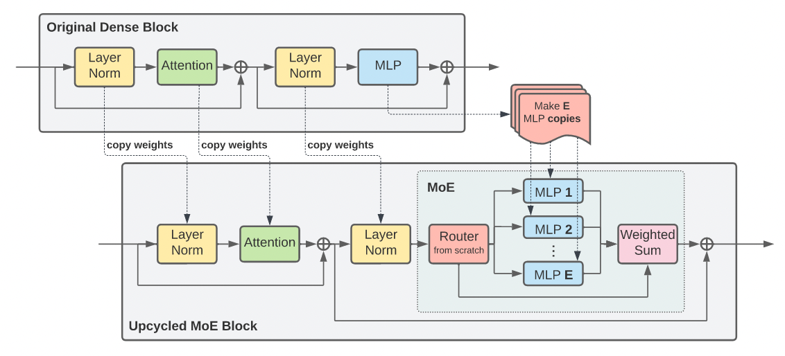
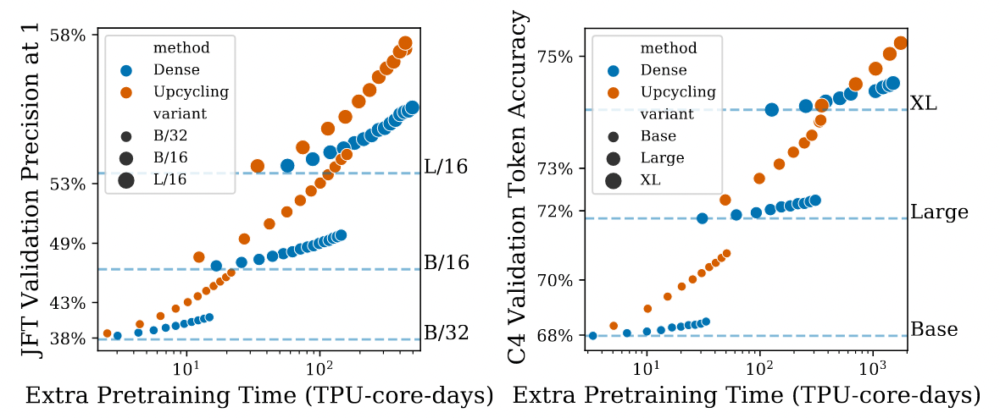
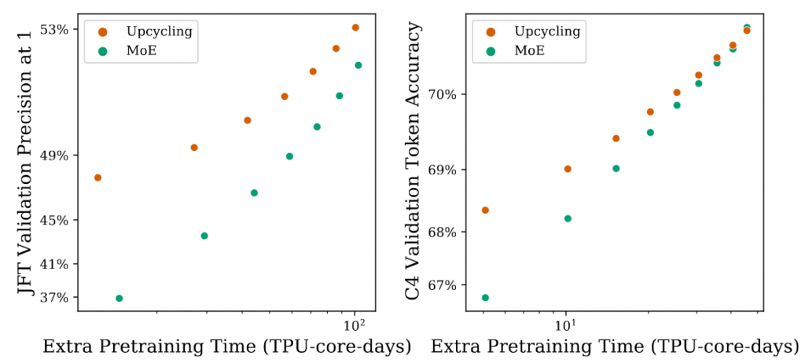

<!--more-->

## Introduction

[Mixture-of-Experts (MoE)](https://huggingface.co/blog/moe)! If you're as fascinated by AI technology as I am, you're surely familiar with this term. MoE has enabled new breakthroughs in the performance of Deep Neural Networks across many fields.

For example, the recent [Mixtral 8x7B](https://mistral.ai/news/mixtral-of-experts/) used MoE technology to achieve performance that approaches or even surpasses LLaMA 2 70B, making the MoE technique instantly more famous. (On a side note: Mixtral was developed in December 2023, which is less than half a year from now (April 2024), but it already feels like ancient history... The pace of progress in the AI field is frighteningly fast.)

Today's post isn't about introducing the concept of MoE itself—there are already many great articles and tutorials online for that. Instead, I want to share an interesting MoE-related paper I recently read: [Sparse Upcycling: Training Mixture-of-Experts from Dense Checkpoints](https://arxiv.org/abs/2212.05055).

This is a paper from Google Research that was accepted by ICLR 2023. With endorsements from both Google and ICLR, you can bet it's going to be an interesting read!

So, let's spend less than 10 minutes to quickly understand the problem this paper aims to solve and its contributions! (Quick tip: Having a basic understanding of MoE will help you grasp the concepts in this article and the paper more easily!)

## Prerequisites

Before diving into Sparse Upcycling, let's briefly cover some fundamental concepts to ensure we're all on the same page.

When we talk about MoE today, we're mostly referring to Sparse MoE. "Sparse" signifies that during computation, the MoE model does **not** utilize **all** of its parameters to process the input.

From a higher-level perspective, a model consists of many modules (e.g., FFNs, Self-Attention Layers). For a given input, it won't pass through every module in a Sparse MoE model. In contrast to Sparse MoE, previous models were mostly Dense Models.

A Dense Model uses all of its parameters to compute the input. In other words, an input passes through every module in a Dense Model. Therefore, as a Dense Model gets larger, its computational load increases. A Sparse MoE Model, however, only uses a portion of its parameters for any given input. This means that even if the total number of parameters in the model increases, the computational cost doesn't necessarily scale proportionally, effectively decoupling "Model Size" from "Computation Cost (FLOPS)."

Typically, to convert a Dense Model (composed of Transformer Blocks) into an MoE Model, you replace the FFNs in the Transformer Blocks with MoE Layers. An MoE Layer contains many Experts and a Router. Each Expert is essentially an FFN itself.

In an MoE model, the quality of the Router in each MoE layer is crucial. Imagine if the router is poor and always sends input tokens to the same specific experts, without distributing them to suitable experts based on their characteristics. This would not only defeat the purpose of the "Mixture of Experts" but also lead to poor model performance.

This brings us to an important issue for routers: Expert Load Balancing—how the router can avoid overloading certain experts. There are many routing algorithms, with the most common being Top-K Routing and Expert Choice Routing.

This paper focuses on Expert Choice Routing. Assume an MoE layer has E experts and n tokens. The router outputs a routing matrix of size (n x E), where each row represents the probability of that token being processed by each expert.

In other words, each column in the routing matrix represents the probability of that expert seeing each token. Typically, each expert is set to process the T tokens with the highest probabilities. Here, T is defined as C x (n / E), where C is a factor that controls the number of tokens each expert can see. In Expert Choice Routing, some tokens might be processed by multiple experts, while others might not be processed by any.

## What Problem Does Sparse Upcycling Aim to Solve?

Let's imagine a scenario: We have a large dense model, and we want to further improve its performance.

The most intuitive approach is to continue training it to further decrease the loss. However, as you can imagine, the model is likely approaching saturation, so even with significant additional training, the loss might only decrease slightly.

Alright, what if we add more modules to the model to increase its parameter count? This would indeed allow the loss to decrease further with training, but predictably, a larger model means even longer training times.

Let's think about it from another angle. What if, while scaling up the model, we could convert it into a Sparse MoE architecture? This could solve the aforementioned problems. With a Sparse MoE structure, the model can have a vast number of parameters without a proportional increase in computational load. In other words, we can significantly increase model capacity without a drastic rise in computation cost! Sparse MoE is exactly what we need.

Now, let's consider another scenario: We want to train a Sparse MoE model. If we start training from scratch, it will predictably require a vast amount of training data and time. Opening Hugging Face, we see hundreds, even thousands, of LLMs available. If we could build upon those pre-trained LLMs (which are dense models) and continue training our Sparse MoE model, could we potentially reduce the required training data and time?

By now, you probably have a good idea of what Sparse Upcycling is all about. It's a method for training a Sparse MoE model, not from scratch, but by building upon an already trained dense model.

## Introducing the Sparse Upcycling Method

The figure above clearly illustrates the Sparse Upcycling approach: The Upcycled MoE Block is created by primarily replacing the MLP Layer in the Original Dense Block with an MoE Layer. The weights of all other layers are inherited from the original block.

Furthermore, the weights of the Experts within the MoE Layer are also initialized from the MLP of the original block. During training, the upcycled model uses the exact same training settings as the original model.

To put it more simply: Sparse Upcycling involves replacing some MLP layers in the original dense model with MoE layers and then continuing the training process. While many concepts in AI sound simple, their implementation involves many details. The paper elaborates on the following specifics:

*   **Router Type**: For the upcycled MoE model, the authors use Expert Choice Routing for Vision Model (Encoder) and Language Model Encoder, and Top-K Routing for the Language Model Decoder.
*   **Number of MoE Layers**: Replacing more MLP layers with MoE layers increases the model's capacity but also raises training costs and can cause a larger initial performance drop. It's a trade-off. Following previous methods, the authors convert half of the MLP layers in the model to MoE layers.
*   **Number of Experts**: Adding more experts to an MoE layer also increases model capacity but can lead to a more significant performance drop compared to the original dense model at the beginning of training. Note: Increasing the number of experts in an MoE layer doesn't significantly increase FLOPS. This is because with more experts, each expert processes fewer tokens, as the number of tokens per expert in Expert Choice Routing is T = C x (n/E). The authors found that 32 experts per MoE layer yielded the best results.
*   **Expert Capacity**: Expert Capacity refers to how many tokens an expert can process: T = C x (n/E). A larger expert capacity leads to better model performance but also higher FLOPS. The authors found that a capacity factor of C = 2 provided excellent performance without excessively increasing FLOPS.

## Experimental Results of Sparse Upcycling

In the experiments, the authors took a dense model, upcycled it (converted it to a Sparse MoE architecture), and then continued training it.

The experimental results above show performance on a Vision Model (left) and a Language Model (right). The vertical axis represents the accuracy on the respective tasks, and the horizontal axis represents training time. "Dense" refers to continuing the training of the original dense model.

We can observe that with a small training budget, the performance of both Dense and Upcycling is similar for both vision and language models, regardless of size. However, as the training budget increases, the performance gap between them widens. This indicates that continuing to train a dense model is not efficient for the same training cost.

This experiment is similar to the previous one, but here it compares the performance of Upcycling with an MoE model trained from scratch. As expected, since Upcycling builds upon a pre-trained dense model, it requires significantly less training to reach the same performance level as an MoE model trained from scratch.

These two experimental results support the two scenarios we discussed in the "What Problem Does Sparse Upcycling Aim to Solve?" section. They show that Sparse Upcycling is more efficient in terms of both performance and training cost.

## Conclusion

This article provided a brief introduction to the MoE-related paper [Sparse Upcycling](https://arxiv.org/abs/2212.05055), published by Google Research and accepted at ICLR 2023.

This paper shows us that we can leverage existing dense model checkpoints to train a Sparse MoE model. This approach allows us to further enhance the performance of the dense model while avoiding the high cost of training a Sparse MoE model from scratch. The paper contains many more details and descriptions (especially in the experiments section), so I encourage interested readers to check it out. I hope this article was helpful to you.
